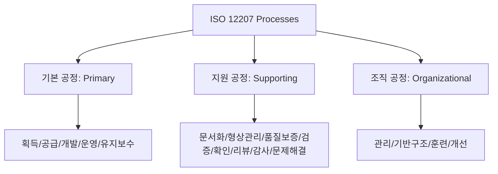

Parent: [[129.소프트웨어_품질_표준]]

# ISO/IEC 12207(소프트웨어 생명주기 공정)

> [!info] **ISO/IEC 12207이란?**
> 소프트웨어의 획득, 공급, 개발, 운영, 유지보수 및 폐기에 이르는 전체 **생명주기(Life Cycle)** 동안 수행되는 공정(Process)을 체계적으로 정의한 국제 표준입니다. 소프트웨어 산업의 공용어 역할을 하며, 품질 관리와 프로세스 개선의 기초가 됩니다.

---

## 1. ISO/IEC 12207의 개요
### 가. ISO 12207의 정의
- 소프트웨어 생명주기 전 과정을 비즈니스 관점에서 체계화하여, 이해관계자 간의 역할과 책임을 명확히 한 프로세스 프레임워크

### 나. 등장 배경 및 필요성 (Why)
1. **의사소통 표준화**: 발주자(Acquirer)와 공급자(Supplier) 간의 용어와 공정 단계를 통일하여 분쟁 방지
2. **품질 보증**: 정의된 표준 공정을 준수함으로써 일관된 품질의 산출물 생산 유도
3. **프로세스 개선**: CMMi, SPICE(ISO 15504) 등의 평가 모델을 적용하기 위한 참조 모델로 활용
4. **전 주기적 관리**: 단순 개발을 넘어 운영 및 유지보수, 폐기 단계까지 포함한 **TCO(Total Cost of Ownership)** 관리

---

## 2. ISO/IEC 12207 공정 체계 (What & How)
### 가. 공정 분류 체계도 (1995년 기준: 기지조)

### 나. 3대 공정별 주요 내용

| 구분 | 주요 공정 항목 | 핵심 역할 |
| :--- | :--- | :--- |
| **기본 공정 (Primary)** | 획득, 공급, 개발, 운영, 유지보수 | 비즈니스 가치를 직접 창출하는 핵심 생명주기 |
| **지원 공정 (Supporting)** | 문서화, 형상관리, QA, 검증, 확인, 감사 | 타 공정의 성공을 돕기 위해 보조적으로 수행되는 활동 |
| **조직 공정 (Organizational)** | 관리, 기반구조, 훈련, 개선 | 조직 차원의 표준 수립 및 인프라, 역량 강화 지원 |

---

## 3. 심화: ISO 12207의 진화 및 현대적 해석
### 가. 2017년 개정판 (ISO/IEC/IEEE 12207:2017)
- **시스템 공학 통합**: ISO 15288(시스템 생명주기)과 구조를 일치시켜 시스템-소프트웨어 간 통합성 강화
- **재귀적/반복적 프로세스**: 폭포수 중심에서 벗어나 애자일, 반복적 모델을 수용할 수 있도록 유연성 부여

### 나. 주요 공정 간 상호작용
- **검증(Verification)**과 **확인(Validation)** 공정은 개발 공정의 각 단계마다 반복적으로 수행되어 결함 유출을 차단함

---

## 4. 기술사적 제언 및 실무 적용 방안
### 가. 테일러링(Tailoring) 전략
- 표준의 모든 공정을 적용하는 것은 비효율적이므로, 프로젝트 규모, 성격, 리스크 수준에 따라 필수 공정을 선별하고 조정하는 **테일러링** 과정이 반드시 필요함

### 나. 기술사적 인사이트
- **프로세스 자산화**: ISO 12207을 기반으로 기업 자체의 **표준 소프트웨어 생명주기(OSSL)**를 정립하고, 이를 레포지토리에 저장하여 재사용하는 체계가 성숙도의 척도임
- **DevOps와의 융합**: 현대적인 운영 환경에서는 '운영'과 '유지보수' 공정이 '개발'과 실시간으로 통합되는 **DevOps** 모델로 진화하고 있으며, ISO 12207은 이러한 자동화된 공정의 논리적 뼈대를 제공함
- 결론적으로 ISO 12207은 **'소프트웨어 공학의 헌법'**이며, 이를 준수하는 것은 프로젝트의 거버넌스를 확립하는 가장 기본적인 행위임

---

## Related Notes
- [[129.소프트웨어_품질_표준]]
- [[042.개발_방법론_테일러링(Tailoring)]]
- [[002.DevOps]]
- [[119.소프트웨어_유지보수(Software_Maintenance)]]
