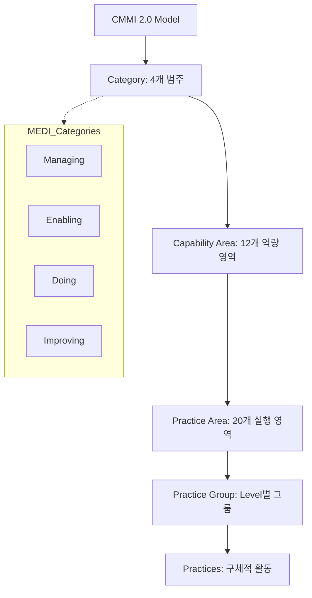

Parent: [[136.CMMI(Capability_Maturity_Model_Integration)]]

# CMMI 2.0

> [!info] **CMMI 2.0이란?**
> 기존 CMMI V1.3의 복잡성을 개선하고, **비즈니스 가치(Performance)**와 **최신 트렌드(Agile, DevOps)**를 반영하여 2018년 새롭게 출시된 프로세스 개선 모델입니다. "프로세스 준수"보다 "성과 달성"에 초점을 맞춘 것이 핵심 변화입니다.

---

## 1. CMMI 2.0의 개요 및 변화 배경
### 가. CMMI 2.0의 정의
- 비즈니스 성능 향상을 목적으로 개발, 서비스, 획득 능력을 평가하고 개선하기 위한 차세대 프로세스 참조 모델

### 나. 등장 배경 (R-최심사)
1. **ROI/Value 입증**: 프로세스 개선이 실제 비즈니스 이익으로 연결됨을 증명 요구
2. **최신 트렌드 반영**: **Agile, DevOps, Lean** 등 현대적 방법론과의 융합 필요
3. **사용자 중심 개선**: 모델 구조를 단순화하고 언어를 명확히 하여 접근성 향상
4. **심화 Value 증대**: 심사(Appraisal)의 신뢰성을 높이고 비용과 시간을 절감

---

## 2. CMMI 2.0의 구조 및 메커니즘 (What & How)
### 가. CMMI 2.0의 아키텍처 (Mermaid)

### 나. 4대 카테고리 (MEDI)

| 카테고리 | 의미 | 주요 Capability Area |
| :--- | :--- | :--- |
| **Managing** | 비즈니스 운영 및 관리 | 계획/추정, 모니터링, 공급자 관리 |
| **Enabling** | 개발/서비스 지원 역량 | 인프라, 거버넌스, 품질보증 |
| **Doing** | 실제 제품 제작 및 서비스 | 요구사항 개발, 설계, 구현, 검증/확인 |
| **Improving** | 성과 분석 및 개선 | 프로세스 관리, 성과 측정(Performance) |

---

## 3. 심화: CMMI 2.0의 핵심 특징 및 V1.3과의 비교
### 가. CMMI V1.3 vs CMMI 2.0 비교 분석

| 비교 항목 | CMMI V1.3 | CMMI 2.0 |
| :--- | :--- | :--- |
| **핵심 철학** | 프로세스 준수 및 표준화 | **비즈니스 성능 및 성과 (Performance)** |
| **모델 구조** | PA (Process Area) 중심 | **PA (Practice Area)** 중심 (언어 순화) |
| **방법론 수용** | 폭포수 모델 지향 | **Agile, DevOps 가이드 내재화** |
| **성숙도 레벨** | 1~5 단계 | **0~5 단계 (Incomplete 추가)** |
| **심화 방식** | SCAMPI (엄격, 고비용) | Benchmark Appraisal (효율, 신뢰성 강화) |

### 나. 성숙도 레벨의 재정의
- **Level 0 (Incomplete)**: 프로세스 부재 또는 부분적 수행
- **Level 1 (Initial)**: 예측 불가능하며 반응적(Reactive)
- **Level 2 (Managed)**: 프로젝트 수준에서 관리됨
- **Level 3 (Defined)**: 조직 수준에서 표준화 및 선제적 대응
- **Level 4 (Quantitatively Managed)**: 데이터 기반 통계적 관리
- **Level 5 (Optimizing)**: 지속적 성능 최적화 및 비즈니스 변화 대응

---

## 4. 기술사적 제언 및 실무 적용 방안
### 가. CMMI 2.0 안착을 위한 전략
1. **성능 지표(Metrics) 설계**: 단순 활동 기록이 아닌, 품질 향상이나 비용 절감 등 **비즈니스 가치**를 측정할 수 있는 지표를 설계해야 함
2. **Agile과의 시너지**: Agile 테마를 적용하여 스프린트 내에서 CMMI의 거버넌스가 자연스럽게 녹아들도록 경량화된 가이드라인 제공

### 나. 기술사적 인사이트
- **Performance-Driven Improvement**: 2.0의 가장 큰 특징은 **'성능(Performance)'**이 모델 전반에 스며들어 있다는 것임. 이제 인증은 끝이 아니라, 조직의 이익을 극대화하기 위한 시작점임을 인식해야 함
- **지속적 역량 강화**: 고정된 레벨 획득보다, **Sustaining Appraisal**을 통해 조직의 역량이 퇴보하지 않도록 상시 모니터링 체계를 갖추는 것이 중요함
- 결론적으로 CMMI 2.0은 **'복잡성을 걷어내고 실질적인 성과를 지향하는 현대적 품질 관리 프레임워크'**로 진화함

---

## Related Notes
- [[136.CMMI(Capability_Maturity_Model_Integration)]]
- [[034.애자일_방법론(Agile)]]
- [[002.DevOps]]
- [[129.소프트웨어_품질_표준]]
