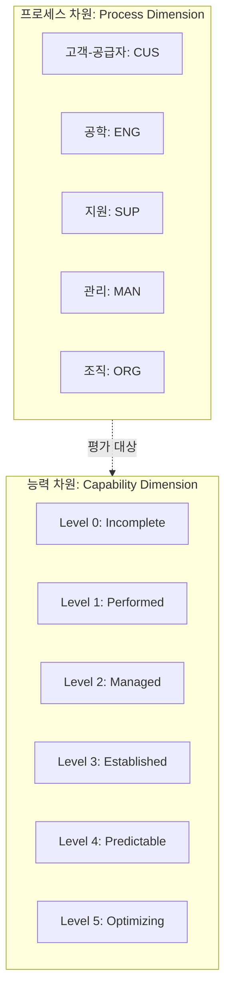

Parent: [[135.ISO_IEC_12207]]

# SPICE(ISO/IEC 15504 / ISO/IEC 330xx)

> [!info] **SPICE(Software Process Improvement and Capability dEtermination)란?**
> 소프트웨어 개발 프로세스의 역량을 평가하고 개선하기 위한 국제 표준 프레임워크입니다. **ISO/IEC 15504**로 시작되어 현재는 **ISO/IEC 330xx** 시리즈로 개정 및 확장되었으며, 조직의 프로세스 수행 능력을 정량적으로 측정하는 **2차원 평가 모델**을 제공합니다.

---

## 1. SPICE의 개요 및 배경
### 가. SPICE의 정의
- SW 프로세스에 대한 개선 및 능력 측정(Capability Determination)을 위한 국제 표준(ISO/IEC 15504)

### 나. 등장 배경 및 필요성 (Why)
1. **프로세스 표준화**: 국가 및 벤더별로 상이한 프로세스 평가 모델을 국제 표준으로 통합
2. **객관적 역량 증빙**: 발주자가 공급자의 프로세스 수행 능력을 객관적으로 검증할 수 있는 기준 필요
3. **지속적 개선**: 자신의 현재 수준을 파악하고 목표 수준으로 나아가기 위한 **PDCA** 기반 개선 로드맵 제공
4. **리스크 통제**: 부적절한 프로세스로 인한 프로젝트 지연 및 품질 저하 리스크를 설계 단계부터 관리

---

## 2. SPICE의 2차원 평가 모델 및 구성 (What & How)
### 가. SPICE의 2차원 구조 (Mermaid)

### 나. 능력 레벨 상세 (불수관확예최)

| 레벨 | 명칭 | 핵심 특징 |
| :--- | :---: | :--- |
| **Level 0** | **Incomplete** | 프로세스가 구현되지 않았거나 목적을 달성하지 못함 |
| **Level 1** | **Performed** | 프로세스가 수행되어 산출물이 생성되는 단계 |
| **Level 2** | **Managed** | 계획에 따라 프로세스가 수행되고 모니터링됨 (Project level) |
| **Level 3** | **Established** | 조직 차원의 표준 프로세스가 정의되고 준수됨 (Org level) |
| **Level 4** | **Predictable** | 통계적 기법을 통해 프로세스 성과를 정량적으로 관리 |
| **Level 5** | **Optimizing** | 지속적인 개선 활동을 통해 프로세스 혁신 이행 |

---

## 3. 심화: SPICE의 평가 메커니즘 및 진화 (Deep-dive)
### 가. 프로세스 수행 지표 (N-P-L-F)
- 각 프로세스 속성(PA)에 대해 4단계 척도로 등급을 부여합니다.
- **N (Not achieved)**: 0~15% 달성
- **P (Partially achieved)**: 15~50% 달성
- **L (Largely achieved)**: 50~85% 달성
- **F (Fully achieved)**: 85~100% 달성

### 나. ISO/IEC 15504에서 330xx로의 전환 (최신 트렌드)
- **범위 확장**: 소프트웨어를 넘어 시스템, 서비스, 보안, 데이터 거버넌스로 영역 확장
- **구조 개편**: ISO/IEC 33001(용어), 33002(요구사항), 33020(측정 프레임워크) 등으로 세분화

---

## 4. 기술사적 제언 및 실무 적용 방안
### 가. CMMI와의 비교를 통한 전략적 선택
- **CMMI**: 조직 전반의 성숙도(Maturity) 강조, 미국 중심, 하이 레벨 전략에 유리
- **SPICE**: 특정 프로세스의 능력(Capability) 강조, 유럽/ISO 중심, 실무적 개선에 유리

### 나. 기술사적 인사이트
- **국내 인증제도와의 연계**: 한국의 **SP(Software Process) 인증**은 SPICE 모델을 기반으로 국내 환경에 맞게 테일러링된 제도임. 따라서 SP 인증 준비 시 SPICE의 2차원 모델 구조를 정확히 이해하는 것이 선행되어야 함
- **품질 거버넌스의 도구**: SPICE는 단순 인증용이 아니라, **ISO 12207** SDLC 공정과 결합하여 실질적인 **품질 보증(QA)** 체계를 구축하는 강력한 거버넌스 도구로 활용되어야 함
- 결론적으로 SPICE는 **'측정할 수 없으면 관리할 수 없다'**는 원칙을 실천하는 프로세스 엔지니어링의 정수임

---

## Related Notes
- [[136.CMMI(Capability_Maturity_Model_Integration)]]
- [[135.ISO_IEC_12207]]
- [[140.ASPICE(Automotive_SPICE)]]
