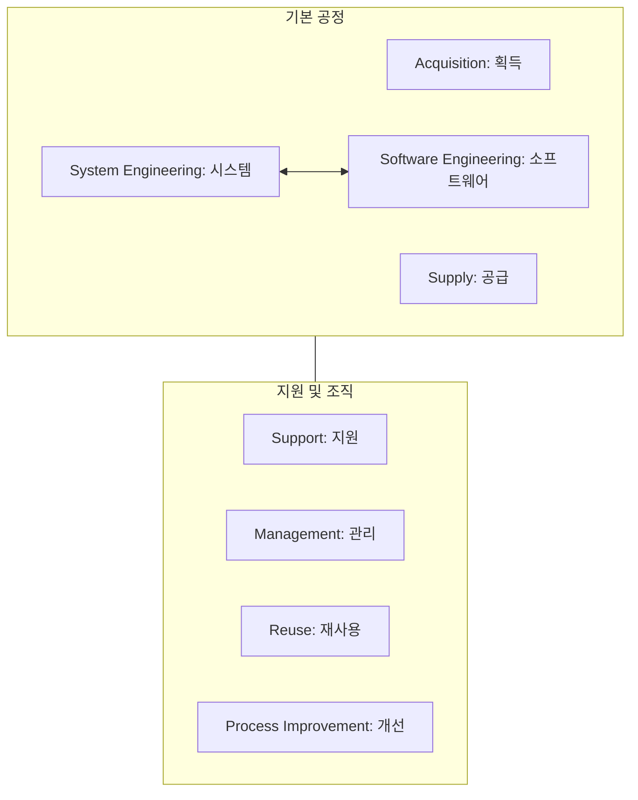

Parent: [[139.SPICE(ISO_IEC_15504)]]

# ASPICE(Automotive SPICE)

> [!info] **ASPICE란?**
> 자동차 산업에 특화된 소프트웨어 프로세스 평가 모델입니다. ISO/IEC 15504(현재 330xx)를 기반으로 **유럽 자동차 제조사(OEM)**들이 공동으로 정립하였으며, 차량용 소프트웨어의 복잡성 증가에 대응하여 개발 역량의 적합성을 평가하는 글로벌 산업 표준입니다.

---

## 1. ASPICE의 개요 및 배경
### 가. ASPICE의 정의
- 자동차 전자제어장치(ECU) 소프트웨어 개발 프로세스의 능력을 평가하고 개선하기 위한 프로세스 참조 모델(PRM) 및 프로세스 평가 모델(PAM)

### 나. 필요성 및 배경 (Why)
1. **자동차의 SW화 (SDV)**: Software Defined Vehicle 트렌드에 따라 소프트웨어 결함이 곧 대규모 리콜로 직결되는 상황 발생
2. **OEM의 공급망 관리**: 현대, 벤츠, BMW 등 완성차 업체가 부품사(Tier-1)의 개발 역량을 검증하기 위한 필수 조건으로 요구
3. **안전성 보장**: **ISO 26262 (기능 안전)** 표준 준수를 위한 기반 프로세스로서의 역할 수행
4. **추적성(Traceability) 강조**: 요구사항부터 설계, 코드, 테스트까지의 엄격한 상호 연결 보장

---

## 2. ASPICE의 구조 및 프로세스 모델 (What & How)
### 가. ASPICE v4.0 프로세스 프레임워크 (Mermaid)

### 나. 주요 프로세스 그룹 (획공소시지 관재프)

| 그룹 | 명칭 | 핵심 활동 |
| :--- | :--- | :--- |
| **ACQ / SPL** | 획득 / 공급 | 고객 요구사항 수렴 및 공급자 관리 |
| **SYS** | 시스템 공학 | 시스템 요구사항 분석, 아키텍처 설계, 통합 테스트 |
| **SWE** | 소프트웨어 공학 | SW 요구사항 분석, 설계, 단위/통합 테스트 |
| **SUP** | 지원 | **형상 관리**, 품질 보증, 문제 해결, 문서화 |
| **MAN / REU** | 관리 / 재사용 | 프로젝트 관리, 리스크 관리, 자산 재사용 |

---

## 3. 심화: ASPICE v4.0 변화 및 성숙도 레벨
### 가. 최신 ASPICE v4.0 주요 변경 사항 (Deep Research 반영)
- **Machine Learning**: AI/ML 개발 프로세스(MLE) 신규 도입
- **Cybersecurity**: ISO/21434와의 연계를 위한 보안 프로세스 강화
- **Hardware Engineering**: 기존 SW 중심에서 HW 개발 공정 수용성 확대
- **Agile Bridge**: 애자일 개발 방식과의 정합성을 위한 가이드라인 보완

### 나. 성숙도 레벨 및 등급 (불수관확예혁)
- **Level 0 ~ 5**: SPICE와 유사하나 Level 5는 **Innovation(혁신)**으로 명명
- **N-P-L-F 등급**: 각 프로세스의 달성도를 Not, Partially, Largely, Fully achieved로 평가

---

## 4. 기술사적 제언 및 실무 적용 방안
### 가. 실무 적용 시 고려사항 (Governance)
1. **Traceability의 실체화**: 단순히 문서 간 링크를 거는 수준을 넘어, **ALM(Application Lifecycle Management)** 도구를 통해 요구사항 변경이 테스트 케이스까지 자동 반영되는 체계 구축 필수
2. **V-모델의 엄격한 준수**: 좌측(개발)과 우측(검증)의 정합성을 보장하는 양방향 추적성을 확보해야 함

### 나. 기술사적 인사이트
- **ISO 26262와의 관계**: ASPICE는 '프로세스'를, ISO 26262는 '안전성 제품'을 다룸. ASPICE Level 2~3가 뒷받침되지 않은 상태에서 기능 안전 인증은 사상누각임
- **SDV 시대의 경쟁력**: 소프트웨어가 중심이 되는 자율주행 시대에 ASPICE 인증은 단순한 '자격증'이 아니라, 글로벌 OEM과 협업하기 위한 **'기술 통행증'**임
- 결론적으로 ASPICE는 **'복잡한 자동차 소프트웨어의 품질을 수학적 추적성과 공학적 절차로 담보'**하는 미래 모빌리티의 핵심 거버넌스임

---

## Related Notes
- [[139.SPICE(ISO_IEC_15504)]]
- [[083.V-모델(V-Model)]]
- [[007.형상관리(Configuration_Management)]]
- [[131.ISO_IEC_25010]]
