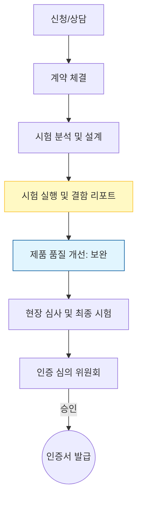

Parent: [[129.소프트웨어_품질_표준]]

# GS(Good Software) 인증

> [!info] **GS 인증이란?**
> 국산 소프트웨어의 품질 향상 및 유통 활성화를 위해 국제 표준(ISO/IEC 25023, 25051 등)을 기반으로 소프트웨어의 **기능성, 신뢰성, 효율성** 등을 종합적으로 평가하여 품질을 증명하는 국가 인증 제도입니다. **소프트웨어 진흥법 제20조**에 근거합니다.

---

## 1. GS 인증의 개요 및 배경
### 가. GS 인증의 정의
- 실제 운영 환경과 유사한 테스트베드에서 소프트웨어 제품의 품질을 측정하여 인증 실무 위원회의 심의를 거쳐 품질 마크를 부여하는 제도

### 나. 등장 배경 및 필요성 (Why)
1. **국산 SW 경쟁력 강화**: 외산 SW에 대응하여 객관적인 품질 증빙을 통한 시장 신뢰도 확보
2. **공공 구매 활성화**: 공공기관에서 우수한 국산 SW를 믿고 구매할 수 있는 법적 근거 제공
3. **품질 비용 절감**: 제3자 시험 기관(TTA, KTL)의 정밀 진단을 통해 제품의 잠재적 결함 조기 제거
4. **글로벌 표준 준수**: **SQuaRE(ISO 25000)** 시리즈를 수용하여 해외 진출 시 품질 기반 마련

---

## 2. GS 인증 평가 체계 및 절차 (What & How)
### 가. GS 인증 시험 및 평가 프로세스 (Mermaid)

### 나. 주요 평가 항목 (ISO/IEC 25010 기반)

| 구분 | 주요 품질 특성 | 세부 평가 내용 |
| :--- | :--- | :--- |
| **제품 품질** | **기신상효유연보호안** | 기능적합성, 신뢰성, 상호작용능력, 성능효율성 등 9대 특성 |
| **문서 품질** | **사용자/제품 설명서** | 문서의 완전성, 정확성, 일관성, 가독성 (ISO 25051) |
| **일반 요구** | **식별성 및 안전성** | 제품 식별 정보의 적절성 및 위해성 여부 점검 |

---

## 3. 심화: GS 인증 획득에 따른 혜택 및 법적 근거
### 가. 공공 사업 지원 혜택 (Strong Incentives)
- **우선구매 대상**: 국가기관 등에서 SW 구매 시 GS 인증 제품을 우선적으로 구매해야 함
- **수의계약 허용**: 국가계약법에 따라 인증 제품에 대한 수의계약 가능
- **PQ 가점 부여**: 공공 소프트웨어 사업 입찰 시 기술성 평가에서 가산점 혜택
- **성능보험 제도**: 인증 제품 구매로 인한 손해 발생 시 보험을 통해 책임 면제

### 나. 인증 등급 체계
- **1등급**: 고도의 기술력과 안정성을 갖춘 제품 (기존 1등급 중심 통합 운영 추세)
- **2등급**: 특정 분야나 중소기업 제품의 품질 보증

---

## 4. 기술사적 제언 및 실무 적용 방안
### 가. 실무 도입 시 성공 전략
1. **V&V 활동의 내재화**: 인증을 위한 일회성 대응이 아닌, 개발 전 과정에서 **ISO 25000** 기반의 메트릭을 관리하는 체계 구축
2. **결함 관리 프로세스**: 시험 과정에서 발행되는 **결함 리포트**를 분석하여 제품 아키텍처의 근본적인 취약점을 개선하는 기회로 활용

### 나. 기술사적 인사이트
- **SaaS 및 클라우드 대응**: 최근 CSAP(클라우드 보안인증)와 GS 인증의 중복 부담을 줄이기 위한 통합/연계 논의가 활발하므로, **Cloud-Native** 환경에서의 품질 지표를 선제적으로 확보해야 함
- **공급망 보안과 GS**: 소프트웨어 공급망 공격이 증가함에 따라, GS 인증 평가 시 **SBOM** 제출 및 오픈소스 라이선스/보안 점검 항목이 더욱 강화될 것으로 전망됨
- 결론적으로 GS 인증은 **'국산 SW의 품질 브랜드화'**를 넘어 디지털 정부의 안전성을 담보하는 핵심 품질 관문임

---

## Related Notes
- [[129.소프트웨어_품질_표준]]
- [[130.ISO_25000(SQuaRE)]]
- [[134.ISO_IEC_25051(RUSP_품질_요구사항_및_시험)]]
- [[057.요구사항_명세서(SRS)_및_IEEE830]]
