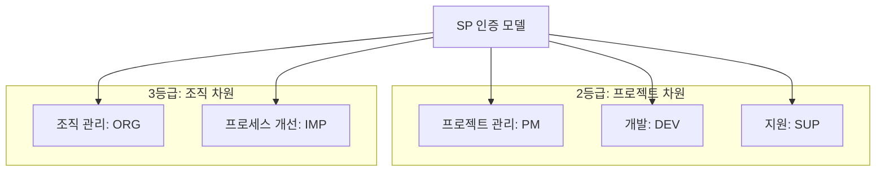

Parent: [[129.소프트웨어_품질_표준]]

# SP(Software Process) 인증

> [!info] **SP 인증이란?**
> 소프트웨어 기업의 **프로세스 역량 수준**을 객관적으로 심사하여 인증하는 제도입니다. **소프트웨어 진흥법 제21조**에 근거하여 중소 SW 기업의 사업 수행 능력을 강화하고 프로젝트 부실을 방지하기 위해 **NIPA(정보통신산업진흥원)**에서 운영합니다.

---

## 1. SP 인증의 개요 및 배경
### 가. SP 인증의 정의
- SW 개발 단계별 작업 절차 및 산출물 관리 역량 등을 분석하여 조직의 소프트웨어 프로세스 관리 능력을 등급화(1~3등급)하는 제도

### 나. 필요성 및 목적 (Why)
1. **프로세스 표준화**: 주먹구구식 개발 관행에서 벗어나 표준화된 SDLC 공정 정립 유도
2. **중소기업 역량 강화**: 고비용의 해외 CMMI 인증을 대체하여 국내 기업에 적합한 비용 효율적인 인증 제공
3. **사업 부실 방지**: 요구사항 관리 및 프로젝트 통제 역량을 검증하여 사업 지연 및 품질 저하 방지
4. **입찰 경쟁력 확보**: 공공 SW 사업 참여 시 기술성 평가 가점 등 실질적인 혜택 제공

---

## 2. SP 인증 모델 및 등급 체계 (What & How)
### 가. SP 인증의 5대 영역 및 구성 (Mermaid)

### 나. 등급별 평가 영역 상세 (조프개지프)

| 등급 | 핵심 관점 | 주요 평가 영역 및 활동 |
| :--- | :--- | :--- |
| **1등급** | **인식 단계** | 프로세스 개선의 필요성 인식 및 기초적인 활동 수행 |
| **2등급** | **프로젝트 관리** | **[개지프]** 개발(요구사항~테스트), 지원(QA, 형상관리), 프로젝트 관리(계획, 통제) |
| **3등급** | **조직 관리** | **[조프개지프]** 2등급 항목 + 조직 관리(훈련), 프로세스 개선(성과 관리) |

---

## 3. 심화: SP 인증 vs CMMI 비교 분석
### 가. 프로세스 평가 모델 간 비교 (Comparison)

| 비교 항목 | SP 인증 (국내) | CMMI (국제) |
| :--- | :--- | :--- |
| **주관 기관** | NIPA (한국) | ISACA (미국) |
| **평가 기준** | 국내 SW 환경에 최적화된 모델 | 글로벌 범용 프로세스 모델 (V2.0/3.0) |
| **인증 비용** | 상대적으로 저렴 (중소기업 지원) | 고비용 (해외 심사원 초빙 등) |
| **핵심 혜택** | 공공 입찰 PQ 가점, 하도급 승인 제외 | 글로벌 사업 참여 필수 조건인 경우가 많음 |
| **상호 인정** | 국내 한정 | 전 세계 통용 |

---

## 4. 기술사적 제언 및 실무 적용 방안
### 가. SP 인증 도입 시 고려사항 (Governance)
1. **실효성 있는 프로세스**: 인증 획득을 위한 '가짜 산출물' 생산을 경계하고, 실제 개발 생산성을 높일 수 있는 **경량화된 표준 프로세스** 수립 필요
2. **형상관리 및 QA 강화**: 2등급의 핵심인 지원 영역(지원)에서 형상관리 도구의 자동화와 독립적인 QA 조직 운영이 인증 통과의 관건임

### 나. 기술사적 인사이트
- **Agile 환경과의 조화**: 최근 SP 인증 가이드라인도 애자일 방법론을 수용하는 추세이므로, **백로그 관리**나 **스프린트 회고** 활동을 SP 인증의 프로세스 영역과 어떻게 매핑할 것인지 전략이 필요함
- **공공 SW 사업의 필수 역량**: 소프트웨어 진흥법 개정에 따라 대기업 참여 제한이 강화된 상황에서, 중소/중견 기업에게 SP 인증은 **사업 수행 능력의 객관적 지표**이자 수주를 위한 생존 전략임
- 결론적으로 SP 인증은 **'개인의 역량을 조직의 프로세스로 자산화'**하여 지속 가능한 품질 성장을 도모하는 경영 전략의 일환임

---

## Related Notes
- [[129.소프트웨어_품질_표준]]
- [[136.CMMI(Capability_Maturity_Model_Integration)]]
- [[135.ISO_IEC_12207]]
- [[007.형상관리(Configuration_Management)]]
