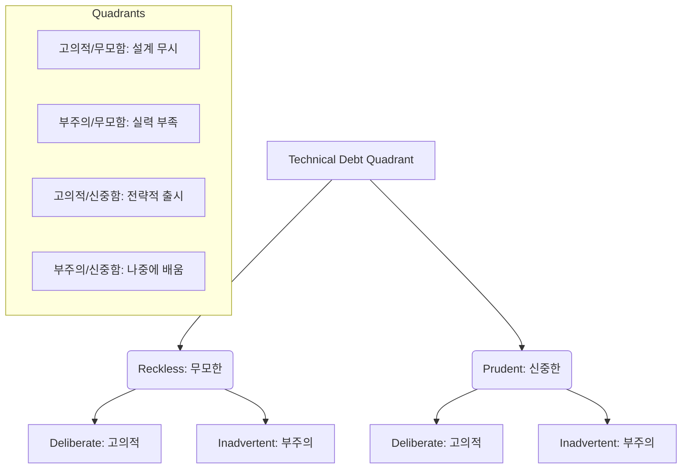

Parent: [[127.소프트웨어_리팩토링(Refactoring)]]

# 기술 부채(Technical Debt)

> [!info] **기술 부채란?**
> 현시점에서 빠른 시장 출시나 문제 해결을 위해 최선의 설계 대신 **임시방편적인 코드나 설계(Short-cut)**를 선택함으로써, 미래에 지불해야 할 추가적인 유지보수 비용과 노력을 의미합니다. 워드 커닝햄(Ward Cunningham)이 처음 제시한 개념으로, 금융 부채처럼 **'이자(유지보수 오버헤드)'**가 발생하며 이를 갚기 위해 **'원금(리팩토링)'** 상환이 필요합니다.

---

## 1. 기술 부채의 개요 및 발생 원인
### 가. 기술 부채의 정의
- 단기적 이익(Time-to-Market)을 위해 장기적인 코드 품질과 아키텍처 건전성을 희생한 결과로 발생하는 잠재적 비용의 총합

### 나. 주요 발생 원인 (Why)
1. **Business Pressure**: 마감 기한 준수를 위한 의도적인 품질 타협 (가장 흔한 원인)
2. **복잡도 관리 미흡**: 요구사항의 빈번한 변경으로 인한 초기 설계의 오염
3. **기술 역량 부족**: 개발자의 숙련도 미달로 인한 **코드 스멜(Code Smell)** 유입
4. **부적절한 계획**: 테스트 자동화 부재나 문서화 누락 등 엔지니어링 프로세스 결여

---

## 2. 기술 부채의 분류 및 아키텍처 (What & How)
### 가. 마틴 파울러의 기술 부채 사분면 (Technical Debt Quadrant)

### 나. 기술 부채의 4대 유형 (코설테문)

| 유형 | 상세 내용 | 영향도 |
| :--- | :--- | :--- |
| **코드 부채** | 중복 코드, 긴 메서드, 복잡한 조건문 | 가독성 저하, 버그 발생 확률 증가 |
| **설계 부채** | 유연하지 못한 아키텍처, 잘못된 추상화 | 확장성 결여, **산탄총 수술** 유발 |
| **테스트 부채** | 단위 테스트 부재, 낮은 커버리지 | 리그레션 리스크 증가, 리팩토링 불가 |
| **문서 부채** | 유실된 요구사항, 최신화되지 않은 API 명세 | 인력 교체 시 지식 전이(KT) 마비 |

---

## 3. 심화: 기술 부채의 경제성 및 관리 프로세스
### 가. 부채의 경제적 비용 모델
- **Total Cost = Principal (원금) + Interest (이자)**
- **Principal**: 코드를 다시 올바르게 작성(Refactoring)하는 데 드는 비용
- **Interest**: 부채가 쌓인 코드 때문에 평소보다 더 많은 시간이 걸리는 유지보수 오버헤드
> [!warning] 이자가 원금을 초과하기 전, 즉 **기술적 파산(Technical Bankruptcy)** 상태에 이르기 전에 상환 전략을 실행해야 함

### 나. 관리 프로세스 (Estimation & Management)
1. **부채 식별**: 정적 분석 도구(SonarQube)를 활용한 지표 가시화
2. **부채 백로그(Backlog)**: 수정이 필요한 항목을 백로그에 등록하여 관리
3. **우선순위화**: 비즈니스 영향도와 이자율이 높은 항목 우선 선별
4. **점진적 상환**: 매 스프린트마다 일정 비율(예: 20%)을 리팩토링에 할당

---

## 4. 기술사적 제언 및 실무 적용 방안
### 가. 실무 적용 시 고려사항
- **전략적 부채 허용**: 모든 부채를 0으로 만드는 것은 불가능함. 제품 초기에는 시장 선점을 위해 '신중하고 고의적인 부채'를 전략적으로 활용하고, 안정기에 접어들면 상환하는 **Cycle 관리**가 중요함

### 나. 기술사적 인사이트
- **Quality Gate 운영**: CI/CD 파이프라인에 품질 게이트를 설정하여, 기술 부채 지수가 특정 수치를 넘을 경우 배포를 차단하는 **강력한 품질 거버넌스**가 필요함
- **보이스카우트 원칙**: 개발 문화 측면에서, 자신이 수정한 코드 주변의 부채를 조금씩 갚아나가는 문화를 정착시켜 대규모 재공학(Re-engineering) 비용을 예방해야 함
- 결론적으로 기술 부채는 **'관리의 대상이지 박멸의 대상이 아님'**을 인지하고, 지속 가능한 성장을 위한 **비즈니스 가치와의 절충(Trade-off)** 능력을 발휘해야 함

---

## Related Notes
- [[126.코드_스멜(Code_Smell)]]
- [[127.소프트웨어_리팩토링(Refactoring)]]
- [[118.리먼(Lehman)_소프트웨어_변화_원리]]
- [[094.테스트_자동화(Test_Automation)]]
