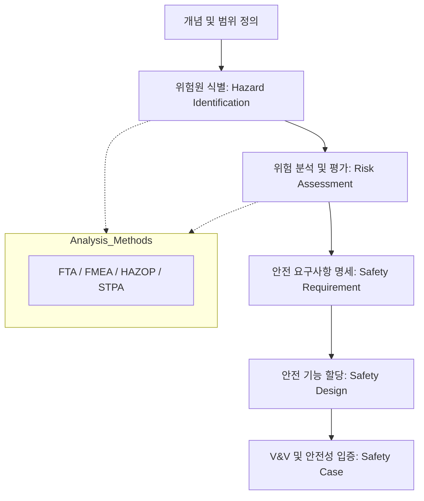

Parent: [[131.ISO_IEC_25010]] (Safety 특성)

# 소프트웨어 안전성 분석(SW Safety Analysis)

> [!info] **소프트웨어 안전성 분석이란?**
> 시스템의 잠재적 위험원(Hazard)을 식별하고, 발생 가능성과 영향도를 분석하여 사고(Accident)를 방지하기 위한 안전 기능을 설계 및 검증하는 공학적 활동입니다. 오작동 시 인명, 재산, 환경에 치명적인 피해를 줄 수 있는 고신뢰 시스템의 필수 과정입니다.

---

## 1. 소프트웨어 안전성 분석의 개요
### 가. 안전성(Safety)과 위험성(Risk)의 정의
- **안전성**: 수용 불가능한 위험이 없는 상태. 시스템이 의도하지 않은 비정상적 동작을 하지 않도록 보장함
- **위험성(Risk)**: 사고 발생 가능성(Probability)과 사고 결과의 심각도(Severity)의 조합

### 나. 안전성 보장의 2대 원칙 (Why)
1. **GAMAB 원칙**: 새로운 시스템은 최소한 기존 시스템과 동등하거나 그 이상의 안전 수준을 유지해야 함
2. **ALARP 원칙 (As Low As Reasonably Practicable)**: 위험을 기술적, 경제적 관점에서 합리적으로 실행 가능한 최저 수준까지 감소시켜야 함

---

## 2. 안전성 진단 영역 및 수행 절차 (What & How)
### 가. 안전성 분석 및 설계 프로세스 (Mermaid)

### 나. 안전성 진단 3대 핵심 영역

| 진단 영역 | 주요 진단 내용 | 핵심 포인트 |
| :--- | :--- | :--- |
| **안전기능 충분성** | 위험원 감지, 회피, 제거 기능이 설계에 충분히 반영되었는가 | Fail-safe 설계 여부 |
| **SW 품질 안전성** | 주요 로직의 정합성, 정적 분석을 통한 잠재 결함(Runtime Error) 제거 | 소스 레벨 무결성 |
| **기반 SW 안전성** | OS, 미들웨어의 실시간성 보장, 장애 감지 및 백업/복구 메커니즘 | 인프라 복원력 |

---

## 3. 심화: 안전성 분석 기법의 단계별 적용
### 가. 생명주기별 분석 기법
- **요구분석/설계**: PHA(예비위험분석), **FTA(연역적)**, **FMEA(귀납적)**, **HAZOP(전문가)**
- **개발/테스트**: 정형 명세(Formal Spec), 정형 검증, 코드 정적 분석
- **운영/유지보수**: **O&SHA**(운영 및 지원 위험 분석)를 통한 작업자 과실 방지

### 나. 안전 무결성 등급 (SIL / ASIL)
- **SIL (Safety Integrity Level)**: IEC 61508 기반의 안전 등급 (1~4단계)
- **ASIL (Automotive SIL)**: ISO 26262 기반의 자동차 특화 안전 등급 (A~D단계)

---

## 4. 기술사적 제언 및 실무 적용 방안
### 가. 실무 도입 시 고려사항
1. **Safety-by-Design**: 개발 완료 후 테스트로 안전성을 확인하는 것이 아니라, 설계 단계부터 **STPA** 등을 통해 상호작용 결함을 원천 차단해야 함
2. **증거 기반 안전성 입증**: 인증 획득을 위해 **Safety Case**를 체계적으로 수집하고, 요구사항과 검증 결과 간의 **Traceability**를 100% 확보해야 함

### 나. 기술사적 인사이트
- **AI 안전성(AI Safety)**: 딥러닝 기반 시스템은 내부 로직 설명이 어려우므로, 전통적 FTA/FMEA 외에 **데이터 품질 검증**과 **런타임 모니터링(Enforcement)** 기술이 병행되어야 함
- **보안과 안전의 결합**: 사이버 공격이 물리적 안전을 위협하는 시대(Cyber-Physical System)이므로, **Cybersecurity(ISO 21434)**와 **Safety(ISO 26262)**를 통합한 분석 체계가 필수적임
- 결론적으로 안전성 분석은 **'기술적 무결성을 넘어 생명 존중의 가치를 공학적으로 실천'**하는 고도의 거버넌스 활동임

---

## Related Notes
- [[145.FTA(Fault_Tree_Analysis)]]
- [[146.FMEA(Failure_Mode_and_Effects_Analysis)]]
- [[149.STPA(System-Theoretic_Process_Analysis)]]
- [[117.정형_검증(Formal_Verification)]]
- [[131.ISO_IEC_25010]]
