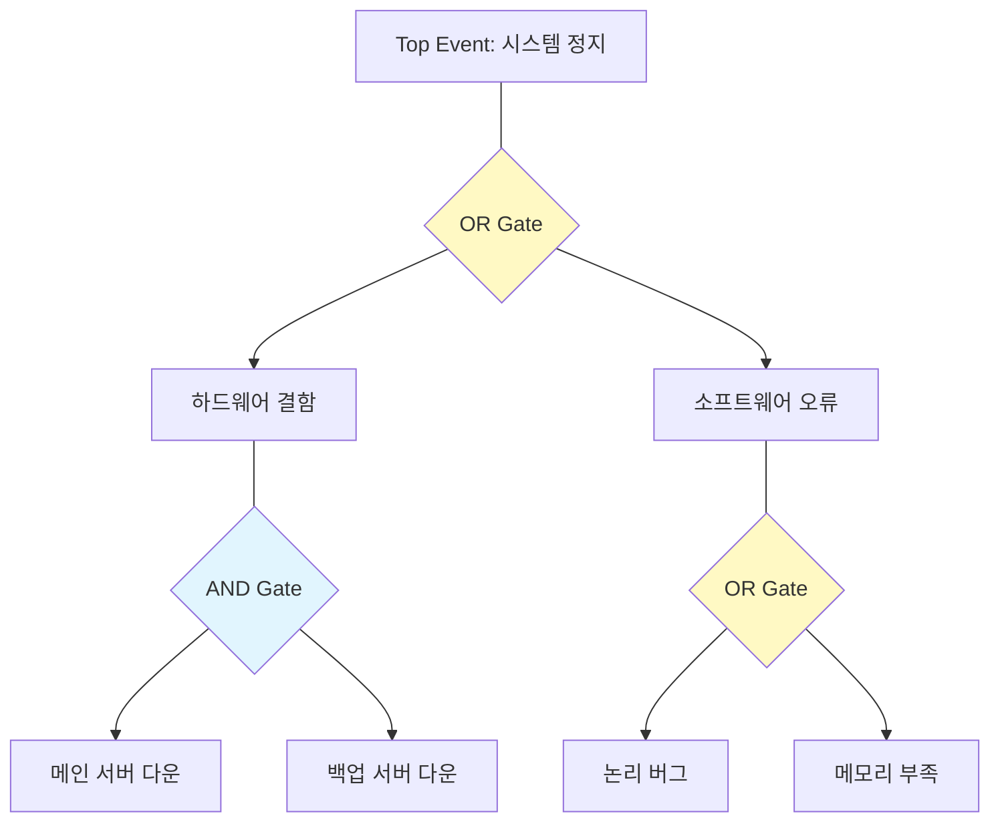

Parent: [[144.소프트웨어_안전성_분석]]

# FTA(Fault Tree Analysis)

> [!info] **FTA란?**
> 시스템의 치명적인 사고인 **정상 사상(Top Event)**을 먼저 정의하고, 그 사고를 유발할 수 있는 하위 결함 원인들을 논리 게이트(AND, OR)를 통해 계층적으로 찾아나가는 **연역적(Deductive), 하향식(Top-down)** 안전성 분석 기법입니다.

---

## 1. FTA의 개요
### 가. FTA의 정의
- 사고의 원인 시나리오를 트리 다이어그램으로 도식화하여 정성적(경로 분석) 및 정량적(발생 확률)으로 분석하는 기법

### 나. 필요성 및 특징 (Why)
1. **근본 원인 분석 (RCA)**: 복잡한 시스템 장애의 배후에 있는 기본 사상(Basic Event)을 체계적으로 식별
2. **논리적 시각화**: AND/OR 게이트를 통해 결함 간의 인과관계를 한눈에 파악 가능
3. **정량적 평가**: 각 기본 사상의 고장률을 기반으로 최종 사고 발생 확률 산출
4. **설계 개선**: 사고를 유발하는 최소 조합인 **Cut Set**을 찾아내어 취약 지점 보강

---

## 2. FTA의 메커니즘 및 구성 요소 (What & How)
### 가. 결함 트리 구조 예시 (Mermaid)

### 나. 주요 구성 요소 (입출사기부)

| 분류 | 기호 명칭 | 설명 |
| :--- | :--- | :--- |
| **사상 기호** | **정상 사상 (Top Event)** | 분석의 대상이 되는 최종 사고 |
| | **기본 사상 (Basic Event)** | 더 이상 분석할 필요가 없는 가장 기초적인 원인 |
| | **결합 사상 (Intermediate)** | 게이트로 연결된 중간 단계의 결함 상태 |
| **게이트 기호** | **AND 게이트** | 모든 하위 사상이 동시에 발생해야 상위 사상 발생 |
| | **OR 게이트** | 하위 사상 중 하나만 발생해도 상위 사상 발생 |

---

## 3. 심화: FTA 분석의 핵심 결과물
### 가. MCS (Minimal Cut Set)
- **정의**: 정상 사상을 일으키기 위한 **최소한의 기본 사상 조합**
- **활용**: MCS의 개수가 적을수록 시스템은 취약하며, MCS 내 사상들을 제거하는 것이 안전 설계의 우선순위임

### 나. MPS (Minimal Path Set)
- **정의**: 시스템의 안전성을 유지하기 위해 반드시 정상적으로 작동해야 하는 최소한의 사상 집합
- **활용**: 시스템의 신뢰도(Reliability)를 높이기 위한 핵심 경로 파악

---

## 4. 기술사적 제언 및 실무 적용 방안
### 가. 실무 수행 절차 (6단계)
1. **Top 이벤트 설정** → 2. **시스템 특성 파악** → 3. **FT 작성** → 4. **정성적 분석(MCS/MPS)** → 5. **정량적 분석(확률 산출)** → 6. **대책 수립**

### 나. 기술사적 인사이트
- **FMEA와의 상호 보완**: FMEA는 구성 요소의 고장이 전체에 미치는 영향을 보는 'Bottom-up' 방식인 반면, FTA는 사고로부터 원인을 찾는 'Top-down' 방식임. 두 기법을 병행하여 분석의 누락을 방지해야 함
- **소프트웨어 FTA (SFTA)**: 코딩 단계 이전에 설계 명세(UML 등)를 기반으로 SFTA를 수행하여 논리적 모순을 조기에 제거하는 **Shift-Left Safety** 전략이 필요함
- 결론적으로 FTA는 **'사고의 시나리오를 수학적 논리로 증명'**하여 안전 가시성을 확보하는 최고의 분석 도구임

---

## Related Notes
- [[144.소프트웨어_안전성_분석]]
- [[146.FMEA(Failure_Mode_and_Effects_Analysis)]]
- [[147.HAZOP(Hazard_and_Operability_Study)]]
