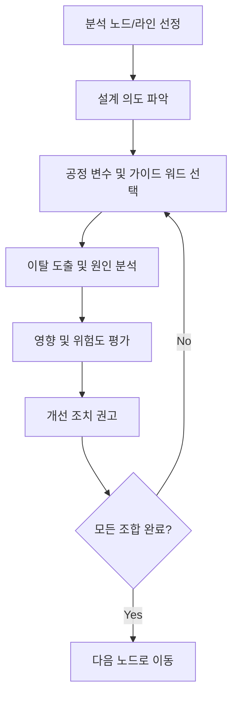

Parent: [[144.소프트웨어_안전성_분석]]

# HAZOP(Hazard and Operability Study)

> [!info] **HAZOP이란?**
> 시스템의 설계 의도에서 벗어난 **이탈(Deviation)**을 찾기 위해, 다양한 분야의 전문가들이 모여 **가이드 워드(Guide Words)**와 **공정 변수(Parameters)**의 조합을 통해 잠재적 위험과 운전상의 문제를 식별하는 브레인스토밍 기반의 분석 기법입니다.

---

## 1. HAZOP의 개요
### 가. HAZOP의 정의
- 시스템의 공정이나 로직을 노드(Node) 단위로 나누고, 표준화된 단어(Guide Words)를 적용하여 설계 한계를 탐색하는 귀납적 분석 방법

### 나. 필요성 및 배경 (Why)
1. **집단 지성 활용**: 설계자, 테스터, 운영자 등 다양한 시각에서 예상치 못한 위험 시나리오 발굴
2. **정형화된 탐색**: '없음', '증가' 등 7가지 표준 가이드 워드를 사용하여 분석의 누락 방지
3. **운전성(Operability) 개선**: 단순 안전 사고뿐만 아니라 시스템의 가동 효율을 저해하는 요소까지 식별
4. **창의적 사고**: 고정된 체크리스트를 넘어 "만약 ~한다면 어떻게 될까?"라는 질문을 통해 심층 분석

---

## 2. HAZOP의 핵심 구성 및 메커니즘 (What & How)
### 가. 이탈(Deviation) 도출 공식
- **이탈 (Deviation) = 공정 변수 (Parameter) × 가이드 워드 (Guide Word)**

| 구성 요소 | 상세 내용 | 예시 |
| :--- | :--- | :--- |
| **공정 변수** | 분석 대상의 물리적/논리적 속성 | 유량, 압력, 시간, 데이터, 신호 |
| **가이드 워드** | 설계 의도에서의 변화를 나타내는 단어 | No, More, Less, As Well As, Part Of, Reverse, Other Than |
| **이탈 (결과)** | 변수와 가이드 워드가 결합된 상태 | **No Flow (유량 없음)**, **More Time (시간 초과)** |

### 나. HAZOP 수행 프로세스 (Mermaid)

---

## 3. 심화: 7가지 표준 가이드 워드 상세
- **No (설계 의도 부정)**: 완전히 수행되지 않음 (예: 데이터 전송 없음)
- **More (양적 증가)**: 수치나 시간이 초과됨 (예: 처리 속도 과다)
- **Less (양적 감소)**: 수치나 시간이 미달됨 (예: 대역폭 부족)
- **As Well As (질적 증가)**: 설계 의도 외에 다른 부가 기능이 수행됨 (예: 불필요한 로그 생성)
- **Part Of (질적 감소)**: 설계 의도의 일부만 수행됨 (예: 패킷 일부 유실)
- **Reverse (논리적 반대)**: 설계 의도와 정반대로 수행됨 (예: 입/출력 반전)
- **Other Than (완전 대체)**: 설계 의도와 완전히 다른 일이 발생함 (예: 시스템 정지)

---

## 4. 기술사적 제언 및 실무 적용 방안
### 가. 소프트웨어 HAZOP (SHAZOP) 적용 전략
- **SW 특화 변수 선정**: 전통적인 유량/압력 대신 **메모리 할당량**, **메시지 순서**, **인증 상태** 등을 변수로 설정하여 분석의 실효성 확보
- **Agile 환경 대응**: 방대한 HAZOP 세션이 부담될 경우, 핵심 마이크로서비스 간의 **인터페이스(API)** 영역에 집중하여 경량화된 HAZOP 수행

### 나. 기술사적 인사이트
- **전문가 팀 구성(Team Composition)**: HAZOP의 성패는 분석 팀의 역량에 달려 있음. 주관자인 퍼실리테이터(Facilitator)의 역할이 매우 중요하며, 기록원(Scribe)을 통한 상세한 **HAZOP 워크시트** 관리가 필수적임
- **안전 무결성 입증**: 분석 결과 도출된 개선 권고 사항이 실제 설계에 반영되었는지 **Traceability Matrix**를 통해 추적 관리하여 규제 기관의 감사를 대비해야 함
- 결론적으로 HAZOP은 **'표준화된 가이드워드로 인간의 창의적 직관을 자극'**하여 사각지대 없는 안전을 실현하는 실전형 기법임

---

## Related Notes
- [[144.소프트웨어_안전성_분석]]
- [[146.FMEA(Failure_Mode_and_Effects_Analysis)]]
- [[101.성능_시험_결과보고서]] (병목 분석 연계)
