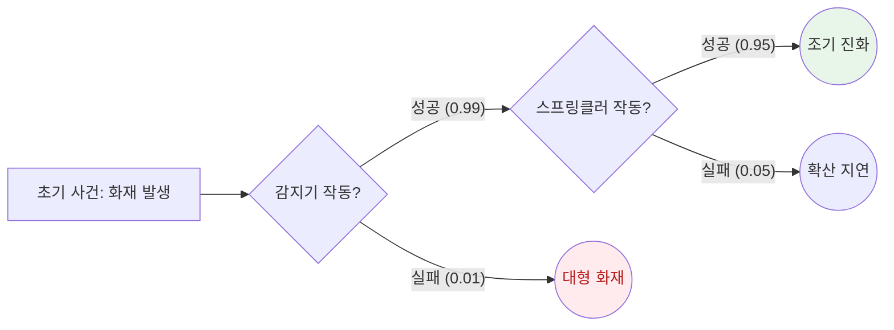

Parent: [[144.소프트웨어_안전성_분석]]

# ETA(Event Tree Analysis)

> [!info] **ETA란?**
> 시스템에 영향을 미치는 **초기 사건(Initial Event)**이 발생했을 때, 이에 대응하는 안전 장치나 보호 계층의 작동 여부(성공/실패)에 따라 전개될 수 있는 모든 시나리오와 최종 결과를 분석하는 **귀납적(Inductive), 전방향(Forward)** 위험 분석 기법입니다.

---

## 1. ETA의 개요
### 가. ETA의 정의
- 특정 사고 원인으로부터 시작하여 시스템 내의 방어 기제들이 순차적으로 어떻게 반응하는지를 트리 형태로 모델링하고, 각 경로의 발생 확률을 계산하는 방법

### 나. 필요성 및 목적 (Why)
1. **결과 시나리오 예측**: 하나의 원인이 초래할 수 있는 다양한 파국적 상황(Consequences)을 가시화
2. **안전 장치 유효성 검증**: 현재 설계된 보호 계층(Safety Barrier)이 사고 확산을 막기에 충분한지 평가
3. **정량적 리스크 평가 (QRA)**: 각 분기점의 확률을 곱하여 최종 사고 발생 빈도를 수치로 산출
4. **대응 우선순위 도출**: 가장 확률이 높거나 심각도가 큰 사고 경로를 식별하여 집중 관리

---

## 2. ETA의 메커니즘 및 분석 절차 (What & How)
### 가. 사건 전개 트리 구조 (Mermaid)

### 나. ETA 수행 6단계

| 단계 | 활동 내용 | 핵심 포인트 |
| :--- | :--- | :--- |
| **1. 초기 사건 정의** | 시스템에 위협이 되는 시작점 식별 | 예: 네트워크 단절, 센서 오류 |
| **2. 안전 기능 식별** | 사고 대응을 위한 하위 시스템/기능 나열 | 복구 로직, 알람, 다중화 장치 |
| **3. Event Tree 전개** | 각 기능의 성공(상향) / 실패(하향) 분기 수행 | 시각적 트리 생성 |
| **4. 결과 정의** | 각 경로 끝의 최종 상태 정의 | 정상 복구, 부분 마비, 시스템 붕괴 |
| **5. 확률 산출** | 각 단계별 고장률(Probability) 적용 | **정량적 수치 계산** |
| **6. 리스크 평가** | 허용 위험도(ALARP) 준수 여부 판단 | 개선 대책 수립 |

---

## 3. 심화: FTA vs ETA 비교 분석
- 기술사 답안에서 두 기법의 상호 보완성을 강조하는 것이 중요합니다.

| 비교 항목 | FTA (Fault Tree) | ETA (Event Tree) |
| :--- | :--- | :--- |
| **분석 방향** | **연역적 (결과 -> 원인)** | **귀납적 (원인 -> 결과)** |
| **핵심 질문** | "이 사고가 왜 발생했는가?" | "이 사건이 어떤 결과를 초래하는가?" |
| **논리 구조** | AND / OR 게이트 중심 | Success / Failure 분기 중심 |
| **주요 용도** | 복합적 고장 원인 분석 | 사고 시나리오 및 안전 장치 평가 |
| **상호 관계** | ETA의 각 분기점 확률을 구하기 위해 FTA 사용 가능 (**Bow-tie 모델**) |

---

## 4. 기술사적 제언 및 실무 적용 방안
### 가. 실무 적용 시 고려사항
- **조건부 확률의 이해**: 하위 안전 기능의 성공 확률은 상위 기능의 결과에 영향을 받을 수 있으므로(Common Cause Failure), 이를 고려한 정밀한 확률 모델링이 필요함
- **안전 계층 설계 (LOPA)**: ETA 분석을 통해 **방어 계층 분석(Layer of Protection Analysis)**을 수행하여, 다중 방어 체계의 적정성을 검토해야 함

### 나. 기술사적 인사이트
- **Bow-tie 모델의 완성**: 왼쪽에는 원인을 분석하는 FTA, 오른쪽에는 결과를 분석하는 ETA를 배치한 '나비넥타이' 모델을 통해 리스크의 시작부터 끝까지 전 주기적인 **위험 관리 거버넌스**를 구축해야 함
- **실시간 리스크 대시보드**: 운영 단계에서 수집되는 실제 장비의 고장률 데이터를 ETA 모델에 실시간 반영하여, 현재 시스템의 **사고 발생 기대값**을 상시 모니터링하는 지능형 안전 관리로 발전해야 함
- 결론적으로 ETA는 **'단일 고장이 재앙으로 진화하는 경로를 차단'**하는 방어 전략의 핵심 설계 도구임

---

## Related Notes
- [[144.소프트웨어_안전성_분석]]
- [[145.FTA(Fault_Tree_Analysis)]]
- [[132.SW_신뢰성과_가용성]]
- [[116.카오스_테스트(Chaos_Test)]]
