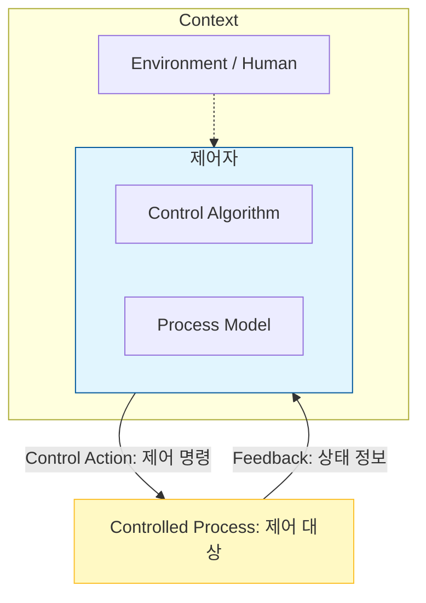

Parent: [[144.소프트웨어_안전성_분석]]

# STPA(System-Theoretic Process Analysis)

> [!info] **STPA란?**
> MIT의 낸시 레브슨(Nancy Leveson) 교수가 제안한 **STAMP(System-Theoretic Accident Model and Processes)** 모델 기반의 위험 분석 기법입니다. 개별 부품의 고장보다는 **구성 요소 간의 부적절한 상호작용**이나 **제어(Control)**의 실패를 사고의 근본 원인으로 보고 시스템 전체 관점에서 위험을 식별합니다.

---

## 1. STPA의 개요
### 가. STPA의 정의
- 시스템을 제어 루프(Control Loop)의 집합으로 모델링하고, 제어 명령이 안전하지 않게 전달되는 상황(UCA)을 분석하여 안전 요구사항을 도출하는 기법

### 나. 등장 배경 및 필요성 (Why)
1. **복잡한 시스템 대응**: 하드웨어 고장이 없어도 SW 로직의 설계 미흡이나 컴포넌트 간 상호작용 오류로 사고가 발생하는 현대 시스템의 특징 반영
2. **전통적 기법의 한계**: FTA/FMEA는 부품 고장에 집중하여, 복잡한 SW 비즈니스 로직이나 휴먼 에러에 의한 사고 분석에 한계 존재
3. **제어계 관점 분석**: 시스템을 구성 요소의 합이 아닌 **제어와 피드백의 유기적 관계**로 파악하여 구조적 위험 식별
4. **자율주행 및 로보틱스**: 수많은 센서와 알고리즘이 결합된 고도의 자동화 시스템 안전성 보장을 위한 필수 기법

---

## 2. STPA의 핵심 메커니즘 및 프로세스 (What & How)
### 가. 계층적 제어 구조 (Control Structure) 도식화 (Mermaid)

### 나. STPA 수행 4단계

| 단계 | 활동 내용 | 핵심 산출물 |
| :--- | :--- | :--- |
| **1. 사고 및 위험 정의** | 시스템 수준의 손실(Loss)과 위험(Hazard) 정의 | 분석 범위 확정 |
| **2. 제어 구조 도식화** | 제어자, 제어 대상, 명령, 피드백 관계를 모델링 | **Control Structure** |
| **3. 불안전 제어 행동 도출** | 위험을 유발하는 부적절한 제어 명령 식별 | **UCA (Unsafe Control Action)** |
| **4. 원인 시나리오 분석** | UCA가 발생하는 구체적인 원인(시나리오) 분석 | 안전 요구사항 도출 |

---

## 3. 심화: UCA(Unsafe Control Action)의 4가지 유형
- 사고를 유발하는 제어 명령의 잘못된 형태를 체계적으로 분류합니다.

1. **Not Providing**: 필요한 제어 명령이 제공되지 않아 위험 발생 (예: 제동 명령 미발생)
2. **Providing Causes Hazard**: 부적절한 제어 명령이 제공되어 위험 발생 (예: 주행 중 문 열림)
3. **Wrong Timing / Order**: 너무 빨리, 너무 늦게, 또는 잘못된 순서로 제공됨 (예: 에어백 지연 전개)
4. **Stopped Too Soon / Applied Too Long**: 너무 일찍 중단되거나 너무 오래 지속됨 (예: 급발진)

---

## 4. 기술사적 제언 및 실무 적용 방안
### 가. 실무 적용 시 고려사항
- **시스템 사고(System Thinking)**: 분석가는 개별 모듈의 기능에 매몰되지 않고, "시스템 전체가 어떻게 안전을 유지하는가"에 대한 거시적 관점을 유지해야 함
- **반복적 정교화**: 설계 초기 단계에서 시작하여 상세 설계가 진행됨에 따라 제어 구조를 점진적으로 구체화하는 프로세스 필요

### 나. 기술사적 인사이트
- **SOTIF(ISO 21448)와의 연계**: 자율주행의 '의도된 기능의 안전성(SOTIF)' 분석 시, 고장이 아닌 환경적 제약이나 알고리즘의 한계를 식별하는 데 STPA가 가장 최적화된 도구로 사용됨
- **인간-시스템 상호작용 (HCI)**: STPA는 제어 루프에 '인간 운전자'를 포함하여 분석할 수 있으므로, 휴먼 에러에 의한 대형 사고 예방에 탁월함
- 결론적으로 STPA는 **'부품의 신뢰성을 넘어 구조적 안전성을 설계'**하는 현대 소프트웨어 공학의 정수이며, 복잡성이라는 파고를 넘기 위한 기술사의 필수 무기임

---

## Related Notes
- [[144.소프트웨어_안전성_분석]]
- [[062.소프트웨어_아키텍처(Software_Architecture)]]
- [[110.퍼지_이론(Fuzzy_Theory)]] (모호한 상황의 제어)
- [[140.ASPICE(Automotive_SPICE)]]
