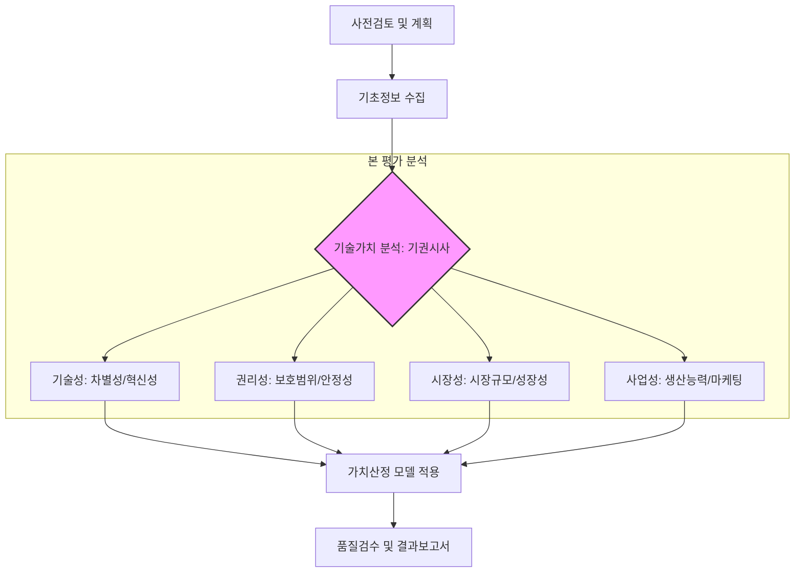

Parent: [[IT_투자성과_분석]] (유관 도메인)

# 기술가치평가

> [!info] **기술가치평가란?**
> 사업화 대상 기술이 창출하는 경제적 가치를 **화폐 금액**으로 산출하는 활동입니다. 기술이전, 출자지분 결정, 담보 설정 등을 목적으로 하며, **기술성, 권리성, 시장성, 사업성** 분석을 바탕으로 수익, 시장, 비용 관점에서 가치를 산정합니다.

---

## 1. 기술가치평가의 개요
### 가. 기술가치평가의 정의
- 특정 기술이 미래에 창출할 수 있는 유무형의 가치를 화폐가치로 환산하여 적정 기술료(Royalty)나 기술 경쟁력을 객관화하는 공학적/경제적 정량화 기법

### 나. 등장 배경 및 필요성 (Why)
1. **기술 사업화 지원**: 기술이전 시 적정한 거래 가격(Price)을 산출하여 이해관계자 간의 원활한 합의 지원
2. **IP 금융 활성화**: 지식재산(IP)을 담보로 자금을 조달하거나 기술 기반의 투자를 유치하기 위한 객관적 근거 필요
3. **R&D 효율성 제고**: 투자 대비 가치(NPV)를 사전에 분석하여 연구개발 과제의 우선순위를 결정하고 자원 배분을 최적화
4. **전략적 의사결정**: M&A, 기술 제휴, 특허 분쟁 시 손해배상액 산정 등 기업 거버넌스의 기초 자료로 활용

---

## 2. 기술가치평가 프로세스 및 핵심 분석 요소 (What & How)
### 가. 기술가치평가 수행 절차 (Mermaid)

### 나. 4대 분석 요소 (기권시사)

| 구분 | 주요 분석 항목 | 핵심 포인트 |
| :--- | :--- | :--- |
| **기술성 (Tech)** | 기술의 모방 난이도, 혁신성, 유용성, 확장성 | 해당 기술이 기술적으로 얼마나 우월한가 |
| **권리성 (Rights)** | 특허권의 범위, 법적 안정성, 침해 회피 가능성 | 법적으로 독점적인 지위를 보장받는가 |
| **시장성 (Market)** | 시장 규모, 진입 장벽, 경쟁 구도, 성장 주기 | 기술이 적용될 시장이 매력적인가 |
| **사업성 (Business)** | 사업화 주체의 역량, 자금 동원력, 생산/판매 인프라 | 실제로 돈을 벌 수 있는 실행력이 있는가 |

---

## 3. 심화: 기술가치평가의 3대 접근법 비교
### 가. 가치 산정 모델 상세 분석 (수시비)

| 접근법 | 주요 모델 | 적용 원리 | 장단점 |
| :--- | :--- | :--- | :--- |
| **수익접근법 (Income)** | **DCF**, **로열티공제법**, 실물옵션 | 미래 예상 수익을 현재 가치로 환산 | 가장 널리 쓰이나, 미래 추정의 주관성 개입 |
| **시장접근법 (Market)** | 거래사례비교법, 경매 기법 | 유사 기술의 시장 거래 가격과 비교 | 객관성이 높으나, 유사 사례 확보가 어려움 |
| **비용접근법 (Cost)** | 재생산원가법, 역사적원가법 | 기술 개발에 투입된 총 비용 합산 | 산출이 쉬우나, 기술의 미래 가치를 반영 못함 |

### 나. 수익접근법의 핵심 산식
- **기술가치 = $\sum \frac{FCF \times 기술기여도}{(1+r)^n}$**
    - **FCF (Free Cash Flow)**: 기술로 인해 발생하는 잉여현금흐름
    - **기술기여도**: 전체 수익 중 순수하게 기술이 기여한 비율 (산업별 가중치 적용)
    - **r (Discount Rate)**: 할인율 (WACC 등을 고려한 리스크 반영율)

---

## 4. 기술사적 제언 및 실무 적용 방안
### 가. 평가의 객관성 및 신뢰성 확보 방안
1. **민감도 분석 (Sensitivity Analysis)**: 할인율이나 시장 점유율 등 주요 변동 요인에 따른 가치 변화 범위를 제시하여 불확실성 관리
2. **다각적 기법 적용**: 수익접근법을 기본으로 하되, 실물옵션법(Real Options) 등을 병행하여 기술의 유연한 가치(Flexibility Value)를 반영

### 나. 기술사적 인사이트
- **데이터 기반 평가 (AI-based Valuation)**: 최근에는 빅데이터와 머신러닝을 활용하여 유사 특허의 거래 정보를 분석하고, 가치를 자동 추정하는 **지능형 가치평가 시스템**이 도입되고 있음
- **Open Innovation과의 결합**: 기술가치평가는 단순한 가격 산출을 넘어, 기업 외부에 존재하는 혁신 기술을 발굴하고 도입하는 **오픈 이노베이션** 전략의 핵심 판단 준거로 활용되어야 함
- 결론적으로 기술가치평가는 **'무형의 지식을 유형의 자산으로 정립'**하여 기술 패권 시대의 지속 가능한 성장 동력을 확보하는 경제 공학의 핵심임

---

## Related Notes
- [[125.재사용(Reuse)]]
- [[058.오픈소스_소프트웨어(OSS)]]
- [[IT_ROI_분석]]
