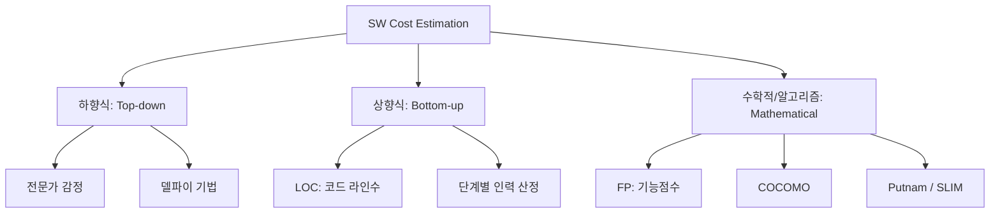

Parent: [[150.기술가치평가]] (유관 도메인)

# 소프트웨어 비용 산정 모델

> [!info] **소프트웨어 비용 산정이란?**
> 소프트웨어의 규모(Size)를 파악하고 이를 바탕으로 투입 인력(Effort), 자원, 기간(Schedule)을 예측하여 실행 가능한 프로젝트 계획을 수립하는 활동입니다. 투명한 비용 산정은 프로젝트의 성공적인 거버넌스와 수익성 확보의 기초가 됩니다.

---

## 1. 소프트웨어 비용 산정의 개요
### 가. 비용 산정의 정의
- 소프트웨어 개발에 소요되는 비용을 인건비, 직접비, 간접비 등으로 구분하여 객관적인 수치로 도출하는 정량화 프로세스

### 나. 비용 산정의 중요성 (Why)
1. **의사결정 지원**: 프로젝트 추진 여부(Go/No-Go) 및 우선순위 결정을 위한 근거 제공
2. **리스크 완화**: 과소 산정(Underestimation)으로 인한 품질 저하 및 일정 지연 방지
3. **자원 최적화**: 한정된 인적/물적 자원을 효율적으로 배분하여 프로젝트 생산성 극대화
4. **계약의 공정성**: 발주자와 공급자 간의 명확한 비용 기준을 제시하여 상호 신뢰 구축

---

## 2. 비용 산정 기법의 분류 및 메커니즘 (What & How)
### 가. 비용 산정 기법 체계도 (Mermaid)

### 나. 주요 기법별 특징 비교 분석

| 분류 | 주요 기법 | 산정 방식 | 특징 |
| :--- | :--- | :--- | :--- |
| **하향식** | **델파이 (Delphi)** | 여러 전문가의 의견을 수렴하여 합의 | 주관적일 수 있으나 경험적 통찰 반영 |
| **상향식** | **LOC (Line of Code)** | 세부 기능별 코드 라인 수 합산 | 산출이 쉬우나 구현 언어에 의존적임 |
| | **Man-Month** | 1인당 월평균 작업량 기준 | 가장 직관적이나 숙련도 차이 반영 미흡 |
| **수학적** | **FP (Function Point)** | 사용자 요구 기능의 양과 복잡도 측정 | **국제 표준(ISO)**, 구현 기술과 독립적 |
| | **COCOMO** | 소프트웨어 규모에 따른 가중치 적용 | 보헤(Boehm) 제시, 규모별 3단계 모델 |

---

## 3. 심화: 상향식 산정의 핵심 산식
### 가. LOC(Line of Code) 예측치 산정
- 낙관치(Optimistic), 기대치(Most Likely), 비관치(Pessimistic)를 활용한 3점 추정법(PERT 방식) 적용
- **예측치 ($E$) = $\frac{Optimistic + 4 \times Most\ Likely + Pessimistic}{6}$**

### 나. Man-Month 기반 개발 기간 산출
- **총 투입 공수 (M/M)** = $\sum (세부\ 기능별\ 소요\ M/M)$
- **개발 기간 (TDEV)** = $\frac{M/M}{투입\ 인원}$ (단, '브룩스의 법칙'에 의해 인원 증가가 기간 단축과 정비례하지 않음)

---

## 4. 기술사적 제언 및 실무 적용 방안
### 가. 실무 적용 시 고려사항
1. **기법의 복합 적용**: 하나의 기법에 의존하기보다 하향식(경험)과 수학적 모델(정량)을 교차 검증(Cross-check)하여 신뢰도 향상
2. **데이터 자산화**: 과거 프로젝트의 실적 데이터를 레포지토리에 저장하여 조직 특성에 맞는 **보정 계수**를 지속적으로 업데이트해야 함

### 나. 기술사적 인사이트
- **Agile Estimation의 부상**: 고전적 기법 외에 **스토리 포인트(Story Point)**나 **플래닝 포커(Planning Poker)**를 통한 상대적 규모 산정이 현대적 개발 환경에서 더 효과적일 수 있음
- **브룩스의 법칙(Brooks' Law)**: "지체되는 소프트웨어 개발 프로젝트에 인력을 추가하는 것은 개발을 더 지연시킨다."는 원리를 인지하고, 단순 수치 계산 이상의 매니지먼트 역량 발휘 필요
- 결론적으로 비용 산정은 **'숫자를 만드는 행위가 아니라 프로젝트의 불확실성을 관리 가능한 범위로 좁히는 과정'**임

---

## Related Notes
- [[152.McCabe_회전_복잡도]]
- [[154.기능점수(Function_Point)]]
- [[155.COCOMO_및_Putnam_모델]]
- [[024.폭포수_모델(Waterfall_Model)]]
