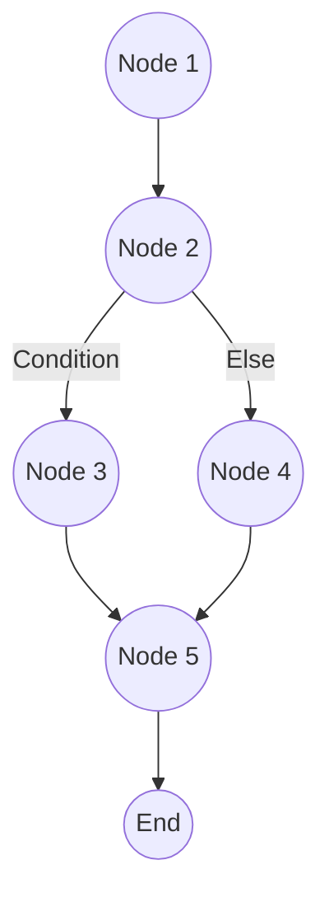

Parent: [[090.화이트박스_테스트(White-box_Testing)]]

# McCabe 회전 복잡도(Cyclomatic Complexity)

> [!info] **McCabe 회전 복잡도란?**
> 소프트웨어의 논리적인 복잡도를 정량적으로 측정하기 위해 토마스 맥케이브(Thomas McCabe)가 제안한 지표입니다. 프로그램의 **제어 흐름 그래프(Control Flow Graph)**를 기반으로 실행 경로의 수를 계산하며, 테스트 케이스의 최소 수와 유지보수 난이도를 판단하는 기준이 됩니다.

---

## 1. McCabe 회전 복잡도의 개요
### 가. 회전 복잡도의 정의
- 프로그램 내의 독립적인 경로(Linearly Independent Paths)의 개수를 수치화한 구조적 복잡도 메트릭

### 나. 필요성 및 배경 (Why)
1. **테스트 설계 지표**: **화이트박스 테스트** 시 모든 경로를 검증하기 위한 최소 테스트 케이스(TC) 수 결정
2. **유지보수성 평가**: 복잡도가 높을수록 코드 이해가 어렵고 수정 시 Side Effect 발생 확률 증가
3. **결함 예방**: 복잡도가 임계치를 넘는 모듈을 식별하여 선제적인 **리팩토링** 유도
4. **품질 거버넌스**: 정량적 지표를 통해 개발 생산성과 품질 간의 균형점 제시

---

## 2. 회전 복잡도 측정 메커니즘 (What & How)
### 가. 제어 흐름 그래프(CFG) 기반 측정 (Mermaid)

> [!tip] 위 그래프에서 $V(G) = 영역 수 + 1$ 또는 $Edge - Node + 2$ 방식을 적용함

### 나. 3가지 산출 공식 (영화조)

| 측정 방식 | 공식 | 상세 설명 |
| :--- | :--- | :--- |
| **면적(Region) 기준** | **$V(G) = R$** | 그래프에 의해 나뉘는 평면의 영역 수 (외부 영역 포함) |
| **간선/노드 기준** | **$V(G) = E - N + 2$** | $E$: 간선(Edge) 수, $N$: 노드(Node) 수 |
| **의사결정(Predicate) 기준** | **$V(G) = P + 1$** | $P$: 조건문(If, While 등)의 개수 |

---

## 3. 심화: 복잡도 수치에 따른 품질 가이드라인
- 일반적으로 수용 가능한 복잡도 임계치는 **10**으로 설정합니다.

| 복잡도 수치 | 평가 상태 | 리스크 수준 |
| :--- | :--- | :--- |
| **1 ~ 10** | 단순한 프로그램 | 리스크 낮음, 안정적 |
| **11 ~ 20** | 다소 복잡함 | 리스크 보통, 관리 필요 |
| **21 ~ 50** | 매우 복잡함 | **리스크 높음**, 리팩토링 강력 권고 |
| **50 초과** | 테스트 불가능 | 극도로 위험, 분할 필수 |

---

## 4. 기술사적 제언 및 실무 적용 방안
### 가. 실무 적용 시 활용 전략
1. **단위 테스트 자동화 연계**: 회전 복잡도 수치를 해당 모듈의 **기초 경로 테스팅(Basis Path Testing)** 목표치로 설정하여 테스트 누락 방지
2. **정적 분석 도구 통합**: CI 파이프라인(SonarQube 등)에서 복잡도 임계치를 설정하고, 이를 초과하는 코드는 **Quality Gate**에서 차단

### 나. 기술사적 인사이트
- **응집도와 복잡도의 상관관계**: 복잡도가 높다는 것은 하나의 함수가 너무 많은 일을 하고 있다는 증거임. 이는 **단일 책임 원칙(SRP)** 위배와 직결되므로 구조적 개선이 동반되어야 함
- **MC/DC와의 시너지**: 고신뢰성 시스템에서는 단순 회전 복잡도를 넘어, 조건문 내부의 개별 조건까지 검증하는 **MC/DC** 커버리지를 함께 관리하여 품질의 완결성 확보
- 결론적으로 McCabe 복잡도는 **'소프트웨어의 뇌 용량'**을 측정하는 지표이며, 이를 적절히 제어하는 것이 기술 부채를 방지하는 지름길임

---

## Related Notes
- [[090.화이트박스_테스트(White-box_Testing)]]
- [[099.MC_DC(Modified_Condition_Decision_Coverage)]]
- [[127.소프트웨어_리팩토링(Refactoring)]]
- [[128.클린_코드(Clean_Code)]]
