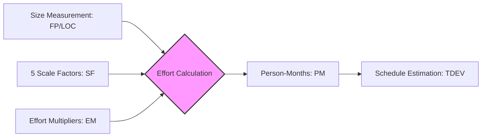

Parent: [[154.COCOMO_I]]

# COCOMO II

> [!info] **COCOMO II 란?**
> 기존 COCOMO I의 한계를 극복하고 **객체지향 방법론, 재사용, 4세대 언어(4GL)** 등 현대적 개발 환경을 수용하기 위해 배리 보헤가 1995년에 발표한 차세대 비용 산정 모델입니다. 개발 단계에 따라 3단계의 정교화된 모델을 제공하는 것이 특징입니다.

---

## 1. COCOMO II의 개요 및 진화
### 가. COCOMO II의 정의
- 프로젝트의 진행 단계별 가용 정보량에 따라 규모 산정 방식을 달리하여 예측의 정확도를 높인 다단계 비용 산정 모델

### 나. COCOMO I 대비 주요 변화 (Why)
1. **규모 측정의 다양화**: LOC 외에 **기능점수(FP)**와 **객체점수(Object Point)** 수용
2. **규모 계수(Scale Factors)** 도입: 프로젝트의 비선형적 복잡도를 5개 요인으로 정교하게 관리
3. **현대적 공정 반영**: 나선형 모델, 프로토타이핑, 상용 컴포넌트(COTS) 재사용 고려

---

## 2. COCOMO II의 3단계 모델 (What & How)
### 가. 개발 단계별 모델링 구조 (초개설)

| 모델명 | 적용 시점 | 규모 측정 단위 | 특징 |
| :--- | :--- | :--- | :--- |
| **Application Composition** | 개발 초기 (프로토타이핑) | **객체점수 (Object Point)** | 화면, 보고서, 4GL 컴포넌트 수 기준 |
| **Early Design** | 설계 초기 (아키텍처 확정 전) | **기능점수 (Function Point)** | 7가지 노력 승수(EM) 적용 |
| **Post Architecture** | 설계 완료 후 (구현 단계) | **LOC** 또는 **FP** | 17가지 상세 노력 승수 적용 (가장 정밀) |

### 나. COCOMO II 산정 프로세스 (Mermaid)

---

## 3. 심화: COCOMO II의 핵심 파라미터 (Deep-dive)
### 가. 5개 규모 계수 (Scale Factors, SF) - 비선형적 복잡도
- **PREC**: 프로젝트 선행 경험 (Precedentedness)
- **FLEX**: 개발 유연성 (Development Flexibility)
- **RESL**: 아키텍처 및 위험 해결 (Architecture/Risk Resolution)
- **TEAM**: 팀 응집도 (Team Cohesion)
- **PMAT**: 프로세스 성숙도 (Process Maturity)

### 나. 노력 승수 (Effort Multipliers, EM)
- 제품 속성(RELY, DATA 등), 플랫폼 속성(TIME, STOR), 인사 속성(ACAP, PCAP 등), 프로젝트 속성(TOOL, SITE) 등 총 17개 지표로 구성 (Post-Architecture 모델 기준)

---

## 4. 기술사적 제언 및 실무 적용 방안
### 가. 실무 적용 시 고려사항
1. **단계별 전이(Transition)**: 프로젝트 초기에는 객체점수로 대략적인 규모를 파악하고, 설계가 진행됨에 따라 기능점수와 LOC로 점진적으로 정밀도를 높여야 함
2. **도구 활용**: 파라미터가 방대하므로 전문 산정 도구(COCOMO II Tool 등)를 활용하여 정합성 확보

### 나. 기술사적 인사이트
- **Agile과의 정렬**: COCOMO II의 'Early Design' 단계는 애자일의 **반복적 추정**과 일맥상통함. 스프린트가 반복될수록 데이터가 축적되어 예측력이 강화됨
- **디지털 전환(DX) 시대의 비용**: 이제는 단순 코딩량보다 **API 통합** 및 **클라우드 설정** 비용이 커지고 있으므로, COCOMO II의 비용 동인 중 **'Platform'**과 **'Reuse'** 가중치를 재설계해야 함
- 결론적으로 COCOMO II는 **'불확실성을 점진적으로 제거해 나가는 동적 비용 관리 체계'**이며, 아키텍처 기반의 품질 관리를 지원하는 강력한 프레임워크임

---

## Related Notes
- [[154.COCOMO_I]]
- [[151.소프트웨어_비용_산정_모델]]
- [[150.기술가치평가]]
- [[026.나선형_모델(Spiral_Model)]]
