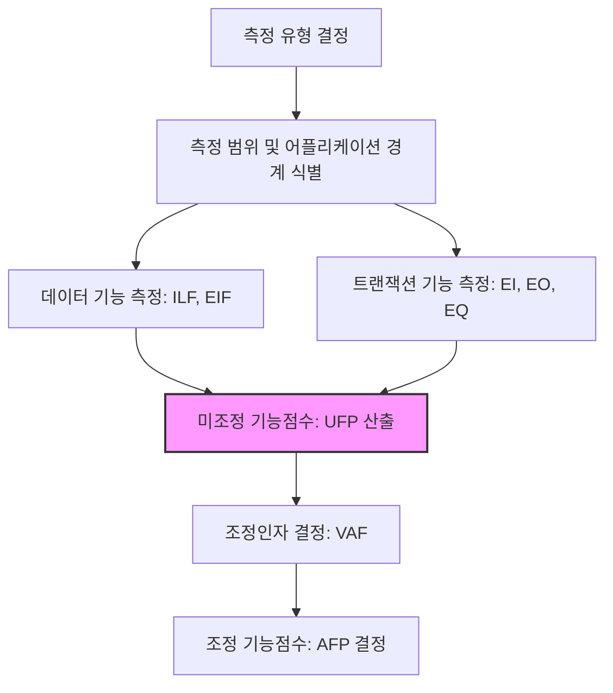

Parent: [[151.소프트웨어_비용_산정_모델]]

# 기능점수(Function Point)

> [!info] **기능점수(FP)란?**
> 사용자 관점에서 소프트웨어가 제공하는 기능을 정량적으로 측정하여 규모를 산정하는 기법입니다. **ISO/IEC 14143**에서 표준화된 프레임워크를 정의하며, 구현 기술이나 언어에 독립적으로 소프트웨어의 논리적 크기를 측정하는 것이 핵심입니다.

---

## 1. 기능점수의 개요
### 가. 기능점수의 정의
- 소프트웨어의 각 기능에 대해 사용자 요구사항을 기반으로 복잡도 가중치를 부여하여 합산한 정량적 규모 지표

### 나. 등장 배경 및 필요성 (Why)
1. **기술 독립성**: LOC와 달리 Java, Python, Low-code 등 개발 언어에 관계없이 동일한 기능은 동일한 점수로 산출
2. **사용자 관점**: 개발자의 구현 로직이 아닌 사용자가 체감하는 비즈니스 가치(입력, 출력 등)를 기준으로 측정
3. **SDLC 전 주기 활용**: 요구분석 단계부터 유지보수 단계까지 일관된 척도로 규모 및 생산성 관리
4. **객관적 대가산정**: 공공 소프트웨어 사업 등에서 발주자와 공급자 간의 합리적인 계약 기준 제공

---

## 2. 기능점수 측정 프로세스 및 구성 요소 (What & How)
### 가. 기능점수 산정 절차 (Mermaid)

### 나. 기능점수 5대 구성 요소 (Data & Transaction)

| 분류 | 기능 유형 | 설명 | 주요 예시 |
| :--- | :--- | :--- | :--- |
| **데이터 기능** | **ILF (Internal Logical File)** | 애플리케이션 내부에서 유지되는 논리적 파일 | 내부 DB 테이블, 마스터 파일 |
| | **EIF (External Interface File)** | 타 시스템에서 참조만 하는 논리적 파일 | 외부 연계 DB, API 연동 데이터 |
| **트랜잭션 기능** | **EI (External Input)** | 외부에서 데이터가 유입되어 ILF를 변경함 | 등록, 수정, 삭제, 설정 변경 |
| | **EO (External Output)** | 계산 로직이나 파생 데이터를 포함하여 출력 | 집계 보고서, 환율 적용 결과 조회 |
| | **EQ (External Query)** | 단순 조회 및 리스트 출력 (로직 미포함) | 게시판 목록, 단순 마스터 조회 |

---

## 3. 심화: 조정인자(VAF) 및 국내 산정 기준
### 가. 조정인자 결정 (IFPUG 방식 vs 국내 방식)
- **IFPUG VAF**: 14가지 시스템 특성(데이터 통신, 분산 처리 등)에 대해 0~5점 부여
- **국내(SW사업 대가산정 가이드)**: 규모, 유형, 품질, 언어 보정계수 적용 (주로 300FP 이상 프로젝트)

### 나. 비용 산출 메커니즘
- **SW 개발비 = 기능점수(AFP) × 기능점수당 단가**
- 최종 개발비 = SW 개발비 + 직접경비 + 이윤(25%)

---

## 4. 기술사적 제언 및 실무 적용 방안
### 가. 기능점수 산정 시 유의사항
1. **경계(Boundary) 설정의 중요성**: 어플리케이션 간의 경계를 어떻게 설정하느냐에 따라 ILF가 EIF가 될 수 있으므로, 초기 분석 단계에서 명확한 시스템 경계 정의가 필수적임
2. **물리적 DB vs 논리적 파일**: DB의 물리적 테이블 개수가 아닌 사용자가 인지하는 '논리적 레코드 그룹' 단위로 측정해야 함

### 나. 기술사적 인사이트
- **SaaS 및 Cloud 환경의 FP**: 현대적 환경에서는 서버리스나 마이크로서비스 간 연동 비중이 높으므로 **EIF(외부 인터페이스)**의 비중과 복잡도 산정 기준이 더욱 정밀해져야 함
- **자동화 도구(CASE) 활용**: 수작업 산정은 오차가 크므로 소스 코드나 설계서를 분석하여 자동으로 FP를 추출하는 도구를 활용하여 객관성을 확보해야 함
- 결론적으로 기능점수는 **'소프트웨어의 경제적 크기를 규정하는 표준 잣대'**이며, 이를 기반으로 한 **데이터 기반 프로젝트 관리(Metric-based Mgmt)**가 고도화되어야 함

---

## Related Notes
- [[157.기능점수_산정_기법(간이법_및_정규법)]]
- [[151.소프트웨어_비용_산정_모델]]
- [[057.요구사항_명세서(SRS)_및_IEEE830]]
