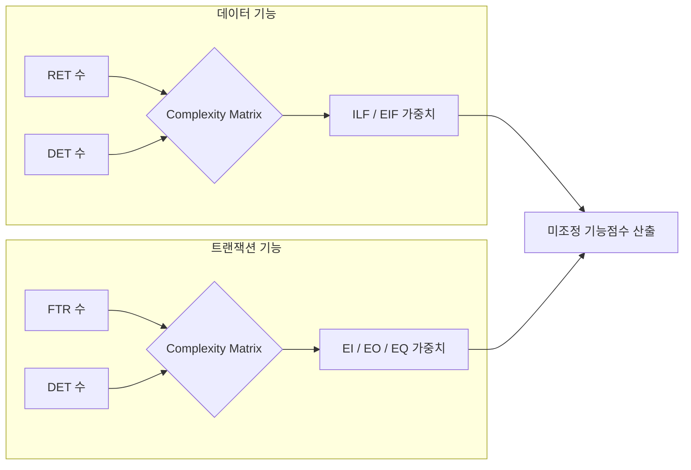

Parent: [[156.기능점수(Function_Point)]]

# 기능점수 산정 기법(간이법 및 정규법)

> [!info] **간이법과 정규법이란?**
> 기능점수를 산정하는 상세 수준에 따른 두 가지 방식입니다. **간이법(Estimated Method)**은 프로젝트 초기 불확실한 상황에서 평균 복잡도를 적용하여 신속하게 산정하고, **정규법(Detailed Method)**은 설계가 완료된 시점에 각 기능의 세부 속성을 분석하여 정밀하게 측정합니다.

---

## 1. 기능점수 산정 기법의 개요
### 가. 두 기법의 정의
- **간이법**: 요구사항 명세가 상세하지 않은 단계에서 기능 유형별 평균 복잡도 가중치를 적용하여 규모를 추정하는 방식
- **정규법**: 논리적 설계 산출물을 바탕으로 데이터 요소(DET)와 참조 파일(FTR/RET) 수를 파악하여 개별 기능의 복잡도를 결정하는 방식

### 나. 비교의 필요성 (Why)
1. **의사결정 시점 차이**: 예산 수립 단계(간이법)와 실제 발주 및 정산 단계(정규법)의 요구되는 정밀도 상이
2. **관리 효율성**: 모든 기능을 정밀 분석하기에는 시간과 비용이 과다하므로, 프로젝트 성격에 맞는 전략적 선택 필요

---

## 2. 간이법 vs 정규법 상세 비교 (What & How)
### 가. 산정 방식 및 프로세스 (Comparison)

| 구분 | 간이법 (Estimated) | 정규법 (Detailed) |
| :--- | :--- | :--- |
| **적용 시점** | 기획, 예산 편성, 분석 초기 | 설계 완료 후, 구현 및 종료 단계 |
| **기초 자료** | 사용자 요구사항 정의서, 기능 목록 | ERD, 클래스 다이어그램, UI 설계서 |
| **가중치 적용** | 기능 유형별 **평균 가중치** 고정 적용 | **복잡도 매트릭스**에 의한 차등 적용 |
| **정확도** | 상대적으로 낮음 (오차 ±10~15%) | 매우 높음 |

### 나. 정규법 복잡도 결정 매커니즘 (Mermaid)

---

## 3. 심화: 정규법의 핵심 식별 요소 (DET, RET, FTR)
### 가. 데이터 기능의 복잡도 요소
- **DET (Data Element Type)**: 사용자가 식별 가능한 유일한 필드 (e.g., 성명, 주소)
- **RET (Record Element Type)**: ILF/EIF 내에서 사용자가 식별 가능한 하부 데이터 그룹 (e.g., 사원정보 테이블 내의 부서정보 그룹)

### 나. 트랜잭션 기능의 복잡도 요소
- **FTR (File Type Reference)**: 기능을 수행하기 위해 참조하거나 갱신하는 논리적 파일(ILF/EIF)의 수
- **DET**: 입출력 화면에서 사용자가 입력하거나 출력받는 유일한 필드 수

### 다. 복잡도 가중치 예시 (IFPUG 기준)

| 기능 유형 | 낮음 (Low) | 보통 (Average) | 높음 (High) |
| :--- | :---: | :---: | :---: |
| **ILF** | 7 | 10 | 15 |
| **EIF** | 5 | 7 | 10 |
| **EI** | 3 | 4 | 6 |
| **EO** | 4 | 5 | 7 |
| **EQ** | 3 | 4 | 6 |

---

## 4. 기술사적 제언 및 실무 적용 방안
### 가. 실무 적용 시나리오 (Hybrid Strategy)
- **예산 편성 시**: 간이법으로 산정한 후 리스크 관리를 위해 일정 비율의 예비비 편성
- **정산 시**: 반드시 정규법을 통해 실제 구현된 기능의 가치를 확정하고, 차이 발생 시 원인을 분석하여 데이터 자산화

### 나. 기술사적 인사이트
- **자동화의 역설**: 정규법은 정밀하지만 수작업 시 비용이 크므로, 요구사항이나 모델링 도구(Enterprise Architect 등)와 연동하여 **DET/FTR을 자동 식별**하는 체계를 갖추는 것이 진정한 공학적 접근임
- **Agile 환경의 기능점수**: 스프린트마다 기능이 점진적으로 추가되는 애자일에서는 간이법을 활용하여 **속도(Velocity)**를 측정하고, 릴리스 시점에 정규법으로 최종 규모를 확정하는 방식이 효과적임
- 결론적으로 두 기법은 **'속도와 정확도의 상충 관계(Trade-off)'**를 관리하는 도구이며, 상황에 맞는 유연한 적용 능력이 프로젝트 관리자의 핵심 역량임

---

## Related Notes
- [[156.기능점수(Function_Point)]]
- [[151.소프트웨어_비용_산정_모델]]
- [[042.개발_방법론_테일러링(Tailoring)]]
