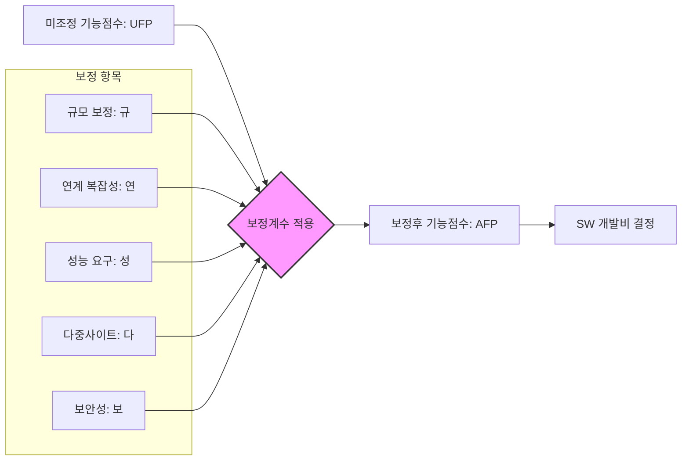

Parent: [[156.기능점수(Function_Point)]]

# 애플리케이션 복잡도 보정계수

> [!info] **애플리케이션 복잡도 보정계수란?**
> 소프트웨어 개발비 산정 시, 미조정 기능점수(UFP)에 프로젝트의 특수성 및 비기능적 요구사항의 난이도를 반영하여 실질적인 개발 공수와 비용을 현실화하기 위해 곱해주는 계수입니다. 국내 **'SW사업 대가산정 가이드'**에서는 **연규성다보**의 5대 요소를 핵심 보정 요인으로 정의합니다.

---

## 1. 보정계수의 개요 및 필요성
### 가. 보정계수의 정의
- 소프트웨어의 단순한 기능적 크기(Size) 외에 개발 난이도에 영향을 미치는 기술적, 환경적 요인을 수치화하여 최종 기능점수를 산출하는 보정 수단

### 나. 필요성 (Why)
1. **대가의 현실화**: 동일한 기능이라도 높은 보안성이나 성능이 요구될 경우 투입되는 추가 공수를 비용에 반영
2. **리스크 분산**: 연계 시스템이 많거나 다중 사이트 운영 등 복잡도가 높은 프로젝트의 실패 리스크를 예산 차원에서 관리
3. **비기능 요구사항 가치 인정**: 기능 구현 외에 아키텍처 설계 및 튜닝 노력을 정량적으로 평가

---

## 2. 보정계수 산정 체계 및 프로세스 (What & How)
### 가. 기능점수 보정 프로세스 (Mermaid)

### 나. 5대 보정 요소 상세 (연규성다보)

| 구분 | 보정 항목 | 상세 내용 | 가중치/기준 예시 |
| :--- | :--- | :--- | :--- |
| **연** | **연계 복잡성** | 타 시스템과의 인터페이스(API, DB 연계) 수와 복잡도 | 연계 대상 기관/시스템 수 |
| **규** | **규모** | 프로젝트 전체 기능점수 크기에 따른 생산성 차이 반영 | 소규모 vs 대규모 프로젝트 |
| **성** | **성능 요구 수준** | 응답 시간, 처리량 등 고도의 성능 최적화 필요성 | 실시간 처리, 대용량 트래픽 |
| **다** | **다중사이트 운영** | 설치 및 운영되는 장소의 수와 환경의 이질성 | 본사/지사, 클라우드 리전 분산 |
| **보** | **보안성 수준** | 데이터 암호화, 웹 취약점 대응, 인증 강화 등 요구 수준 | 개인정보 보호, 국가 보안 가이드 |

---

## 3. 심화: 보정계수 산출 산식 (국내 가이드 기준)
- **보정후 기능점수(AFP) = UFP × (규모 보정계수 × 애플리케이션 복잡도 보정계수)**
- **애플리케이션 복잡도 보정계수** = $1 + [ (연계 + 성능 + 다중사이트 + 보안성) \text{ 가중치 합} ]$
> [!tip] 각 항목의 배점은 'SW사업 대가산정 가이드'의 최신 테이블을 참조하며, 일반적으로 항목당 0.01~0.05 수준의 가산이 이루어짐

---

## 4. 기술사적 제언 및 실무 적용 방안
### 가. 실무 적용 시 고려사항
1. **증빙 자료 확보**: 보안성이나 성능 보정계수를 높게 책정할 경우, 요구사항 정의서(SRS)에 관련 비기능 요구사항이 명확히 명세되어 있어야 함
2. **보정계수의 중복 주의**: 특정 기술적 노력이 여러 보정 항목에 중복 계산되지 않도록 항목 간 정의를 명확히 분리하여 산정해야 함

### 나. 기술사적 인사이트
- **비기능 품질의 비용화**: 과거에는 '기능' 중심의 대가 산정이 주를 이루었으나, 현대 아키텍처에서는 **보안성(Zero Trust)**과 **성능(Scalability)**이 개발 비용의 핵심 변수임. 따라서 보정계수는 단순한 수치가 아닌 **품질 아키텍처의 설계 비용**으로 인식되어야 함
- **클라우드 네이티브 환경의 변화**: 클라우드 도입 시 '다중사이트 운영'이나 '연계 복잡성'의 정의가 서비스 메시나 멀티 리전 관점으로 진화하고 있으므로, 가이드라인의 주기적인 **테일러링(Tailoring)**이 필요함
- 결론적으로 보정계수는 **'소프트웨어의 보이지 않는 가치를 가격으로 전환'**하는 정교한 조절판이며, 이를 전략적으로 활용하여 프로젝트의 적정 예산을 확보하는 것이 관리자의 핵심 역량임

---

## Related Notes
- [[156.기능점수(Function_Point)]]
- [[151.소프트웨어_비용_산정_모델]]
- [[131.ISO_IEC_25010]] (비기능 품질 속성 연계)
