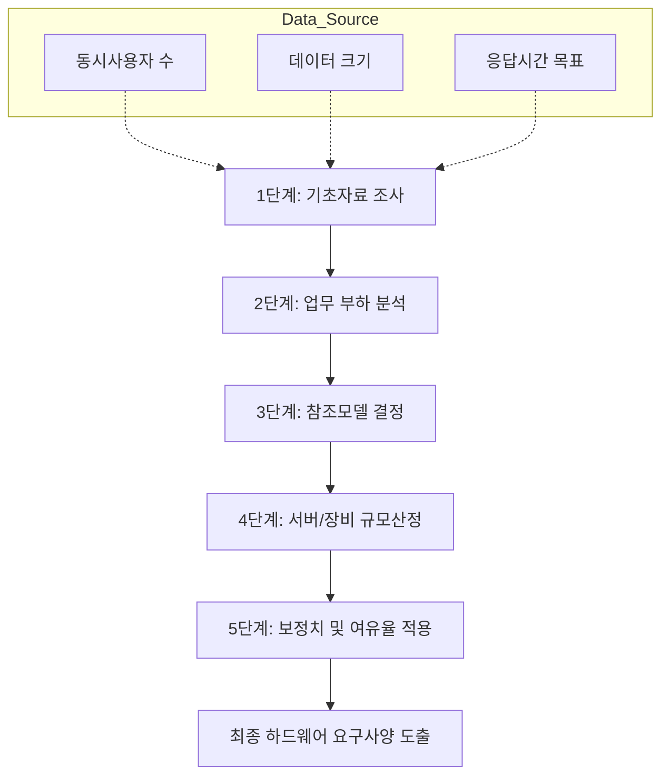

Parent: [[151.소프트웨어_비용_산정_모델]]

# 하드웨어 규모산정

> [!info] **하드웨어 규모산정이란?**
> 정보시스템의 목표 서비스 수준을 달성하기 위해 필요한 **CPU, 메모리, 디스크, 네트워크** 등의 용량을 정량적인 기법을 통해 산출하는 활동입니다. TTA의 '정보시스템 하드웨어 규모산정 지침'을 표준으로 하며, 인프라 투자 효율성(ROI)과 시스템 가용성을 보장하는 핵심 과정입니다.

---

## 1. 하드웨어 규모산정의 개요
### 가. 하드웨어 규모산정의 정의
- 사용자 요구사항 및 업무 부하를 분석하여 시스템의 성능 목표를 충족할 수 있는 최적의 하드웨어 스펙(Spec)을 결정하는 용량 계획(Capacity Planning) 활동

### 나. 필요성 (Why)
1. **투자 효율성 확보**: 과잉 투자(Over-provisioning)로 인한 예산 낭비 방지 및 과소 산정으로 인한 성능 병목 예방
2. **시스템 안정성 보장**: 피크 타임(Peak Time) 부하를 고려한 설계를 통해 중단 없는 서비스 제공
3. **객관적 근거 제시**: 발주자와 공급자 간의 기술적 타당성 검토 및 장비 도입의 투명성 확보

---

## 2. 하드웨어 규모산정 3대 방법론 및 절차 (What & How)
### 가. 규모산정 기법 분류 (수참시)

| 기법 | 상세 내용 | 장단점 |
| :--- | :--- | :--- |
| **수식계산법** | 사용자 수, 트랜잭션 수 등 수치 데이터에 보정치를 적용하여 계산 | **장**: 명확성, 간편성 / **단**: 보정치 설정의 주관성 |
| **참조법** | 유사한 업무량과 환경을 가진 기존 시스템의 사례를 모델로 선정 | **장**: 신뢰성, 편리성 / **단**: 정확한 비교 모델 확보 어려움 |
| **시뮬레이션법** | 작업 부하를 모델링하고 시뮬레이션 도구로 가상 실행하여 도출 | **장**: 가장 높은 정확도 / **단**: 시간과 비용의 비효율성 |

### 나. 규모산정 표준 절차 (Mermaid)

---

## 3. 심화: 대상별 산정 산식 및 성능 기준치
### 가. 주요 대상별 산출 공식

| 대상 | 핵심 산정 산식 | 성능 기준 지표 |
| :--- | :--- | :--- |
| **CPU (OLTP)** | $\{(사용자수 \times 트랜잭션수) \times \sum(보정치)\} \times 여유율$ | **tpmC** (TPC-C) |
| **CPU (Web/WAS)** | $동시사용자 \times 사용자당\ Ops \times \sum(보정치) \times 여유율$ | **Max-jOPS** (SPECjbb) |
| **Memory** | $\{시스템\ 영역 + (사용자수 \times 인당\ 메모리)\} \times 버퍼캐쉬 \times 여유율$ | GB |
| **Disk/Storage** | $\{(데이터\ 영역 + 백업\ 영역) \times RAID\ 계수\} \times 여유율$ | **IOPS**, TB |

### 나. 네트워크 규모 산정 기준
- **L2/L3 스위치**: 업링크/다운링크 포트 수량, 패브릭 스위칭 용량(Backplane)
- **L4/L7 스위치**: **CPS**(Connections Per Second), **RPS**(Requests Per Second)
- **전송 성능**: **TCP Throughput** (실효 대역폭)

---

## 4. 기술사적 제언 및 실무 적용 방안
### 가. 실무 적용 시 고려사항
1. **여유율(Margin)의 적정성**: 시스템 노후화에 따른 성능 저하와 미래 성장률(Growth Rate)을 고려하여 통상 **20~30%**의 여유율을 반영해야 함
2. **보정계수의 현실화**: 어플리케이션 인터페이스의 복잡도, 데이터베이스 크기 등 프로젝트 특성에 맞는 최신 보정치를 지침에 따라 적용

### 나. 기술사적 인사이트
- **Cloud-Native Sizing (FinOps)**: 온프레미스와 달리 클라우드 환경에서는 고정된 규모산정보다 **오토 스케일링(Auto-scaling)** 임계치 설정과 비용 최적화를 위한 **Right-sizing** 전략이 더 중요해지고 있음
- **Virtualization Overhead**: 가상화 환경(VM, Container) 도입 시 하이퍼바이저 오버헤드(통상 10~15%)를 반드시 추가 산정 항목에 포함해야 함
- 결론적으로 하드웨어 규모산정은 **'정적 계산을 넘어 동적 자원 관리(Elasticity)'**로 패러다임이 전환되고 있으며, 인프라 아키텍처의 유연성을 확보하는 설계 능력이 필수적임

---

## Related Notes
- [[151.소프트웨어_비용_산정_모델]]
- [[095.성능_테스트(Performance_Testing)]]
- [[003.IaC(Infrastructure_as_Code)]]
- [[001.SRE(Site_Reliability_Engineering)]]
