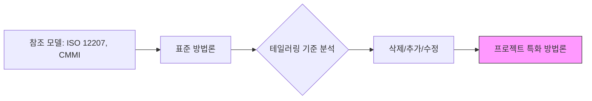

Parent: [[03.SW/GEMINI.MD]]

# 1. 개발방법론 테일러링의 개요 및 배경

## 가. 정의
- 표준 소프트웨어 개발 방법론을 기반으로 프로젝트의 특성(규모, 난이도, 성격 등)에 맞게 **프로세스, 활동, 산출물을 수정 및 조정**하는 활동
- **'One Size Fits All'**의 한계를 극복하고 프로젝트 수행의 효율성을 극대화하기 위한 최적화 기법

## 나. 등장 배경 및 필요성
- **프로젝트 다양성**: 비즈니스 모델, 기술 스택, 팀 역량 등 모든 프로젝트의 환경이 다름
- **생산성 향상**: 불필요한 절차 및 산출물을 제거하여 리소스를 핵심 업무에 집중
- **품질 확보**: 프로젝트 위험 요소에 맞는 필수 통제 지점을 강화하여 품질 리스크 최소화

# 2. 개발방법론 테일러링의 아키텍처 및 핵심 메커니즘

## 가. 개념도

## 나. 핵심 구성 요소 [두음: 기내절산]
| 요소 | 설명 | 주요 내용 |
|---|---|---|
| **기준 (Criteria)** | 테일러링 여부를 판단하는 잣대 | 프로젝트 규모(MM), 기간, 난이도, 위험도, 비즈니스 영역 |
| **내용 (Content)** | 조정 대상이 되는 방법론 요소 | 생명주기(Life Cycle), 단계(Phase), 활동(Activity), 작업(Task) |
| **절차 (Procedure)** | 테일러링 수행 단계 | 환경 분석 -> 대상 선정 -> 가이드라인 작성 -> 승인 및 전파 |
| **산출물 (Artifacts)** | 최종 결과물 및 근거 문서 | 테일러링 가이드, 개발 표준, 산출물 목록, 테일러링 이력서 |

# 3. 선도개발(Lead Development)을 위한 테일러링 상세

## 가. 선도개발의 특징
- **불확실성**: 새로운 기술이나 비즈니스 모델을 검증하는 단계로 요구사항 변동이 심함
- **속도**: 시장 선점을 위해 빠른 프로토타이핑 및 MVP(Minimum Viable Product) 개발 요구

## 나. 테일러링 전략 비교 (폭포수 vs 선도개발/애자일)
| 비교 항목 | 일반 프로젝트 (폭포수 중심) | 선도개발 프로젝트 (애자일 중심) |
|---|---|---|
| **프로세스** | 순차적, 정적 단계 준수 | 반복적(Iteration), 유연한 단계 전환 |
| **산출물** | 문서화 중심 (SRS, SDD 등) | 실행 코드 및 테스트 케이스 중심 (문서 최소화) |
| **의사소통** | 공식적 보고서 및 회의 | 일일 스탠드업 미팅, 회고, 실시간 협업 도구 |
| **테일러링 초점** | 엄격한 관리 체계 구축 | 기술 검증 및 빠른 피드백 확보 |

# 4. 기술사적 제언 및 실무 적용 방안

## 가. 실무 도입 시 고려사항
- **거버넌스 준수**: 테일러링 시에도 ISO/IEC 12207이나 조직의 핵심 품질 지표는 반드시 유지
- **전문가 참여**: 방법론 전문가 및 경험 많은 PM의 판단을 통해 과도한 간소화(Over-simplification) 경계

## 나. 최신 트렌드와 발전 방향
- **AI 기반 테일러링**: 과거 유사 프로젝트 데이터를 학습한 AI가 최적의 산출물 리스트와 절차를 추천
- **DevOps 통합**: 배포 주기 및 인프라 구성(IaC)과 연계된 자동화된 테일러링 프로세스 정착

> [!tip] **기술사 인사이트**
> 테일러링은 단순히 **'줄이는 것(Reducing)'**이 아니라 **'최적화하는 것(Optimizing)'**입니다. 특히 선도개발에서는 **'가장 중요한 것에 집중'**하기 위해 불필요한 행정적 절차를 과감히 제거하는 결단력이 필요합니다.

## Related Notes
- [[042.개발_방법론_테일러링(Tailoring).md]] (기존 기본 문서와 연계)
- [[034.애자일_방법론(Agile).md]]
- [[135.ISO_IEC_12207.md]]
