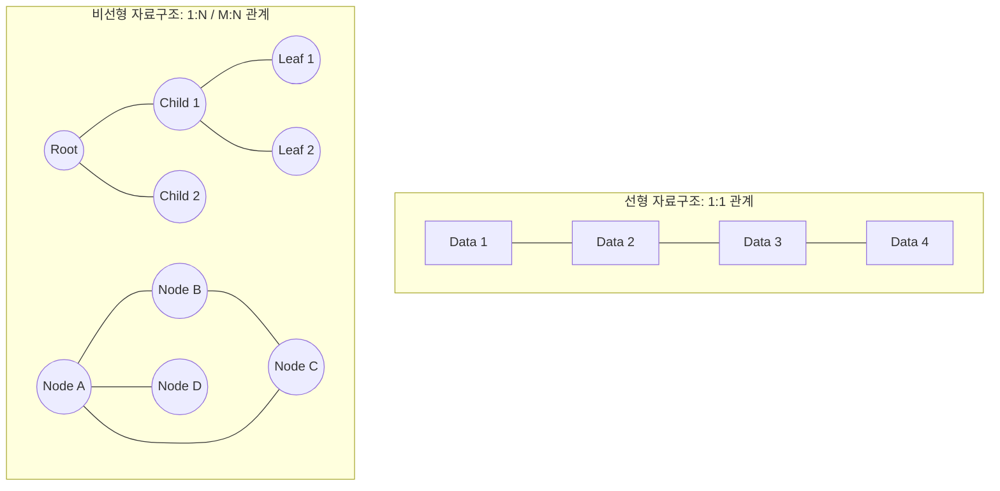

# [001].DS_선형_비선형_자료구조

## 1. [도입: Why] 자료구조의 분류와 데이터 처리 효율성
### 가. 선형 및 비선형 자료구조의 정의
- **선형 자료구조 (Linear Data Structure)**: 데이터를 저장하는 방식이 데이터와 데이터를 **1:1(One-to-One)** 대응 관계의 선형 리스트 형태로 저장하는 자료구조
- **비선형 자료구조 (Non-Linear Data Structure)**: 데이터를 저장하는 방식이 데이터와 데이터를 **1:N 또는 M:N** 구조로 관계를 저장시키는 계층적 또는 망형 자료구조

### 나. 등장 배경 및 필요성
- **데이터 관리 효율성**: 대량의 데이터를 메모리에 효율적으로 배치하고 검색 속도(Time Complexity)를 최적화하기 위해 필요
- **복잡한 관계 표현**: 현실 세계의 계층 구조(조직도)나 네트워크(지도, SNS)를 컴퓨터 시스템 내에 모델링하기 위해 비선형 구조 도입
- **자원 최적화**: 데이터의 성격(순차성 vs 관계성)에 따라 메모리 할당(공간 복잡도)을 최적화하여 시스템 성능 향상

## 2. [핵심: What & How] 자료구조의 구조 및 메커니즘
### 가. 선형/비선형 자료구조 개념도

### 나. 핵심 구성 요소 및 유형
| 구분 | 유형 | 설명 | 비고/특징 |
| :--- | :--- | :--- | :--- |
| **선형** | **Array (배열)** | 동일한 타입의 데이터를 연속적인 메모리 공간에 저장 | 인덱스 접근(O(1)), 삽입/삭제(O(N)) |
| | **Linked List** | 데이터와 포인터를 포함하는 노드들이 연결된 형태 | 동적 크기 조절, 삽입/삭제 용이 |
| | **Stack / Queue** | LIFO(Stack), FIFO(Queue) 원칙에 따른 입출력 구조 | 순차적 제어, 프로세스 관리 |
| **비선형** | **Tree (트리)** | 계층적 관계를 표현하는 사이클이 없는 그래프 | 부모-자식 관계, 탐색 알고리즘(O(log N)) |
| | **Graph (그래프)** | 정점(Node)과 간선(Edge)으로 이루어진 망형 구조 | 사이클 허용, 경로 탐색, 위상 정렬 |

## 3. [심화: Deep-dive] 선형 자료구조와 비선형 자료구조의 비교
### 가. 상세 비교 분석
| 비교 항목 | 선형 자료구조 (Linear) | 비선형 자료구조 (Non-Linear) |
| :--- | :--- | :--- |
| **데이터 관계** | 1:1 (일대일) | 1:N, M:N (다대다) |
| **배열 형태** | 순차적(Sequential) | 계층적(Hierarchical), 망형(Mesh) |
| **순회 방식** | 단일 순회 (Single Traversal) | 다중 순회 (BFS, DFS) |
| **구현 난이도** | 상대적으로 용이함 | 복잡함 (재귀, 포인터 연산) |
| **주요 활용** | 단순 데이터 저장, 버퍼링 | 계층 구조 표현, 최단 경로 탐색 |

### 나. 알고리즘적 접근 방식
- **선형 구조**: 반복문(Iteration) 기반의 탐색이 주를 이루며, 인덱스 또는 포인터 이동을 통해 데이터 처리
- **비선형 구조**: 재귀 호출(Recursion) 및 스택/큐를 활용한 깊이 우선 탐색(DFS) 및 너비 우선 탐색(BFS) 메커니즘 필수

## 4. [결론: Effect & Insight] 기술사적 제언
### 가. 실무 도입 시 고려사항 (성능 및 확장성)
- 데이터의 **빈번한 삽입/삭제**가 발생하는 경우 선형 구조의 Linked List나 비선형 구조의 Balanced Tree(AVL, Red-Black) 고려
- 실시간 응답이 중요한 대규모 서비스에서는 **캐시 지역성(Locality)**이 뛰어난 선형 배열 기반 구조가 비선형보다 성능상 유리할 수 있음

### 나. 보안 및 거버넌스 통제 방안
- **메모리 무결성**: 자료구조 운용 시 Buffer Overflow 방지를 위한 경계 검사 및 메모리 할당 정책 준수
- **데이터 일관성**: 멀티스레드 환경에서 자료구조 접근 시 Lock-free 알고리즘 또는 Mutex/Semaphore를 통한 동기화 관리

### 다. 발전 방향 및 제언
- 최근 초거대 AI 및 빅데이터 분석에서는 관계형 DB의 한계를 극복하기 위해 **Graph DB**와 같은 비선형 자료구조 중심의 아키텍처 도입 확산
- 알고리즘의 복잡도가 높아짐에 따라 하드웨어 가속기(GPU, NPU)를 활용한 병렬 처리 최적화 기법이 자료구조 설계의 핵심으로 부상

## 5. 검증 체크리스트 (PE-Audit)

| # | 검증 항목 | 기준 | 판정 |
|---|---|---|---|
| 1 | **최신성·정확성** | 선형/비선형의 핵심 특성이 명확히 구분되었는가 | ✅ |
| 2 | **키워드 적정성** | LIFO, FIFO, O(log N), DFS/BFS 등 핵심 키워드 배치 | ✅ |
| 3 | **시각화 품질** | Mermaid를 통한 선형/비선형 구조의 직관적 표현 | ✅ |
| 4 | **논리적 일관성** | 정의에서 제언까지의 흐름이 논리적인가 | ✅ |
| 5 | **차별화 요소** | Graph DB, 하드웨어 가속기 연계 등 기술사적 통찰 제시 | ✅ |
