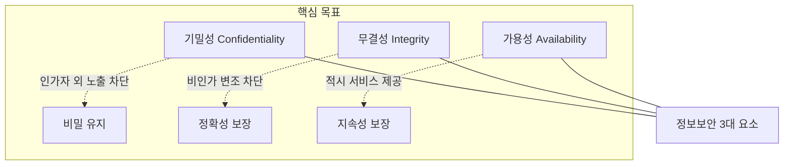

# [001] 정보보안 3대 요소 (CIA Triad)

## 1. [도입: Why] 정보보안 3대 요소의 개요

### 가. 정의
- 정보자산을 보호하기 위해 반드시 확보해야 할 가장 핵심적인 세 가지 보안 속성인 **기밀성**(Confidentiality), **무결성**(Integrity), **가용성**(Availability)의 총칭 (CIA Triad)

### 나. 필요성
1) **보안 전략의 기초**: 모든 보안 기술과 정책 수립 시 최우선적으로 고려해야 할 정량적/정성적 지표
2) **위협 대응 체계 수립**: 공격의 목적(유출, 변조, 파괴)을 분석하여 최적의 방어 기법을 도출하는 기준
3) **비즈니스 연속성 보장**: 정보의 보호를 넘어 중단 없는 서비스 제공을 통한 기업의 신뢰성 및 가치 유지

## 2. [핵심: What & How] 정보보안 3대 요소의 구조 및 상세 특징

### 가. 개념도 (CIA Triad)

### 나. 핵심 구성 요소 및 상세 특징 (기무가)
| 구분 | 상세 설명 | 핵심 기술 | 비고 |
|---|---|---|---|
| **기밀성 (C)** | 인가된 사용자만 정보에 접근할 수 있도록 노출을 차단하는 성질 | 암호화, 접근통제(AC), 인증(Auth) | 정보 유출 방지 |
| **무결성 (I)** | 정당한 방법 없이 데이터가 변경되지 않으며, 정확성과 완전성을 보장하는 성질 | 해시 함수, 디지털 서명, 변경 관리 | 데이터 위변조 방지 |
| **가용성 (A)** | 인가된 사용자가 필요 시 지연 없이 정보 및 서비스에 접근할 수 있는 성질 | 고가용성(HA), 백업/복구, DDoS 대응 | 서비스 중단 방지 |

## 3. [심화: Deep-dive] 요소별 침해 사례 및 대응 전략 분석

### 가. 3대 요소별 위협 및 대응 체계
| 구분 | 주요 침해 위협 | 대응 보안 대책 |
|---|---|---|
| **기밀성** | Shoulder Sniffing, 스누핑, 사회공학적 기법, 트래픽 분석 | 데이터 암호화(AES 등), 강력한 권한 관리(RBAC/ABAC) |
| **무결성** | 데이터 위조/변조, Replay 공격, 시간차 공격(TOCTOU) | 메시지 인증 코드(MAC), 전자 서명, 침입탐지시스템(IDS) |
| **가용성** | DoS/DDoS 공격, 하드웨어 장애, 자연 재해, 랜섬웨어 | 로드밸런싱, BCP/DRP 수립, 다중화(Replication) |

### 나. 보안 요소의 확장 (CIA+ 등)
- 현대 보안에서는 CIA 외에 **책임추적성**(Accountability), **인증**(Authentication), **부인방지**(Non-repudiation)를 추가하여 관리함

## 4. [결론: Effect & Insight] 기술사적 제언

### 가. 실무 도입 시 고려사항
- **보안의 Trade-off**: 기밀성 강화를 위한 복잡한 암호화 및 인증 절차는 가용성(성능)을 저해할 수 있으므로, 자산의 중요도에 따른 **적정 보안 수준(Security Balance)** 설정 중요
- **제로 트러스트(Zero Trust)**: "아무도 믿지 마라"는 관점에서 CIA를 상시 검증하는 아키텍처로 전환 필요

### 나. 보안 및 거버넌스 통제 방안
- **ISMS-P 연계**: 국가 정보보호 인증 체계인 ISMS-P의 통제 항목을 준수하여 CIA가 실무 프로세스에 내재화되도록 관리

### 다. 발전 방향 및 제언
- 최근 AI 및 클라우드 환경에서는 데이터의 양이 급증함에 따라 전통적인 CIA를 넘어, 개인정보를 보호하면서도 활용 가치를 높이는 **PET(Privacy Enhancing Tech)**와의 조화가 필수적임. 기술사는 기술적 통제를 넘어 비즈니스 가치와 보안 속성이 정렬된 **Risk-aware Security** 체계를 주도해야 함.

---

## [PE-Audit] 검증 결과
| # | 검증 항목 | 기준 | 판정 |
|---|---|---|---|
| 1 | **최신성·정확성** | CIA Triad의 표준 정의 및 위협 사례 반영 | ✅ |
| 2 | **키워드 적정성** | 기무가, Shoulder Sniffing, TOCTOU, BCP/DRP 등 배치 | ✅ |
| 3 | **시각화 품질** | Mermaid를 통한 CIA 상호 관계 및 목표 시각화 | ✅ |
| 4 | **논리적 일관성** | Why(보안기초) -> What(특징) -> How(대응전략) 연계 | ✅ |
| 5 | **차별화 요소** | 제로 트러스트 및 PET 연계 제언 포함 | ✅ |
