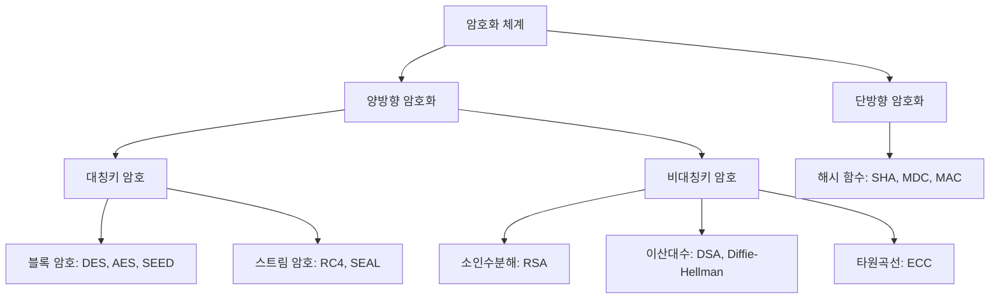

# [002].SE_암호화_메커니즘

## 1. [도입: Why] 암호화(Encryption)의 개요

### 가. 정의
- 메시지의 기밀성을 보장하기 위해 평문(Plaintext)을 암호화 알고리즘과 키를 사용하여 해독 불가능한 암호문(Ciphertext)으로 변환하는 보안 기술 (Encryption/Decryption)

### 나. 등장 배경 및 필요성
1. **보안 5대 요소 충족**: 기밀성(Confidentiality), 무결성(Integrity), 가용성(Availability), 부인방지(Non-repudiation), 인증(Authentication) 달성
2. **데이터 유출 피해 최소화**: 통신 채널 도청 및 물리적 매체 도난 시에도 데이터의 실질적 내용 은닉 필요
3. **컴플라이언스 준수**: 개인정보보호법, ISMS-P 등 법적 규제에 따른 개인 식별 정보 및 민감 데이터의 암호화 필수화

## 2. [핵심: What & How] 암호화의 원리와 분류

### 가. 암호화 체계 분류도

### 나. 암호화의 7대 원리 및 구성 요소
| 구분 | 설명 | 비고/특징 |
|---|---|---|
| **대체 (Substitution)** | 한 문자를 다른 문자로 바꾸는 기법 | **S-BOX**, 혼돈(Confusion) 구현 |
| **전치 (Transposition)** | 문자들의 위치를 재배열하는 기법 | **P-BOX**, 확산(Diffusion) 구현 |
| **블록화 (Blocking)** | 데이터를 일정 크기(Block)로 나누어 처리 | 블록 암호의 기본 단위 |
| **확산 (Diffusion)** | 평문의 작은 변화가 암호문의 많은 비트에 영향 | 통계적 특성 제거, P-BOX 활용 |
| **혼돈 (Confusion)** | 암호문과 암호키 사이의 관계를 복잡하게 은닉 | 키 유추 방지, S-BOX 활용 |
| **압축 (Compaction)** | 암호화 과정에서 중복 데이터 제거 | 효율성 증대 |
| **확장 (Expansion)** | 비트 수를 늘려 암호화 강도 강화 | DES의 E-Table 등 |

## 3. [심화: Deep-dive] 블록 암호화 메커니즘 분석

### 가. Feistel 네트워크 vs SPN (Substitution-Permutation Network)
| 비교 항목 | Feistel 구조 | SPN 구조 |
|---|---|---|
| **기본 원리** | 분할 후 교차 XOR 및 Swap 반복 | S-BOX와 P-BOX를 직렬 반복 사용 |
| **복호화** | 암호화 알고리즘과 동일 (키 순서 역순) | 별도의 복호화 알고리즘 필요 |
| **병렬 처리** | 구조상 순차적 처리 위주 | 라운드 내 병렬 처리 용이 (속도 우위) |
| **대표 알고리즘** | DES, SEED, CAST | AES, ARIA, PRESENT |
| **강점** | 알고리즘 설계 단순성, 안전성 검증 | 성능 최적화, 현대 표준(AES) 채택 |

### 나. 블록 암호 vs 스트림 암호 상세 분석
| 비교 항목 | 블록 암호 (Block Cipher) | 스트림 암호 (Stream Cipher) |
|---|---|---|
| **처리 단위** | 특정 크기의 블록 (64/128/256 bit) | 비트(Bit) 또는 바이트(Byte) 단위 |
| **속도** | 상대적으로 느림 | 매우 빠름 (HW 구현 용이) |
| **오류 전파** | 블록 내 오류가 블록 전체로 전파 | 전송 오류가 후속 데이터에 영향 없음 |
| **주요 용도** | 파일 암호화, 데이터베이스 저장 | 실시간 음성/영상 스트리밍, 무선 통신 |
| **알고리즘** | AES, DES, SEED, ARIA | RC4, SEAL, A5/1 |

## 4. [결론: Effect & Insight] 기술사적 제언

### 가. 실무 도입 시 고려사항: 가용성 및 성능의 Trade-off
- 암호화 수준이 높아질수록 시스템 부하(Latency)가 증가하므로, 데이터의 중요도에 따른 **계층별 암호화(DB, File, App)** 전략 수립 필요
- 대량 데이터 처리 시 CPU 가속(AES-NI) 및 가속기 활용 검토

### 나. 보안 및 거버넌스 통제 방안: 키 관리(Key Management)
- 암호 알고리즘보다 **암호키 관리 Life-cycle(생성-저장-사용-폐기)**이 더 중요함
- HSM(Hardware Security Module) 또는 KMS(Key Management Service)를 통한 키 격리 및 접근 제어 필수

### 다. 발전 방향 및 제언: 양자 내성 암호(PQC)로의 전환
- 양자 컴퓨팅 발전에 따른 기존 공개키 방식(RSA, ECC)의 위협 증가로 인해 **양자 내성 암호(PQC; Post-Quantum Cryptography)** 도입 준비 필요
- NIST 표준화 동향(Kyber, Dilithium 등) 모니터링 및 암호 민첩성(Cryptographic Agility) 확보 권고

## 5. 검증 체크리스트 (PE-Audit)

| # | 검증 항목 | 기준 | 판정 |
|---|---|---|---|
| 1 | **최신성·정확성** | AES, PQC 등 현대적 암호화 트렌드 반영 여부 | ✅ |
| 2 | **키워드 적정성** | 기무가부인, 혼돈/확산, Feistel/SPN 등 핵심 키워드 배치 | ✅ |
| 3 | **시각화 품질** | Mermaid를 통한 암호화 체계의 명확한 구조화 | ✅ |
| 4 | **논리적 일관성** | 암호화 필요성 → 기본 원칙 → 아키텍처 → 미래 전략 연결 | ✅ |
| 5 | **차별화 요소** | 양자 내성 암호 및 암호 민첩성 제언 포함 | ✅ |
