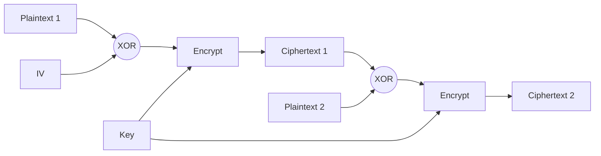

# [003].SE_블록_암호_운영모드_및_패딩

## 1. [도입: Why] 블록 암호 운영모드 및 패딩의 개요

### 가. 정의
- **운영모드(Mode of Operation)**: 임의의 길이를 가진 평문을 블록 단위로 나누어 암호화할 때, 이전 블록의 결과가 다음 블록에 영향을 주는 방식을 정의한 절차
- **패딩(Padding)**: 평문 길이가 블록 크기의 배수가 아닐 경우, 마지막 블록을 고정된 블록 크기로 맞추기 위해 특정 데이터를 채워 넣는 기법

### 나. 필요성
1. **보안성 강화**: 동일한 평문 블록이 항상 동일한 암호문으로 변환되는 결정론적 성질(ECB의 취약점) 제거
2. **가변 길이 대응**: 고정 크기 블록 알고리즘을 다양한 길이의 실제 데이터에 적용 가능케 함
3. **무결성 및 연쇄성**: 데이터의 순서 바뀜이나 누락을 탐지할 수 있는 구조적 기반 제공

## 2. [핵심: What & How] 운영모드 유형 및 메커니즘

### 가. 운영모드(ECCOCP) 상세 분석
| 구분 | 방식 | 특징 | 비고/취약점 |
|---|---|---|---|
| **ECB** | 각 블록 독립적 암호화 | 병렬 처리 용이, 가장 단순 | 패턴 노출, 재전송 공격 취약 |
| **CBC** | 이전 암호문 XOR 후 암호화 | 보안성 우수, 초기화 벡터(IV) 사용 | 전송 오류 전파, 병렬화 불가 |
| **CFB** | 암호문 피드백 기반 스트림 방식 | 패딩 불필요, 실시간 전송 적합 | 전송 오류 전파 |
| **OFB** | 출력 피드백 기반 스트림 방식 | 전송 오류 미전파, IV 사용 | 암호기 동기화 필수 |
| **CTR** | 카운터 값을 암호화 후 XOR | 병렬 처리 최적화, 현대 표준 | 카운터 관리 중요, 고속 처리 |
| **PCBC** | 평문과 암호문 모두 연쇄 처리 | 오류 전파 극대화 (무결성 강조) | 커브로스(Kerberos) v4 사용 |

### 나. CBC 운영모드 메커니즘 (Mermaid)

## 3. [심화: Deep-dive] 패딩(Padding) 기법 상세

### 가. 패딩 분류 및 유형
| 분류 | 주요 기법 | 설명 |
|---|---|---|
| **비트 패딩** | Bit Padding | 마지막에 '1'을 붙이고 나머지를 '0'으로 채움 |
| **바이트 패딩** | **PKCS#5 / PKCS#7** | 채워야 할 바이트 수(N)를 N번 반복하여 채움 (가장 널리 쓰임) |
| | ANSI X9.23 | 마지막 바이트에 패딩 길이를 기록, 앞은 00 또는 랜덤 |
| | ISO 10126 | 마지막 바이트에 패딩 길이를 기록, 앞은 랜덤 값 |
| | Zero Padding | 부족한 공간을 모두 0으로 채움 (데이터 끝이 0일 경우 모호성 발생) |

### 나. 패딩 관련 보안 위협
- **Padding Oracle Attack**: 복호화 과정에서 패딩의 유효성 여부를 알려주는 오류 메시지를 이용하여 평문을 유추하는 공격 기법
- **대응 방안**: 패딩 오류와 다른 오류 메시지를 동일하게 처리하거나, 복호화 전 MAC을 통해 무결성 우선 검증

## 4. [결론: Effect & Insight] 기술사적 제언

### 가. 실무적 선택 기준
- 고속 처리가 필요한 대용량 데이터 전송에는 **CTR 모드** 권장 (병렬 처리 및 랜덤 액세스 가능)
- 무결성이 중요한 인증 데이터에는 **GCM(Galois/Counter Mode)** 등 AEAD(Authenticated Encryption with Associated Data) 방식 선호

### 나. 보안 통제 방안
- 초기화 벡터(IV)는 절대 재사용하지 않아야 하며, 암호학적으로 안전한 난수(CSPRNG)를 사용해야 함
- 최신 TLS 1.3에서는 보안성이 낮은 ECB, CBC 모드를 제외하고 CTR 기반의 GCM 등을 표준으로 채택하는 추세임

## 5. 검증 체크리스트 (PE-Audit)

| # | 검증 항목 | 기준 | 판정 |
|---|---|---|---|
| 1 | **최신성·정확성** | ECCOCP 5대 모드 및 PCBC 반영 여부 | ✅ |
| 2 | **키워드 적정성** | IV, 전송 오류 전파, PKCS#7, AEAD 등 포함 | ✅ |
| 3 | **시각화 품질** | CBC 모드 연쇄 과정을 직관적으로 표현 | ✅ |
| 4 | **논리적 일관성** | 운영모드의 목적과 패딩의 보완 관계 설명 | ✅ |
| 5 | **차별화 요소** | Padding Oracle Attack 및 AEAD 제언 포함 | ✅ |
