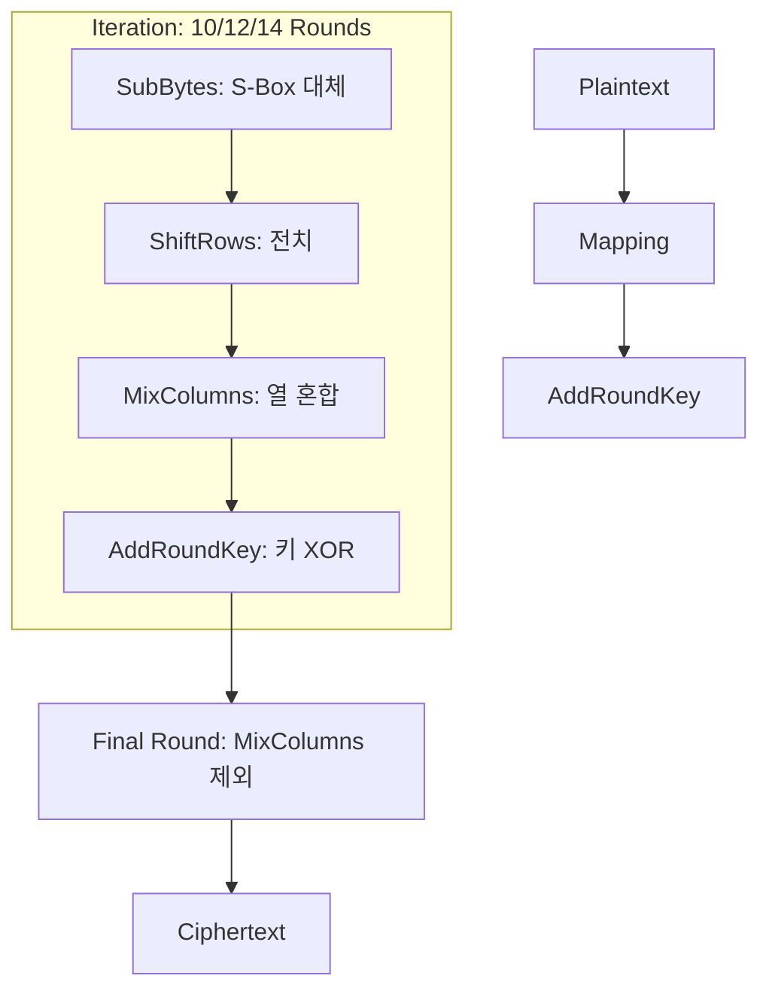

# [004].SE_대칭키_표준_암호_알고리즘_비교

## 1. [도입: Why] 대칭키 표준 암호 알고리즘의 개요

### 가. 정의
- 암호화와 복호화에 동일한 비밀키(Secret Key)를 사용하여 고정된 크기의 블록 단위로 데이터를 처리하는 대칭키 블록 암호 방식

### 나. 등장 배경 및 필요성
1. **성능 최적화**: 공개키 방식 대비 압도적인 연산 속도를 제공하여 실시간 데이터 보안에 필수
2. **글로벌 표준화**: 미국 NIST(AES), 국내 KISA(SEED, ARIA) 등 국가별 표준 암호 기술 확보 및 안정성 검증 필요
3. **취약점 대응**: 기존 DES의 키 길이 부족에 따른 전수조사 공격 위협을 극복하기 위한 고강도 암호화 필요

## 2. [핵심: What & How] 주요 대칭키 암호 알고리즘 분석

### 가. 표준 암호 알고리즘 비교표 (DES vs AES vs SEED)
| 비교 항목 | DES | AES | SEED |
|---|---|---|---|
| **개발/표준** | 미국 NIST (1977) | 미국 NIST (2001) | 한국 KISA (1999) |
| **블록 크기** | 64 bits | 128 bits | 128 bits |
| **키 길이** | 56 bits | 128/192/256 bits | 128/256 bits |
| **라운드 수** | 16 Rounds | 10/12/14 Rounds | 16/24 Rounds |
| **기본 구조** | **Feistel** | **SPN** | **Feistel** |
| **보안 수준** | 취약 (전수조사 가능) | 매우 안전 (현대 표준) | 안전 (국내 공공/금융) |

### 나. AES 암호화 메커니즘 (Mermaid)

## 3. [심화: Deep-dive] 알고리즘별 상세 특징

### 가. DES(Data Encryption Standard)의 한계와 보완
- **취약점**: 56비트라는 짧은 키 길이로 인해 Brute-force 공격에 노출
- **보완책**: 보안성을 강화한 **3-DES(Triple DES)** 사용이 권고되었으나, 성능 저하 문제로 현재는 AES로 완전 대체 추세

### 나. SEED 및 국내 표준 알고리즘
- **SEED**: 순수 국내 기술로 개발된 128비트 블록 암호. ARIA와 함께 공공기관, 금융권에서 널리 사용
- **ARIA**: IS-BOX를 사용하는 SPN 구조. 범용적으로 AES와 유사한 성능 및 보안성 제공

## 4. [결론: Effect & Insight] 기술사적 제언

### 가. 실무적 암호화 정책 수립
- 신규 시스템 구축 시 성능과 글로벌 호환성을 고려하여 **AES-256**을 최우선적으로 채택 권고
- 국가·공공기관 사업의 경우 국정원 검증 필 암호모듈(KCMVP) 탑재 여부 확인 필수

### 나. 미래 기술 대응
- 기존 알고리즘의 라운드 수를 늘리거나(예: 3-DES), 더 긴 키(256bit 이상)를 사용하여 양자 컴퓨팅 초기 위협에 대비하는 암호 민첩성(Crypto-Agility) 확보 필요

## 5. 검증 체크리스트 (PE-Audit)

| # | 검증 항목 | 기준 | 판정 |
|---|---|---|---|
| 1 | **최신성·정확성** | AES, SEED, ARIA 등 현행 표준 반영 여부 | ✅ |
| 2 | **키워드 적정성** | Feistel/SPN, 맵섭시미아, KCMVP 등 배치 | ✅ |
| 3 | **시각화 품질** | AES의 라운드 처리 과정을 직관적으로 표현 | ✅ |
| 4 | **논리적 일관성** | DES의 취약점 보완을 위한 AES/SEED 등장 배경 명확 | ✅ |
| 5 | **차별화 요소** | 국정원 KCMVP 및 암호 민첩성 제언 포함 | ✅ |
