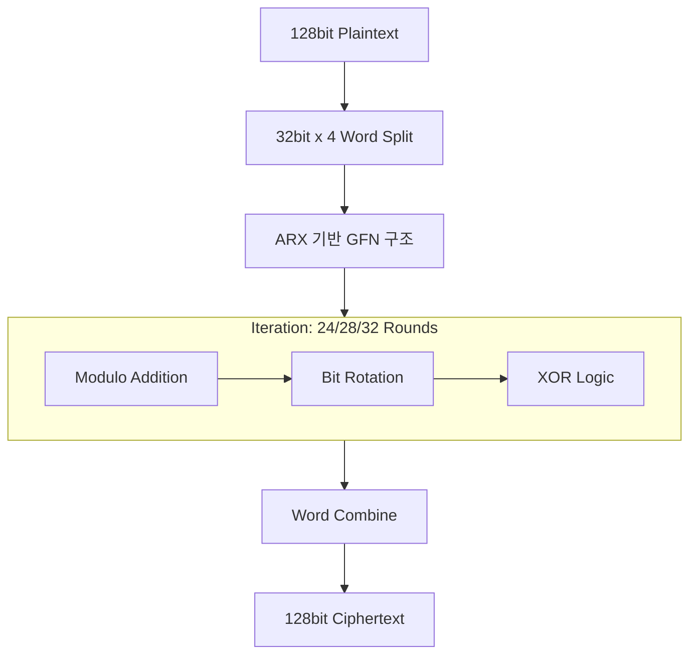

# [005].SE_경량_암호_및_LSH_해시

## 1. [도입: Why] 경량 암호 및 LSH의 개요

### 가. 정의
- **경량 암호(Lightweight Cryptography)**: IoT, 센서 네트워크 등 연산 자원이 극도로 제한된 환경(CPU, Memory, 전력)에서 안전성을 보장하면서 효율적으로 동작하도록 설계된 암호 기술
- **LSH(Lightweight Secure Hash)**: 고속 환경 및 경량 환경에서 데이터 무결성을 보장하기 위해 개발된 국내 표준 경량 해시 알고리즘 (TTAK.KO-12.0276)

### 나. 필요성
1. **IoT 보안 강화**: 저사양 임베디드 기기에 기존 표준 암호(AES 등) 적용 시 성능 저하 및 전력 소모 심화 문제 해결
2. **저지연(Ultra-Low Latency) 요구**: 실시간 제어가 필요한 스마트 팩토리, 자율주행 등에서 초지연 보안 연산 필수
3. **국가 보안 경쟁력**: 독자적인 경량 암호(LEA) 및 해시(LSH) 기술 확보를 통한 기술 자립

## 2. [핵심: What & How] 경량 보안 기술의 구조

### 가. 경량 암호 알고리즘 유형 및 특징
| 분류 | 주요 알고리즘 | 특징 | 핵심 메커니즘 |
|---|---|---|---|
| **경량 블록 암호** | **LEA** | 128bit 블록, 고속 암호화 | **ARX** (Addition, Rotation, XOR) |
| | HIGHT | 64bit 블록, 초경량화 | 덧셈, XOR, 회전 연산 조합 |
| | SIMON/SPECK | 미국 NSA 개발 | 단순 연산 반복, 구현 효율성 극대화 |
| **저지연 암호** | PRINCE | 지연 시간(Latency) 최소화 | Reflection 구조 기반 |
| **경량 해시** | **LSH** | SHA-2 대비 2배 성능 | Wide-pipe Merkle-Damgard 구조 |

### 나. LEA(Lightweight Encryption Algorithm) 구조 (Mermaid)

## 3. [심화: Deep-dive] LSH 해시 및 LEA 상세 분석

### 가. LSH(Lightweight Secure Hash) 메커니즘
1. **해싱 과정**: 초기화(Initialization) → 압축(Compression) → 완료(Finalization) 3단계 수행
2. **특징**: w-비트 워드 단위 동작(LSH-256, LSH-512), 비트 단위 대신 워드 단위 연산으로 소프트웨어 구현 속도 혁신 (SHA-2/3 대비 약 2~3배 빠름)

### 나. LEA의 ARX 기반 GFN(Generalized Feistel Network)
- **ARX**: Addition(덧셈), Rotation(회전), XOR 연산만을 사용하여 S-BOX 없이도 충분한 혼돈과 확산 달성
- **GFN**: 일반적인 2분할 Feistel과 달리 4개 이상의 워드로 분할하여 병렬 연산 효율성 극대화

## 4. [결론: Effect & Insight] 기술사적 제언

### 가. 사물인터넷(IoT) 보안 가이드라인 준수
- 제한된 자원 환경에서는 표준 암호(AES) 대신 **LEA, HIGHT** 등 경량 암호 우선 검토
- 데이터의 중요도에 따라 경량 해시(LSH)를 적용하여 데이터 변조 방지 체계 구축

### 나. 보안 통제 방안 및 전망
- **KCMVP(국가 암호 모듈 검증)**: 공공 IoT 사업 참여 시 경량 암호 모듈의 검증 여부 필수 확인
- 향후 **AIoT(AI + IoT)** 확산에 따라 엣지 컴퓨팅 기기 내 경량 암호 가속기(Hardware Accelerator) 탑재 및 최적화 연구 지속 필요

## 5. 검증 체크리스트 (PE-Audit)

| # | 검증 항목 | 기준 | 판정 |
|---|---|---|---|
| 1 | **최신성·정확성** | LEA, LSH 등 국내외 최신 경량 보안 표준 반영 | ✅ |
| 2 | **키워드 적정성** | ARX, GFN, Wide-pipe, TTAK 표준 등 포함 | ✅ |
| 3 | **시각화 품질** | LEA의 ARX 기반 워드 분할 구조 시각화 | ✅ |
| 4 | **논리적 일관성** | 환경적 제약(IoT) → 기술적 해결(경량화) 흐름 명확 | ✅ |
| 5 | **차별화 요소** | AIoT 연계 및 KCMVP 검증 제언 포함 | ✅ |
