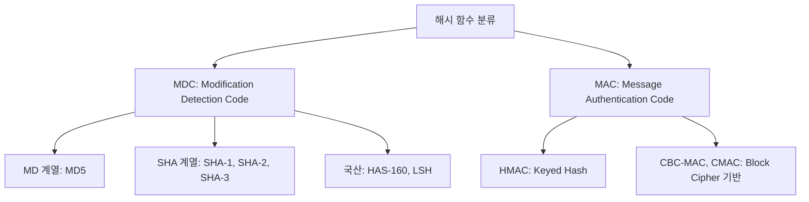

# [006].SE_암호학적_해시_함수

## 1. [도입: Why] 암호학적 해시 함수의 개요

### 가. 정의
- 가변 길이의 데이터를 입력받아 고정된 길이의 메시지 다이제스트(Message Digest)를 출력하는 단방향(One-way) 암호 알고리즘

### 나. 등장 배경 및 필요성
1. **무결성(Integrity) 검증**: 전송 중 데이터의 변조 여부를 신속하게 확인하기 위한 지문(Fingerprint) 역할
2. **효율적 암호화**: 원본 전체를 암호화하는 대신 해시값을 암호화(전자서명)하여 성능 최적화
3. **충돌 저항성 확보**: 서로 다른 입력이 동일한 출력을 내지 않도록 하여 위변조 및 스푸핑 공격 방어

## 2. [핵심: What & How] 해시 함수의 특성 및 분류

### 가. 암호학적 3대 저항성 (성능/보안 요건)
| 구분 | 설명 | 핵심 개념 |
|---|---|---|
| **제1차 역상 저항성** | 해시값 H로부터 입력값 M을 찾는 것이 계산적으로 불가능함 | **단방향성** (One-wayness) |
| **제2차 역상 저항성** | 입력 M1과 해시 H1이 주어질 때, H1=H2인 M2를 찾기 어려움 | **약한 충돌 저항성** |
| **충돌 저항성** | 동일한 해시값을 생성하는 임의의 두 입력(M1, M2)을 찾기 어려움 | **강한 충돌 저항성** |

### 나. 해시 함수의 분류 및 알고리즘

## 3. [심화: Deep-dive] 해시 충돌 및 해결 방안

### 가. 비둘기집 원리와 생일 공격(Birthday Attack)
- 해시 함수의 출력 길이에 비해 입력 공간이 무한하므로 충돌은 반드시 발생함
- **생일 공격**: $2^{n/2}$번의 시도로 충돌을 찾을 확률이 50% 이상이 됨을 이용한 공격 (출력 비트수 확대 필요)

### 나. 해시 충돌 해결 기법 (자료구조 관점)
| 구분 | 기법 | 상세 내용 |
|---|---|---|
| **개방 주소법** | 선형/이차 조사, 이중 해싱 | 빈 공간을 찾아 차례로 저장 (선이중무) |
| **폐쇄 주소법** | **Chaining**, 합병 체인 | 연결 리스트 등을 사용하여 동일 버킷에 중첩 저장 |

## 4. [결론: Effect & Insight] 기술사적 제언

### 가. 알고리즘 선택 가이드라인
- MD5 및 SHA-1은 충돌 저항성 취약점이 발견되어 사용이 중단되었으며, 현재는 **SHA-256 이상** 또는 **SHA-3** 사용 권고
- 민감 데이터(비밀번호 등) 저장 시에는 단순 해시가 아닌 **Salt**와 **Key Stretching** 필수 적용

### 나. 보안 거버넌스 및 발전 방향
- 양자 컴퓨팅 환경에서 해시 함수의 보안 강도는 절반으로 감소하므로, 충분한 길이(384/512 bit)의 다이제스트 확보 필요
- 블록체인, 전자서명 등 현대 보안 인프라의 근간 기술로서 해시 알고리즘의 안정성 정기 점검 체계 구축

## 5. 검증 체크리스트 (PE-Audit)

| # | 검증 항목 | 기준 | 판정 |
|---|---|---|---|
| 1 | **최신성·정확성** | SHA-3, LSH 등 현대 알고리즘 및 저항성 반영 | ✅ |
| 2 | **키워드 적정성** | 압효단충, 역상 저항성, 생일 공격 등 배치 | ✅ |
| 3 | **시각화 품질** | MDC/MAC 분류를 통한 체계적 구조화 | ✅ |
| 4 | **논리적 일관성** | 무결성 필요성 → 저항성 → 해결책 → 제언 인과 명확 | ✅ |
| 5 | **차별화 요소** | 비둘기집 원리 및 양자 암호 대비 제언 포함 | ✅ |
