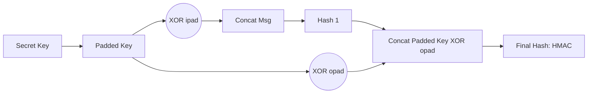

# [007].SE_HMAC_메시지_인증

## 1. [도입: Why] HMAC의 개요

### 가. 정의
- 송신자와 수신자만이 공유하는 비밀키(Secret Key)와 해시 함수를 결합하여 데이터의 무결성과 송신처 인증을 동시에 제공하는 키 기반 메시지 인증 코드 (Keyed-hash MAC)

### 나. 등장 배경 및 필요성
1. **변조 방지**: 단순 해시값만 전송할 경우 공격자가 데이터와 해시값을 모두 변조하여 전송하는 재전송 공격에 취약함
2. **송신처 인증**: 비밀키 공유를 통해 해당 메시지가 정당한 송신자로부터 전송되었음을 보장
3. **효율적 구현**: 복잡한 공개키 기반 전자서명 대비 연산 속도가 매우 빠르고 자원 소모가 적어 실시간 패킷 인증에 적합

## 2. [핵심: What & How] HMAC의 메커니즘 및 생성 절차

### 가. HMAC 내부 구조 및 데이터 흐름 (Mermaid)

### 나. HMAC 상세 생성 절차
| 단계 | 과정 | 상세 설명 |
|---|---|---|
| **1단계** | **키 패딩** | 비밀키가 블록 크기보다 길면 해싱하고, 짧으면 0으로 패딩하여 길이 조정 |
| **2단계** | **Inner Pass** | 패딩된 키와 **ipad**(0x36 반복)를 XOR한 후 메시지와 결합하여 1차 해싱 |
| **3단계** | **Outer Pass** | 패딩된 키와 **opad**(0x5C 반복)를 XOR한 후 1차 해시값과 결합하여 2차 해싱 |
| **4단계** | **최종 출력** | 생성된 최종 해시값을 HMAC 결과값으로 전송 |

## 3. [심화: Deep-dive] HMAC 보안 강화 및 활용 분야

### 가. 보안성 강화 방안
- **키 관리**: 충분한 길이의 키 사용, 주기적 키 교체(Key Rotation), HSM 등 안전한 저장소 활용
- **알고리즘**: SHA-1 이하 구식 해시 대신 **SHA-256 기반 HMAC-SHA256** 권고
- **환경 통제**: 사이드 채널 공격 방지를 위한 일정한 실행 시간 보장 및 오류 메시지 최소화

### 나. 주요 활용 사례
- **API 인증**: REST API 호출 시 Client ID/Secret을 활용한 요청 무결성 검증 (JWT 등)
- **네트워크 보안**: IPsec(AH, ESP) 프로토콜에서 패킷 인증용으로 사용
- **전자 금융**: 뱅킹 거래 메시지 위변조 방지 및 사용자 인증

## 4. [결론: Effect & Insight] 기술사적 제언

### 가. 성능과 보안의 균형점 확보
- 실시간 대용량 트래픽 처리 시에는 보안 강도가 높으면서 연산 효율이 좋은 **HMAC-SHA256**이 표준으로 권장됨
- 전력 및 연산 자원이 극도로 제한된 환경에서는 **GMAC(Galois Message Authentication Code)** 등 고속 대안 검토

### 나. 발전 방향: 제로 트러스트(Zero Trust) 연계
- 모든 요청을 명시적으로 검증해야 하는 제로 트러스트 모델에서 HMAC은 마이크로 세그멘테이션 간 상호 인증의 핵심 기술로 부각됨
- 키 공유 방식의 한계를 보완하기 위해 **KDF(Key Derivation Function)**를 통한 세션별 일시적 키 생성 기법 결합 필요

## 5. 검증 체크리스트 (PE-Audit)

| # | 검증 항목 | 기준 | 판정 |
|---|---|---|---|
| 1 | **최신성·정확성** | ipad/opad 메커니즘 및 최신 해시 표준 반영 | ✅ |
| 2 | **키워드 적정성** | ipad, opad, 무결성, 송신처 인증, IPsec 등 배치 | ✅ |
| 3 | **시각화 품질** | HMAC의 2단계 해싱 과정을 명확히 표현 | ✅ |
| 4 | **논리적 일관성** | 키 결합 필요성 → 알고리즘 절차 → 활용사례 연결 | ✅ |
| 5 | **차별화 요소** | JWT/IPsec 활용 및 KDF 결합 제언 포함 | ✅ |
