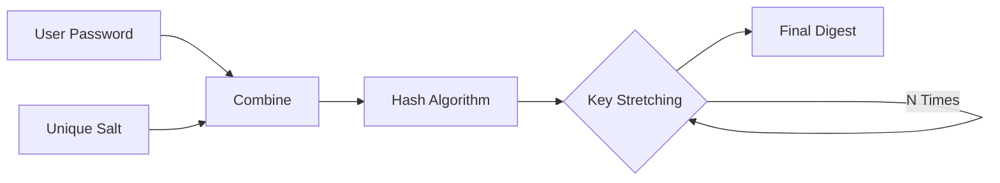

# [008].SE_해시_보안_강화_기법

## 1. [도입: Why] 해시 보안 강화의 개요

### 가. 정의
- 비밀번호 등 민감 데이터의 단방향 해시 시, **Rainbow Table**과 같은 무차별 대입 공격을 방어하기 위해 임의의 데이터(Salt/Pepper)를 추가하거나 연산을 반복(Stretching)하는 보안 강화 기술

### 나. 등장 배경 및 필요성
1. **사전 계산 공격(Rainbow Table)**: 모든 가능한 비밀번호의 해시값을 미리 계산해 놓은 테이블을 이용해 순식간에 원문을 찾는 공격 방어 필요
2. **동일 다이제스트 노출 방지**: 동일한 비밀번호를 사용하는 사용자들의 해시값이 모두 같아지는 현상을 방지하여 대량 유출 피해 최소화
3. **컴퓨팅 성능 향상**: GPU를 이용한 초고속 해시 연산 공격에 대비해 연산 비용을 강제로 증가(Work Factor)시켜야 함

## 2. [핵심: What & How] Salt, Pepper, Key Stretching

### 가. 보안 강화 기법 비교분석
| 구분 | 개념 | 저장 위치 | 특징 및 효과 |
|---|---|---|---|
| **Salt (솔트)** | 사용자별 고유한 임의의 문자열 결합 | **DB** (해시와 함께 저장) | 동일 비번의 해시화 결과 차별화, Rainbow Table 무력화 |
| **Pepper (페퍼)** | 시스템 전체 혹은 그룹별 고유 문자열 | **별도 저장** (Code/Config) | DB 유출 시에도 페퍼 값을 모르면 해시 해독 불가 |
| **Stretching (스트레칭)** | 해시 연산을 수천~수만 번 반복 | **DB** (반복 횟수 저장) | Brute-force 공격에 필요한 시간/비용 증대 |

### 나. 해시 보안 강화 프로세스 (Mermaid)

## 3. [심화: Deep-dive] 최신 패스워드 해싱 알고리즘

### 가. 메모리 및 CPU 집약적 알고리즘
- **PBKDF2**: NIST 표준. Salt와 반복 횟수(Iteration)를 사용하며 가장 범용적으로 활용
- **bcrypt**: 솔트와 반복 횟수 기반. Blowfish 암호 기반으로 설계되어 CPU 연산 비용 조절 가능
- **scrypt**: 메모리 사용량을 강제로 늘려 FPGA/ASIC 등 전용 하드웨어를 통한 고속 공격 방어에 탁월
- **Argon2**: PHC(Password Hashing Competition) 우승작. 메모리 하드니스(Memory-Hardness) 제어 가능

### 나. 키 스트레칭 동작 원리
- `Digest_0 = Hash(Password + Salt)`
- `Digest_i = Hash(Digest_i-1 + Salt + Password)` (i=1 to N)
- **효과**: 사용자는 로그인 시 0.x초의 지연만 느끼지만, 공격자는 대규모 대입 연산 시 기하급수적 비용 발생

## 4. [결론: Effect & Insight] 기술사적 제언

### 가. 실무적 적용 전략 (Best Practice)
- 비밀번호 저장 시 반드시 **Salt + Key Stretching**을 적용한 현대적 알고리즘(**bcrypt, Argon2id**) 채택 권고
- **Salt**는 최소 128비트 이상의 CSPRNG(난수)로 생성하며 매 사용자/비밀번호 변경 시마다 갱신 필수

### 나. 향후 전망 및 제언
- 클라우드 GPU 자원을 활용한 분산 공격이 가속화됨에 따라, 적정 **Iteration count**를 정기적으로 상향 조정하는 정책 수립 필요
- 단순 텍스트 기반 비밀번호를 넘어 생체 인증(FIDO), 2FA/MFA 등 다중 인증 체계로의 보안 거버넌스 전이 가속화 권장

## 5. 검증 체크리스트 (PE-Audit)

| # | 검증 항목 | 기준 | 판정 |
|---|---|---|---|
| 1 | **최신성·정확성** | Argon2, bcrypt 등 현대적 알고리즘 반영 | ✅ |
| 2 | **키워드 적정성** | Salt, Pepper, Stretching, Rainbow Table 배치 | ✅ |
| 3 | **시각화 품질** | Salt/Stretching 결합 프로세스를 직관적으로 표현 | ✅ |
| 4 | **논리적 일관성** | 공격 위협(Rainbow Table) → 기술적 해결책 인과 명확 | ✅ |
| 5 | **차별화 요소** | Argon2/scrypt 비교 및 Work Factor 제언 포함 | ✅ |
