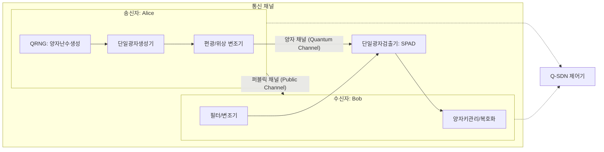

# [009].SE_양자암호통신_QKD

## 1. [도입: Why] 양자암호통신(Quantum Cryptography)의 개요

### 가. 정의
- 양자 물리 법칙인 **복제 불가성(No-Cloning Theorem)**과 **측정의 불확정성**을 활용하여 송수신자 간에 안전하게 비밀키를 공유하고 통신하는 초신뢰 보안 기술 (QKD; Quantum Key Distribution)

### 나. 등장 배경 및 필요성
1. **기존 암호 체계의 위협**: 양자 컴퓨터(Shor 알고리즘) 등장으로 현대 암호의 근간인 소인수분해 및 이산대수 기반 RSA/ECC 암호 체계 무력화 가능성 대두
2. **도청 탐지의 즉각성**: 도청자가 양자 채널을 관측할 경우 양자 상태가 변하는 결잃음 현상이 발생하여 도청 여부를 즉시 탐지 가능
3. **영구적 기밀성 확보**: 수학적 복잡도가 아닌 물리적 원리에 기반하여 미래의 기술 발전에 관계없이 기밀성 보장 (Information-Theoretic Security)

## 2. [핵심: What & How] 양자 키 분배(QKD)의 구조 및 메커니즘

### 가. 양자암호통신 네트워크 아키텍처

### 나. 핵심 구성 요소
| 구분 | 설명 | 비고/특징 |
|---|---|---|
| **QRNG (양자난수생성기)** | 양자 상태의 무작위성을 이용하여 실시간 난수 생성 | 예측 불가능성 제공 |
| **단일 광자 생성기** | 감쇠된 레이저 등을 통해 단일 광자(Single Photon) 방출 | 광자수 분리 공격 방어 |
| **단일 광자 검출기** | SPAD, 초전도체 등을 사용하여 미세 광자 검지 | 높은 양자 효율 및 낮은 암전류 |
| **키 관리 계체 (KME)** | 생성된 양자키의 저장, 수명 관리 및 공급 | 인터페이스 표준 준수 |
| **Q-SDN 제어기** | 소프트웨어 정의 네트워크 기반 양자망 경로 제어 | 확장성 및 유연성 확보 |

## 3. [심화: Deep-dive] BB84 프로토콜 및 보안 위협 분석

### 가. BB84 프로토콜 동작 메커니즘
1. **준비 단계**: Alice가 두 종류의 기저(십자 +, 대각 X)를 무작위로 선택하여 광자 편광 전송
2. **측정 단계**: Bob이 무작위로 기저를 선택하여 측정 (0: ↑/↗, 1: →/↘)
3. **기저 대조**: 퍼블릭 채널을 통해 서로의 기저 일치 여부 확인 (Sifting)
4. **키 정제**: 오류 정정(Error Correction) 및 비밀성 증폭(Privacy Amplification)을 거쳐 최종 키 생성

### 나. 보안 위협 및 대응 방안
| 공격 유형 | 공격 설명 | 대응 방안 |
|---|---|---|
| **광자수 분리 공격(PNS)** | 다중 광자 중 일부를 탈취하여 정보를 유추함 | **Decoy 기반 QKD** (가짜 광자 혼합) |
| **차단 재전송 공격** | Alice의 광자를 측정 후 동일 상태로 Bob에게 재전송 | 물리적 오차 및 양자 비트 에러율(QBER) 감시 |
| **트로이 목마 공격** | 외부 광신호를 QKD 내부로 주입하여 반사광 분석 | 광학 필터 및 아이솔레이터(Isolator) 설치 |
| **검출기 불감시간 공격** | 검출기가 반응하지 않는 시간을 노려 키 정보를 조작 | 불감시간 무작위화 및 감시 회로 운용 |

## 4. [결론: Effect & Insight] 기술사적 제언

### 가. PQC(양자내성암호)와의 하이브리드 전략
- 물리적 계층의 보안을 담당하는 **QKD**와 상위 애플리케이션 계층의 수학적 보안을 담당하는 **PQC**를 상호 보완적으로 적용하여 **다층 방어(Defense in Depth)** 구축

### 나. 국가 암호 거버넌스 및 표준화
- **KCMVP(국가 암호 모듈 검증)** 연계: 공공/국방 분야 도입을 위해 국정원 검증 필 암호모듈 탑재 및 보안성 검증 필수
- **유·무선 통합**: 유선 광섬유 기반을 넘어 저궤도 위성 및 자유공간(Free-space) 양자통신 기술 확보를 통한 전 국토 양자 보안망 확산 필요

## 5. 검증 체크리스트 (PE-Audit)

| # | 검증 항목 | 기준 | 판정 |
|---|---|---|---|
| 1 | **최신성·정확성** | BB84, Decoy QKD, PNS 공격 등 최신 이론 반영 | ✅ |
| 2 | **키워드 적정성** | 복제불가성, 결잃음, SPAD, QRNG, QBER 등 배치 | ✅ |
| 3 | **시각화 품질** | Alice-Bob 간의 양자/퍼블릭 채널 구조 시각화 | ✅ |
| 4 | **논리적 일관성** | 양자 특성 → QKD 구조 → 보안 위협 → 대응 전략 연결 | ✅ |
| 5 | **차별화 요소** | Q-SDN, PQC 하이브리드 및 KCMVP 거버넌스 제언 | ✅ |
