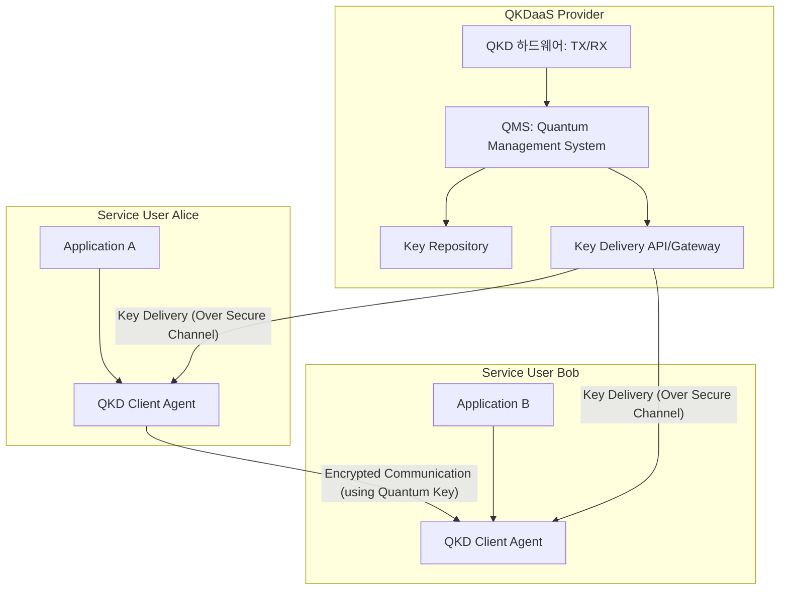

# [010].SE_QKDaaS_양자키_분배_서비스

## 1. [도입: Why] QKDaaS(QKD as a Service)의 개요

### 가. 정의
- 양자역학의 원리(중첩, 얽힘, 불확정성)를 기반으로 생성된 양자키를 클라우드 환경에서 API 형태로 실시간 제공하여, 하드웨어 구축 없이도 안전한 보안 통신을 가능케 하는 서비스형 양자키 분배 기술

### 나. 등장 배경 및 필요성
1. **인프라 구축 비용 절감**: 고가의 QKD 하드웨어(단일 광자 생성기/검출기 등)를 직접 구축하는 대신 서비스 형태로 구독하여 TCO(총 소유 비용) 절감
2. **클라우드 보안 강화**: 데이터 센터 간(DC-to-DC) 또는 클라우드 서비스 이용자에게 물리 계층 수준의 원천적 보안성(Information-Theoretic Security) 제공
3. **확장성 및 유연성 확보**: 복잡한 양자 네트워크를 가상화하고 소프트웨어 정의(Q-SDN) 기술과 연계하여 다수의 사용자에게 유연한 키 공급 가능

## 2. [핵심: What & How] QKDaaS의 구조 및 메커니즘

### 가. QKDaaS 서비스 아키텍처

### 나. 주요 구성 요소
| 구분 | 구성 요소 | 상세 역할 |
|---|---|---|
| **QKD Layer** | 단일 광자 생성/검출기 | 물리적 양자 채널을 통한 로우 데이터(Raw Key) 생성 |
| | 양자 중계기 (Repeater) | 거리 한계 극복을 위한 양자 상태 증폭 및 전달 |
| **QMS Layer** | **QMS (Quantum Mgmt System)** | 키 정제, 오류 수정, 비밀성 증폭 및 수명 관리 |
| | Crypto Algorithm | 키 분배를 위한 인증 및 제어 신호 암호화 |
| **Service Layer** | **Key Delivery API** | 사용자 애플리케이션에 표준화된 인터페이스(Restful) 제공 |
| | Multi-tenant Controller | 다수의 사용자별 키 격리 및 가상화 제어 |

## 3. [심화: Deep-dive] QKDaaS 동작 메커니즘 및 기존 방식 비교

### 가. QKDaaS 핵심 동작 절차
1. **키 생성 및 관리**: Alice와 Bob 노드 사이의 QKD 장비가 양자 채널을 통해 마스터 키 생성
2. **키 요청**: 사용자 애플리케이션(Alice/Bob)이 인증 후 QMS에 보안 통신용 키 요청
3. **키 분배**: QMS는 생성된 키를 TLS 등 안전한 기존 채널을 통해 각 사용자 에이전트에 전달
4. **암호 통신**: 전달받은 양자키를 대칭키(AES 등)의 세션키로 사용하여 실제 데이터 암복호화 수행

### 나. 기존 KaaS(Key as a Service) vs QKDaaS
| 비교 항목 | 기존 KaaS | QKDaaS |
|---|---|---|
| **키 생성 원천** | 의사 난수 생성기 (PRNG) | **양자 난수 생성기 (QRNG) / QKD** |
| **보안 근거** | 수학적 복잡도 (NP-Hard) | **물리적 법칙 (복제 불가성)** |
| **양자 컴퓨터 위협** | 취약 (쇼어 알고리즘에 노출) | **내성 보유 (양자 안전 보장)** |
| **주요 특징** | 소프트웨어 중심, 구축 용이 | 하드웨어 기반 원천 보안, 서비스화 추세 |

## 4. [결론: Effect & Insight] 기술사적 제언

### 가. 실무 도입 시 고려사항: 인터페이스 표준화
- ETSI(유럽통신표준기구) GS QKD 014 등 국제 표준 인터페이스를 준수하여 벤더 종속성(Lock-in) 방지 및 이기종 장비 간 호환성 확보 필수

### 나. 보안 및 거버넌스 통제
- **키 배달 보안**: QMS에서 사용자에게 키를 전달하는 구간(Delivery Path)이 전통적인 암호 채널이므로, 이 구간에 대한 강력한 인증 및 **PQC(양자내성암호)** 결합 검토 필요

### 다. 발전 방향 및 제언
- 향후 5G/6G 모바일 엣지 컴퓨팅(MEC)과 결합하여 스마트폰 등 모바일 기기에서도 양자 보안 서비스를 누릴 수 있는 **Quantum-Safe Mobility** 환경으로 진화할 것으로 전망됨

## 5. 검증 체크리스트 (PE-Audit)

| # | 검증 항목 | 기준 | 판정 |
|---|---|---|---|
| 1 | **최신성·정확성** | 클라우드 기반 서비스 모델 및 QMS 역할 반영 | ✅ |
| 2 | **키워드 적정성** | QMS, API, Multi-tenant, ETSI 표준 등 배치 | ✅ |
| 3 | **시각화 품질** | 공급자-사용자 간의 서비스 흐름을 명확히 표현 | ✅ |
| 4 | **논리적 일관성** | 기술적 제약(구축비용) → 서비스화 해결책 연결 | ✅ |
| 5 | **차별화 요소** | PQC 결합 및 MEC 연계 등 발전 방향 제시 | ✅ |
