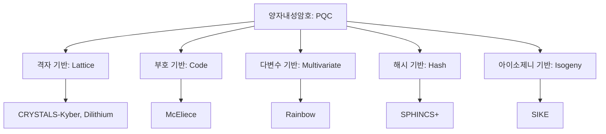

# [011].SE_양자내성암호_PQC

## 1. [도입: Why] 양자내성암호(Post-Quantum Cryptography)의 개요

### 가. 정의
- 양자 컴퓨터의 비약적인 연산 능력(Shor/Grover 알고리즘 등)으로도 해결하기 어려운 수학적 난제에 기반하여 설계된 차세대 암호 체계

### 나. 등장 배경 및 필요성
1. **기존 암호 체계의 붕괴(Shor's Threat)**: 소인수분해 기반 RSA, 이산대수 기반 ECC 등 현재 널리 쓰이는 공개키 암호가 양자 알고리즘에 의해 실시간 해독 가능해짐
2. **대칭키/해시 강도 약화(Grover's Threat)**: Grover 알고리즘에 의해 AES 등 대칭키와 해시 함수의 보안 강도가 절반으로 감소하여 키 길이 확대 필요
3. **데이터 소급 해독 위협**: '지금 탈취하고 나중에 해독(Harvest Now, Decrypt Later)'하는 공격에 대비하여 현재의 민감 데이터를 선제적으로 보호해야 함

## 2. [핵심: What & How] PQC의 유형 및 핵심 알고리즘

### 가. PQC 주요 기술 분류도

### 나. 주요 기반 난제 및 특징
| 구분 | 기반 수학적 난제 | 주요 특징 |
|---|---|---|
| **격자 기반 (Lattice)** | LWE(Learning With Errors) 등 n차원 격자점 찾기 | 가장 유망한 분야, 효율성 및 안전성 균형 우수 |
| **부호 기반 (Code)** | 오류 정정 부호의 복호화 난제 | 역사가 깊고 안전하나 키 사이즈가 매우 큼 |
| **다변수 기반 (MQ)** | 다변수 이차 다항식 해 찾기 | 서명 속도가 빠르나 공개키 크기 조절이 어려움 |
| **해시 기반 (Hash)** | 해시 함수의 일방향성 및 충돌 저항성 | 양자 내성이 입증됨, 주로 전자서명에 활용 |
| **아이소제니 (Isogeny)** | 타원곡선 간의 동종 사상 찾기 | 키 사이즈는 작으나 연산 복잡도가 매우 높음 |

## 3. [심화: Deep-dive] PQC vs QKD 비교 및 NIST 표준화 현황

### 가. QKD와 PQC의 비교 분석
| 비교 항목 | 양자 키 분배 (QKD) | 양자 내성 암호 (PQC) |
|---|---|---|
| **보안 근거** | 물리적 원리 (양자역학) | 수학적 난제 (알고리즘) |
| **구현 방식** | 전용 하드웨어(광케이블 등) 필수 | 소프트웨어 기반 (기존 인프라 활용) |
| **적용 범위** | 지점 간(P2P) 보안 채널 | 네트워크 전 구간, 웹, 앱 범용 적용 |
| **장점** | 물리적 원천 보안, 도청 즉시 탐지 | 경제성, 확장성, 기존 시스템 호환성 |

### 나. NIST PQC 표준화 현황 (제4라운드 기준)
- **KEM(키 설정)**: **CRYSTALS-Kyber** 채택 (범용적인 보안 및 성능)
- **전자서명**: **CRYSTALS-Dilithium**, **FALCON**, **SPHINCS+** 채택
- **전망**: NIST 표준 확정에 따라 전 세계 금융, 공공, 군사 인프라의 암호 전환 가속화

## 4. [결론: Effect & Insight] 기술사적 제언

### 가. 암호 민첩성(Cryptographic Agility) 확보 전략
- 특정 알고리즘의 취약점이 발견될 경우 신속하게 다른 알고리즘으로 교체할 수 있도록 시스템 아키텍처를 유연하게 설계해야 함 (Hybrid Mode 권고)

### 나. 단계적 전환 및 하이브리드 운영
- 기존 RSA/ECC와 PQC를 동시에 사용하는 **하이브리드 암호 체계**를 운영하여 과도기적 안전성 확보 필요
- 공공기관은 국정원 **K-PQC** 추진 로드맵에 따라 검증 필 알고리즘 도입 준비 필수

### 다. 미래 발전 방향
- 하드웨어(QKD)와 소프트웨어(PQC)가 결합된 **양자 안전 통신(Quantum-Safe)** 환경 구축을 통해 양자 컴퓨터 위협에 대한 완전한 방어 체계 수립 지향

## 5. 검증 체크리스트 (PE-Audit)

| # | 검증 항목 | 기준 | 판정 |
|---|---|---|---|
| 1 | **최신성·정확성** | NIST 표준(Kyber, Dilithium 등) 반영 여부 | ✅ |
| 2 | **키워드 적정성** | 쇼공그대, 격다부해아, 암호 민첩성 등 배치 | ✅ |
| 3 | **시각화 품질** | PQC 유형을 계층적으로 명확히 분류 | ✅ |
| 4 | **논리적 일관성** | 양자 위협 → 수학적 해결책 → 표준화 → 제언 연결 | ✅ |
| 5 | **차별화 요소** | 소급 해독(Harvest Now) 위협 및 K-PQC 제언 | ✅ |
