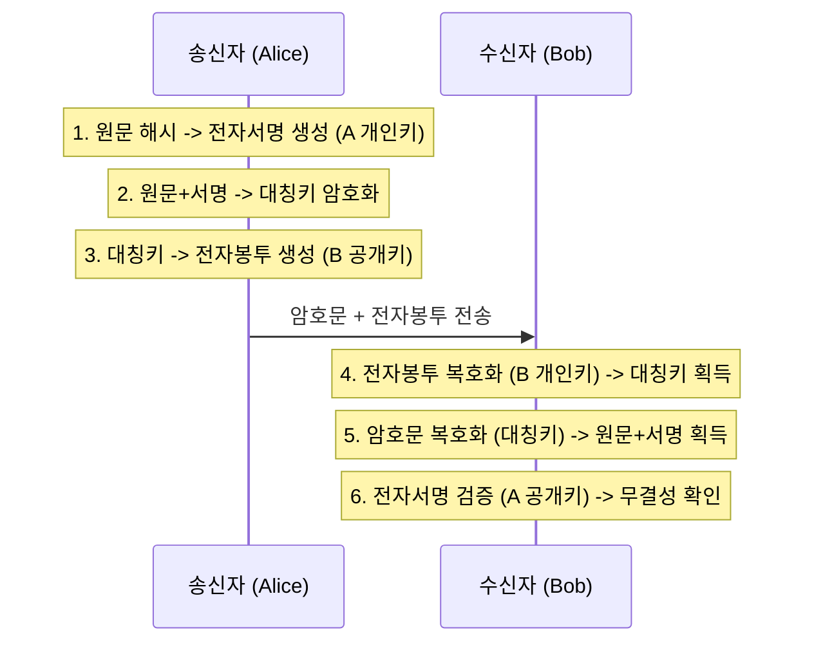

# [012].SE_전자서명_및_전자봉투

## 1. [도입: Why] 전자서명 및 전자봉투의 개요

### 가. 정의
- **전자서명 (Digital Signature)**: 메시지의 해시값을 송신자의 개인키로 암호화하여 무결성, 인증, 부인방지를 제공하는 기술
- **전자봉투 (Digital Envelope)**: 대칭키 암호화에 사용된 비밀키를 수신자의 공개키로 암호화하여 기밀성과 키 분배 문제를 해결한 기술

### 나. 필요성
1. **무결성 및 인증**: 전송 중 데이터 변조를 방지하고 작성자의 신원을 확실히 증명(전자서명)
2. **부인방지**: 나중에 서명 사실을 부인할 수 없도록 법적/기술적 효력 제공
3. **기밀성 및 효율성**: 대량의 데이터는 대칭키로 빠르게 암호화하고, 핵심 키는 공개키로 안전하게 전달(전자봉투)

## 2. [핵심: What & How] 메커니즘 및 구성 요소

### 가. 전자서명 및 전자봉투 복합 메커니즘 (Mermaid)

### 나. 핵심 기술 요소
| 구분 | 기술 요소 | 상세 설명 |
|---|---|---|
| **암호 알고리즘** | 공개키 (RSA, ECC) | 전자서명 생성 및 전자봉투 생성에 활용 |
| | 대칭키 (AES, SEED) | 대량의 원문 데이터 암호화에 활용 |
| **무결성 기술** | 해시 함수 (SHA-256) | 메시지 다이제스트(M.D) 생성을 통한 변조 방지 |
| **인증 기술** | PKI (공인인증서) | 공개키의 정당성을 보증하는 인프라 체계 |

## 3. [심화: Deep-dive] 전자서명의 6대 특징 및 절차 상세

### 가. 전자서명의 6대 특징 (변재부인 분위기)
1. **변경불가 (Integrity)**: 서명 후 메시지 내용 변경 시 즉각 탐지
2. **재사용불가 (Non-reusable)**: 한 문서의 서명을 다른 문서에 복사하여 재사용 불가
3. **부인방지 (Non-repudiation)**: 서명자가 서명 사실을 사후에 부인할 수 없음
4. **서명자 인증 (Authentication)**: 서명자가 누구인지 확인 가능
5. **분쟁해결 (Dispute resolution)**: 제3자(법원 등)가 서명의 진위 여부 판단 가능
6. **위조불가 (Unforgeable)**: 서명자 외에 타인이 서명을 위조할 수 없음

### 나. 전자봉투의 송신 및 검증 절차
- **송신**: [M.D 생성] → [전자서명 생성] → [비밀키로 암호문 생성] → [전자봉투 생성] → [전송]
- **검증**: [전자봉투 복호화] → [비밀키 획득] → [암호문 복호화] → [전자서명 복호화] → [해시 비교]

## 4. [결론: Effect & Insight] 기술사적 제언

### 가. 실무적 활용 시 고려사항
- **성능 최적화**: 대용량 파일 전송 시 대칭키와 공개키를 혼합한 하이브리드 방식(전자봉투)이 필수적임
- **보안성 강화**: 전자서명만으로는 기밀성을 보장할 수 없으므로 반드시 전자봉투 기법을 병행하여 적용 권고

### 나. 발전 방향 및 제언
- **양자 내성**: 양자 컴퓨터 등장 시 기존 RSA 기반 전자서명이 무력화될 수 있으므로, **PQC(양자내성암호)** 기반 전자서명 및 전자봉투로의 전환 준비 필요
- **임베디드 적용**: IoT 기기의 Secure Boot 등에 전자서명을 활용하여 펌웨어 위변조 방지 체계 구축 필수

## 5. 검증 체크리스트 (PE-Audit)

| # | 검증 항목 | 기준 | 판정 |
|---|---|---|---|
| 1 | **최신성·정확성** | 하이브리드 암호 체계 및 전자서명 특징 반영 | ✅ |
| 2 | **키워드 적정성** | 변재부인 분위기, 해시비교, 개인키/공개키 등 배치 | ✅ |
| 3 | **시각화 품질** | 송수신 프로세스를 Sequence Diagram으로 명확화 | ✅ |
| 4 | **논리적 일관성** | 필요성 → 결합 메커니즘 → 특징 → 제언 인과 명확 | ✅ |
| 5 | **차별화 요소** | Secure Boot 및 양자 내성 암호 연계 제언 | ✅ |
