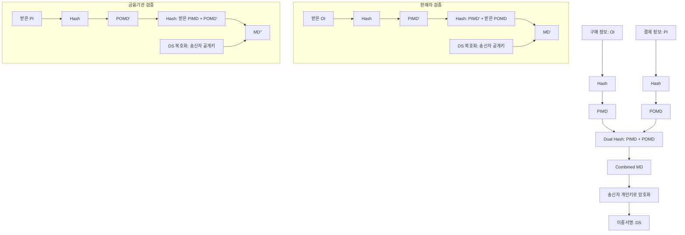

# [013].SE_이중서명_및_SET_프로토콜

## 1. [도입: Why] 이중서명 및 SET의 개요

### 가. 정의
- **이중서명 (Dual Signature)**: 전자상거래 시 판매자에게는 구매 정보를, 금융기관(PG)에게는 결제 정보만을 알 수 있도록 정보를 분리하여 서명하는 기술
- **SET (Secure Electronic Transaction)**: 인터넷 전자상거래의 안전한 결제 수단을 제공하기 위해 Visa와 Master사가 공동 개발한 신용카드 보안 프로토콜

### 나. 필요성
1. **프라이버시 보호**: 판매자가 고객의 결제 정보(카드번호 등)를 알 수 없도록 하여 정보 유출 방지
2. **무결성 및 연계성 보장**: 구매 정보와 결제 정보가 서로 다른 곳으로 전송되더라도 두 정보가 하나의 주문임(연계성)을 증명
3. **인증 및 부인방지**: 구매자, 판매자, 금융기관 간의 상호 인증을 통한 신뢰성 있는 거래 체계 구축

## 2. [핵심: What & How] 이중서명 메커니즘

### 가. 이중서명 생성 및 검증 프로세스 (Mermaid)

### 나. 구성 요소 및 기술
| 기술 요소 | 설명 | 비고 |
|---|---|---|
| **OI (Order Info)** | 구매 정보. 품목, 수량, 배송지 등 포함 | 판매자 열람 가능 |
| **PI (Payment Info)** | 결제 정보. 카드번호, 만료일, 금액 등 포함 | 금융기관 열람 가능 |
| **전자봉투** | 비밀키를 금융기관의 공개키로 암호화하여 전달 | PI의 기밀성 보장 |
| **이중서명 (DS)** | PIMD와 POMD를 합친 해시값을 서명 | 정보 연계 및 무결성 |

## 3. [심화: Deep-dive] 정보 분리 및 연계 메커니즘 분석

### 가. 판매자 관점의 정보 처리
- **정보 수신**: 구매 정보(OI), 암호화된 결제 정보, PIMD, POMD, 이중서명 수신
- **검증**: 자신의 OI를 해시한 결과와 전달받은 POMD를 결합하여 이중서명과 대조. PI 원문은 복호화 불가(기밀성 유지)

### 나. 금융기관(PG) 관점의 정보 처리
- **정보 수신**: 암호화된 결제 정보, 전자봉투, PIMD, POMD, 이중서명 수신
- **검증**: 전자봉투를 복호화하여 비밀키를 얻고 PI를 복호화. 이후 자신의 PI 해시와 전달받은 PIMD를 결합하여 이중서명 대조

## 4. [결론: Effect & Insight] 기술사적 제언

### 가. 실무적 한계 및 현황
- **복잡성 및 비용**: SET은 강력한 보안을 제공하지만 PKI 기반의 복잡한 절차와 연산 부하로 인해 상업적으로는 SSL/TLS에 밀려 활성화되지 못함
- **데이터 분리**: 하지만 정보의 기밀성을 위해 필요한 곳에만 정보를 노출하는 '이중서명'의 논리적 아키텍처는 현대의 **데이터 격리(Data Isolation)** 기술에 영감을 줌

### 나. 발전 방향 및 제언: 핀테크 보안 연계
- 최근의 **간편결제(Pay)** 및 **마이데이터(MyData)** 환경에서 사용자의 민감 정보를 특정 주체만 열람하게 하는 기법에 이중서명과 유사한 토큰화(Tokenization) 및 위변조 방지 기술 적용 필수
- **정보 주체 중심**: 결제 시 고객의 프라이버시를 보호하면서도 거래 무결성을 보장하는 기술로 재조명 필요

## 5. 검증 체크리스트 (PE-Audit)

| # | 검증 항목 | 기준 | 판정 |
|---|---|---|---|
| 1 | **최신성·정확성** | SET 프로토콜 및 이중서명의 정보 분리 메커니즘 반영 | ✅ |
| 2 | **키워드 적정성** | PIMD, POMD, OI/PI 분리, 전자봉투 연계 등 배치 | ✅ |
| 3 | **시각화 품질** | OI/PI가 해시되어 DS로 결합되는 과정을 명확히 표현 | ✅ |
| 4 | **논리적 일관성** | 정보 분리 필요성 → 이중서명 메커니즘 → 검증 프로세스 연결 | ✅ |
| 5 | **차별화 요소** | 현대 핀테크 및 데이터 격리 기술과의 연계 제언 | ✅ |
