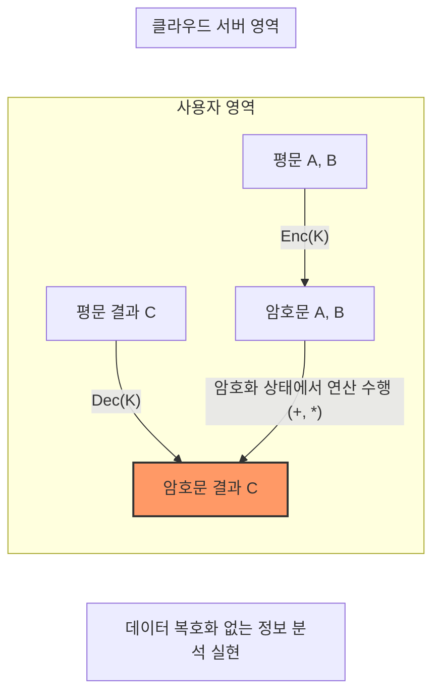

# [014].SE_동형암호

## 1. [도입: Why] 동형암호(Homomorphic Encryption)의 개요

### 가. 정의
- 암호화된 상태의 데이터를 복호화하지 않고도 각종 연산을 수행할 수 있으며, 연산 결과물(암호문)을 복호화했을 때 평문의 연산 결과와 동일하게 도출되는 **4세대 암호화 체계**

### 나. 등장 배경 및 필요성
1. **데이터 프라이버시 보호**: 개인정보보호법 및 GDPR 준수 하에 민감 데이터를 활용하기 위한 프라이버시 보존 컴퓨팅(PET) 수요 증대
2. **클라우드 보안 신뢰성**: 클라우드 사업자에게 데이터를 노출하지 않으면서도 분석 및 통계 서비스를 제공받을 수 있는 기술적 토대 마련
3. **격자기반암호 활용**: 양자 컴퓨터의 공격에 강인한 격자기반암호(Lattice-based Cryptography) 기술을 기반으로 차세대 보안성 확보

## 2. [핵심: What & How] 동형암호의 구조 및 메커니즘

### 가. 개념도 및 데이터 흐름

### 나. 핵심 구성 요소
| 구분 | 설명 | 비고/특징 |
|---|---|---|
| **PHE / SWHE / FHE** | 부분적(PHE), 준(SHE), 완전(FHE) 동형암호로 분류 | 연산 가능 횟수/종류에 따른 구분 |
| **격자 기반 암호** | n차원의 격자점 문제를 활용한 수학적 난제 기반 | **양자 내성(PQC)** 제공 |
| **중국인 나머지 정리** | 대규모 수치 연산을 작은 수의 연산으로 분할 처리 (CRT) | 연산 효율성 및 속도 향상 |
| **서킷 프라이버시** | 연산 결과로부터 수행된 연산의 종류나 깊이를 유출 방지 | 알고리즘 은닉 및 보안 강화 |
| **다중 도약 동형성** | 여러 번의 연산을 거쳐도 동형성이 유지되는 성질 | Multi-hop 연산 지원 |

## 3. [심화: Deep-dive] 동형암호의 원리 및 알고리즘 분석

### 가. 동형암호 핵심 원리 ([부스트])
1. **부분동형암호 (Partial Homomorphism)**: 덧셈 혹은 곱셈 중 한 종류의 연산만 지원하는 초기 모델 (RAD78 등)
2. **스쿼싱 (Squashing)**: 복호화 회로의 복잡도(Depth)를 낮추어 부트스트래핑이 가능하도록 변환하는 기법
3. **부트스트래핑 (Bootstrapping)**: 연산 과정에서 누적된 노이즈를 제거하여 무제한 연산을 가능케 하는 완전동형암호의 핵심 기술

### 나. 주요 알고리즘 및 유형 비교
| 비교 항목 | PHE (부분 동형) | SWHE (준 동형) | FHE (완전 동형) |
|---|---|---|---|
| **지원 연산** | 한 종류 (덧셈 OR 곱셈) | 덧셈 및 제한적 곱셈 | **무제한 덧셈 및 곱셈** |
| **대표 알고리즘** | **RAD78** (RSA), Paillier | **BGN05** | **Gen09** (Gentry), CKKS, BGV |
| **주요 특징** | 구현 단순, 속도 빠름 | 연산 횟수 임계치 존재 | 부트스트래핑 필수, 높은 복잡도 |
| **핵심 기술** | CRT-Based 연산 | 겹선형 사상 (Pairing) | 격자 난제, LWE |

## 4. [결론: Effect & Insight] 기술사적 제언

### 가. 실무 도입 시 고려사항
- **연산 오버헤드**: 평문 연산 대비 수천 배 이상의 지연 시간이 발생하므로, 전용 하드웨어 가속기(FPGA, GPU) 도입을 통한 성능 최적화 필수
- **데이터 확장성**: 암호화 시 데이터 크기가 수백 배 팽창하므로 스토리지 가용량 및 네트워크 대역폭 확보 전략 필요

### 나. 보안 및 거버넌스 통제 방안
- **암호 민첩성**: 신규 동형암호 알고리즘(CKKS 등)의 보안 취약점 발견 시 신속히 교체할 수 있는 유연한 거버넌스 체계 구축
- **가명정보 결합**: 데이터 3법에 따른 가명정보 결합 시, 재식별 위험을 원천 차단하는 기술적 통제 수단으로 활용

### 다. 발전 방향 및 제언
- 향후 AI 및 머신러닝 분야에서 **암호화된 데이터 학습(ML on Encrypted Data)**이 보편화될 것이며, 6G 및 초연결 IoT 환경에서 개인의 프라이버시를 보장하는 **신뢰 컴퓨팅(Trust Computing)**의 핵심 기술로 자리매김할 것임

## 5. 검증 체크리스트 (PE-Audit)

| # | 검증 항목 | 기준 | 판정 |
|---|---|---|---|
| 1 | **최신성·정확성** | Gen09, CKKS 등 현대적 알고리즘 및 부스트 원리 반영 | ✅ |
| 2 | **키워드 적정성** | 격자기반, 부트스트래핑, 스쿼싱, CRT, 서킷 프라이버시 등 | ✅ |
| 3 | **시각화 품질** | Mermaid를 통해 동형암호의 입출력 관계를 명확히 표현 | ✅ |
| 4 | **논리적 일관성** | 도입(PET) → 핵심(구성요소) → 심화(부스트) → 결론(제언) | ✅ |
| 5 | **차별화 요소** | 전용 가속기 도입 및 가명정보 결합 등 실무적 제언 포함 | ✅ |
