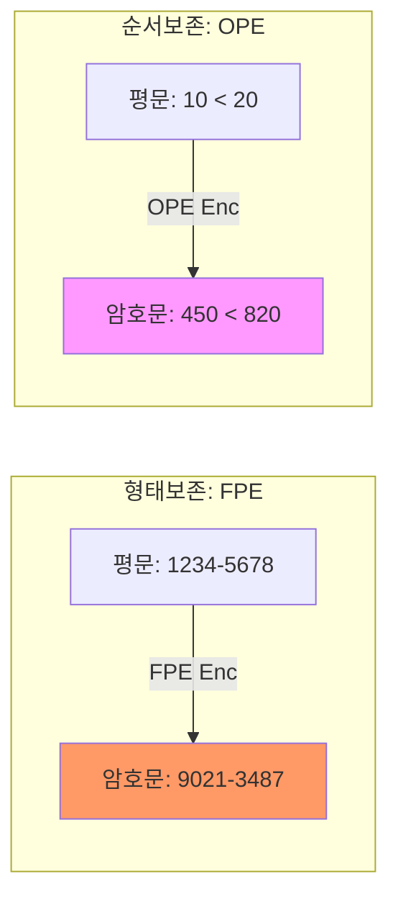

# [015].SE_FPE_및_OPE_데이터_활용_보안

## 1. [도입: Why] FPE 및 OPE의 개요

### 가. 정의
- **형태보존 암호화 (FPE; Format-Preserving Encryption)**: 원본 데이터의 길이와 형태(숫자, 문자 등)를 유지하며 암호화하는 기술 (NIST 표준 FF1, FF3)
- **순서보존 암호화 (OPE; Order-Preserving Encryption)**: 암호화된 상태에서도 원본 평문의 대소 관계(순서)를 유지하는 기술

### 나. 필요성
1. **시스템 수정 최소화**: 기존 데이터베이스 스키마나 애플리케이션의 필드 길이/속성을 변경하지 않고 암호화 적용 가능
2. **검색 효율성**: 순서 정보가 유지되므로 인덱스 사용 및 범위 검색(Range Search)이 가능하여 대량 데이터 처리 성능 유지
3. **빅데이터 활용**: 암호화된 상태에서도 통계적 특성(분포, 순위 등)을 보존하여 분석에 활용

## 2. [핵심: What & How] 유형별 메커니즘 분석

### 가. FPE 및 OPE 연산 구조도 (Mermaid)

### 나. 기술 비교 분석
| 비교 항목 | 형태보존 암호화 (FPE) | 순서보존 암호화 (OPE) |
|---|---|---|
| **핵심 기술** | Tweak 활용, Feistel 구조 | 단조증가함수, Noise 삽입 |
| **주요 특징** | 원본 데이터 타입/길이 고정 | 대소 관계(Index) 유지 |
| **보안 강도** | AES 기반으로 상대적으로 높음 | 순서 정보 노출로 상대적으로 낮음 |
| **세부 기술** | FF1, FF3, Cycle-Walking | POPIS, 초기화/트리 기반 순서보존 |

## 3. [심화: Deep-dive] 구현 기술 및 보안 고려사항

### 가. FPE 구현 기술: Generalized-Feistel
- 원본 데이터의 도메인이 작더라도(예: 0~99) 균등하게 암호화 가능
- **Tweak**: 암호화 키 외에 추가적인 입력값을 사용하여 동일 평문에 대한 암호문 다양성 확보

### 나. OPE의 한계와 대안
- **공격 취약성**: 평문의 분포 정보가 암호문에 노출되어 통계적 분석 공격에 취약함
- **대안**: 보안성을 높인 가변 순서보존 암호화 또는 신뢰 실행 환경(TEE) 내에서의 연산 검토 필요

## 4. [결론: Effect & Insight] 기술사적 제언

### 가. 실무적 적용 전략
- 신용카드 번호(BIN 번호 유지), 주민등록번호 등 기존 인프라 수정이 어려운 레거시 시스템 현대화 시 **FPE** 우선 적용 권고
- 검색 기능이 필수적인 비식별화 데이터셋에는 **OPE**를 적용하되, 중요 정보는 마스킹(Masking) 및 접근 제어 병행

### 나. 보안 거버넌스 강화
- 암호화 기술 자체의 안전성보다 키 관리 및 Tweak 값의 관리가 중요하므로 **KMS(Key Management System)**와의 연동 필수
- 데이터 활용 목적(Analysis vs Protection)에 따른 적정 암호화 수준 정의 및 개인정보 영향 평가 수행 필요

## 5. 검증 체크리스트 (PE-Audit)

| # | 검증 항목 | 기준 | 판정 |
|---|---|---|---|
| 1 | **최신성·정확성** | NIST 표준(FF1, FF3) 및 최신 OPE 동향 반영 | ✅ |
| 2 | **키워드 적정성** | Tweak, 단조증가함수, Feistel, Cycle-Walking 등 배치 | ✅ |
| 3 | **시각화 품질** | FPE와 OPE의 결과적 차이점을 명확히 비교 시각화 | ✅ |
| 4 | **논리적 일관성** | 인프라 제약 → 기술적 대안(FPE/OPE) → 적용 전략 연결 | ✅ |
| 5 | **차별화 요소** | OPE의 취약점과 TEE 등 대안적 접근 제시 | ✅ |
