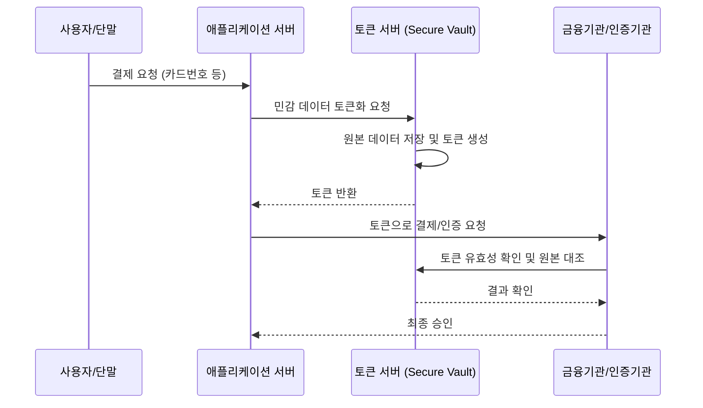

# [016].SE_토큰화_기술_Tokenization

## 1. [도입: Why] 토큰화(Tokenization)의 개요

### 가. 정의
- 개인정보나 신용카드 번호 등 민감 데이터를 직접 전송·저장하는 대신, 원본 데이터와 대응되는 난수 형태의 가상 데이터(Token)로 치환하여 정보 유출 위험을 원천 차단하는 보안 기술

### 나. 필요성
1. **유출 시 피해 최소화**: 토큰 데이터는 그 자체로 아무런 의미가 없으므로, 유출되더라도 원본 정보를 유추할 수 없음
2. **PCI DSS 준수**: 카드 정보를 직접 처리하지 않음으로써 보안 규정 준수 범위를 대폭 축소하고 비용 절감 가능
3. **가역적 활용성**: 필요 시 권한이 있는 주체만 토큰 서버를 통해 원본 데이터를 복원하여 비즈니스 프로세스 지속

## 2. [핵심: What & How] 토큰화의 구조 및 메커니즘

### 가. 토큰화 프로세스 (Mermaid)

### 나. 주요 구성 요소 및 기술
| 구성 요소 | 상세 역할 | 비고 |
|---|---|---|
| **토큰 서버 (Vault)** | 원본 데이터와 토큰의 매핑 정보를 안전하게 저장/관리 | 강력한 접근 제어 필수 |
| **토큰 (Token)** | 의미 없는 난수 또는 형태보존(FPE)된 데이터 | 일회용 또는 다회용 가능 |
| **FPE 기술** | 원본 데이터의 형태를 유지하며 토큰화 수행 | 레거시 시스템 호환성 보장 |
| **MDES / VTS** | 마스터카드(MDES), 비자(VTS)의 디지털 토큰 서비스 | 글로벌 결제 표준 준수 |

## 3. [심화: Deep-dive] 토큰화 vs 암호화 비교 분석

### 가. 토큰화와 암호화의 차이점
| 비교 항목 | 암호화 (Encryption) | 토큰화 (Tokenization) |
|---|---|---|
| **보안 원리** | 수학적 알고리즘 및 암호키 기반 | 무작위 치환 및 매핑 정보 기반 |
| **저장 위치** | 암호화된 데이터가 분산 저장 가능 | 중앙 집중식 토큰 서버(Vault) 운영 |
| **규제 준수** | 암호화 후에도 데이터 관리 책임 존재 | 카드 정보 처리 범위(PCI Scope) 제외 가능 |
| **장점** | 인프라 비용 상대적으로 낮음 | 유출 시 원본 복원 절대 불가 (보안 우위) |

### 나. 토큰화의 유형: Vault vs Vaultless
- **Vault 기반**: 중앙 데이터베이스에 원본과 토큰 매핑 정보 저장
- **Vaultless 기반**: 매핑 정보 저장 대신 FPE와 같은 알고리즘으로 동적 생성 (관리 부담 적으나 보안 고려 필수)

## 4. [결론: Effect & Insight] 기술사적 제언

### 가. 보안 거버넌스 강화
- 토큰 서버 자체가 해킹될 경우 모든 원본 데이터가 노출되므로, 토큰 서버에 대한 **강력한 격리(Isolation)** 및 **HSM(Hardware Security Module)** 활용 필수

### 나. 발전 방향 및 제언
- **애플페이, 삼성페이**: 모바일 결제 환경에서 단말기 내에 카드 정보를 저장하지 않고 토큰(Device Account Number)을 사용하여 보안성 극대화
- **마이데이터(MyData)**: 가명정보 결합 및 전송 시 토큰화 기술을 적극 활용하여 사용자 프라이버시 보호와 데이터 활용의 균형 추구 권고

## 5. 검증 체크리스트 (PE-Audit)

| # | 검증 항목 | 기준 | 판정 |
|---|---|---|---|
| 1 | **최신성·정확성** | 애플페이 등 현대적 결제 환경 및 MDES/VTS 반영 | ✅ |
| 2 | **키워드 적정성** | PCI DSS, FPE, Vault, 매핑 정보, 난수 치환 등 배치 | ✅ |
| 3 | **시각화 품질** | 사용자-서버-토큰서버 간의 흐름을 시퀀스 도로 명확화 | ✅ |
| 4 | **논리적 일관성** | 민감 데이터 노출 방지 필요성 → 토큰화 해결책 연결 | ✅ |
| 5 | **차별화 요소** | 암호화와의 비교 및 Vaultless 방식 언급 | ✅ |
