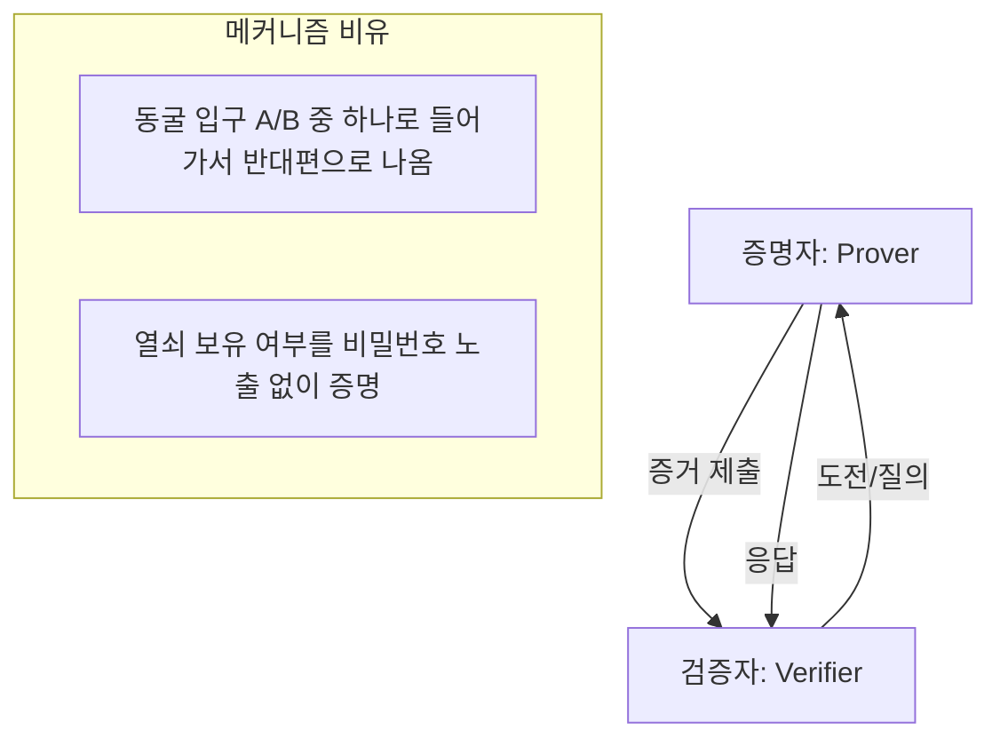

# [017].SE_영지식_증명_Zero_Knowledge_Proof

## 1. [도입: Why] 영지식 증명(ZKP)의 개요

### 가. 정의
- 어떤 지식(정보)을 알고 있다는 사실을 증명할 때, 그 지식 자체를 노출하지 않고도 상대방(검증자)에게 신뢰를 줄 수 있는 암호학적 증명 기법

### 나. 등장 배경 및 필요성
1. **프라이버시와 신뢰의 공존**: 비밀번호나 개인키 등을 전송하지 않고도 인증을 수행하여 가로채기 공격(Man-in-the-Middle) 원천 차단
2. **블록체인 익명성 해결**: 거래 금액이나 송수신자의 주소를 공개하지 않으면서도 해당 거래가 정당함을 네트워크에 증명(Zcash 등)
3. **데이터 소유권 증명**: 데이터의 원본을 제공하지 않고 특정 조건(예: 성인 인증 시 생년월일 미노출) 충족 여부만 증명

## 2. [핵심: What & How] 영지식 증명의 특성 및 구조

### 가. 영지식 증명의 3대 성질 (완건영)
| 성질 | 설명 | 비고 |
|---|---|---|
| **완전성 (Completeness)** | 참인 명제에 대해 정당한 증명자는 검증자를 반드시 설득할 수 있음 | 정직한 참여자 간의 신뢰 |
| **건전성 (Soundness)** | 거짓인 명제에 대해 부정한 증명자가 검증자를 속일 수 없음 | 위조 및 사기 방지 |
| **영지식성 (Zero-knowledge)** | 검증자는 명제의 참/거짓 외에는 어떠한 정보도 얻을 수 없음 | **정보 비노출의 핵심** |

### 나. 영지식 증명 메커니즘 (알리바바 동굴 비유)

## 3. [심화: Deep-dive] 대화형 vs 비대화형 영지식 증명

### 가. 유형별 특징 비교
| 비교 항목 | 대화형 ZKP (Interactive) | 비대화형 ZKP (Non-Interactive) |
|---|---|---|
| **상호작용** | 여러 번의 질의-응답(Challenge-Response) 반복 | 단 한 번의 메시지 전송으로 증명 완료 |
| **효율성** | 지연 시간 발생 가능 | 매우 높음 (블록체인 적합) |
| **주요 기술** | Graph Isomorphism | **zk-SNARK, zk-STARK** |
| **구성 요소** | 증명자, 검증자 | 증명자, 검증자, **신뢰된 제3자 (Setup)** |

### 나. 현대적 비대화형 ZKP 기술 분석
1. **zk-SNARK**: 'Succinct Non-interactive ARgument of Knowledge'. 증명 크기가 작고 검증이 매우 빠름 (초기 신뢰 설정 필요)
2. **zk-STARK**: 'Scalable Transparent ARgument of Knowledge'. 신뢰 설정이 불필요하며 양자 컴퓨터에 대한 내성을 가짐

## 4. [결론: Effect & Insight] 기술사적 제언

### 가. 실무적 활용 방안
- **DID (Decentralized ID)**: 자기 주권 신원 증명 시 최소한의 정보만 노출하여 프라이버시 보호 극대화
- **Layer 2 확장성**: 이더리움 등의 블록체인에서 트랜잭션을 묶어서 영지식 증명으로 제출(ZK-Rollup)하여 처리량(TPS) 향상

### 나. 향후 전망 및 제언
- 영지식 증명은 '신뢰 기술(Trust Tech)'의 정점으로, 향후 중앙은행 디지털화폐(CBDC)나 가명정보 결합 인프라의 핵심 보안 기술로 자리매김할 것으로 전망됨
- 연산 복잡도 최적화를 위해 **ZKP 가속기** 및 표준화된 라이브러리 확보 전략 필요

## 5. 검증 체크리스트 (PE-Audit)

| # | 검증 항목 | 기준 | 판정 |
|---|---|---|---|
| 1 | **최신성·정확성** | zk-SNARK/STARK, DID 연계 등 최신 동향 반영 | ✅ |
| 2 | **키워드 적정성** | 완건영, 알리바바 동굴, 비대화형, ZK-Rollup 등 배치 | ✅ |
| 3 | **시각화 품질** | 증명자와 검증자의 상호작용 및 동굴 비유 시각화 | ✅ |
| 4 | **논리적 일관성** | 정보 노출 딜레마 → 영지식 해결책 → 최신 기술 연결 | ✅ |
| 5 | **차별화 요소** | DID 및 ZK-Rollup 등 구체적 유스케이스 제시 | ✅ |
