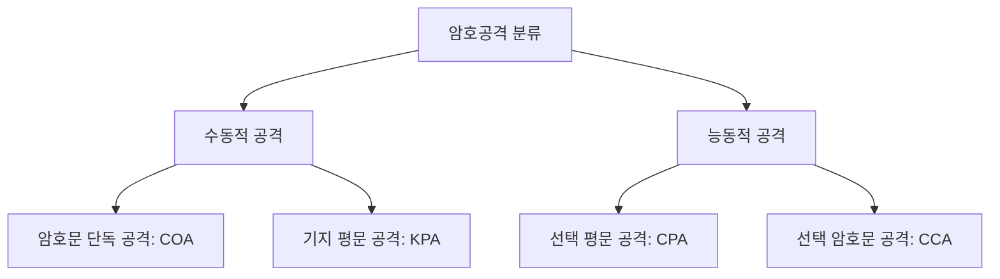

# [018].SE_암호공격

## 1. [도입: Why] 암호공격(Cryptographic Attack)의 개요

### 가. 정의
- 암호키에 대한 정보 없이 암호화된 정보를 해독하거나, 인증에 필요한 패스워드 및 키를 탈취하기 위해 수행되는 모든 암호학적 공격 행위

### 나. 커크호프 원칙 (Kerckhoffs's Principle)
1. **정의**: 암호 알고리즘과 시스템의 모든 내용이 공개되더라도, 오직 **암호키(Secret Key)**만 유출되지 않는다면 시스템은 안전해야 한다는 원칙
2. **의의**: 알고리즘의 비공개가 아닌 키의 복잡성과 관리 체계에 보안의 근간을 두어야 함을 강조

## 2. [핵심: What & How] 암호공격의 분류 및 메커니즘

### 가. 공격자 정보 획득 수준에 따른 분류 (COA/KPA/CPA/CCA)

### 나. 주요 암호공격 기법 상세
| 구분 | 설명 | 비고/특징 |
|---|---|---|
| **COA (Ciphertext Only)** | 암호문(C)만을 수집하여 통계적 성질로 평문 유추 | 공격자 정보 최소 |
| **KPA (Known Plaintext)** | 일정량의 (평문 P, 암호문 C) 쌍을 알고 공격 | 알고리즘 유추 가능 |
| **CPA (Chosen Plaintext)** | 임의의 평문을 입력하여 그에 대응하는 암호문 획득 | 암호기 접근 권한 필요 |
| **CCA (Chosen Ciphertext)** | 임의의 암호문을 입력하여 그에 대응하는 평문 획득 | 가장 강력한 공격 수준 |

## 3. [심화: Deep-dive] 정보단위 기반 공격 및 결과 레벨

### 가. 블록 및 스트림 암호 공격 기법
1. **블록 암호 공격**: 차분 공격(Differential), 선형 공격(Linear), 연관 키 공격(Related-key)
2. **스트림 암호 공격**: 구별 공격(Distinguishing), 예측 공격(Prediction), 대수적 공격(Algebraic)

### 나. 암호 공격 성공 단계 (Result Level)
| 레벨 | 명칭 | 상세 내용 |
|---|---|---|
| **Level 1** | **Total Break** | 암호 키(Key) 자체를 완전히 발견 |
| **Level 2** | **Global Deduction** | 키는 모르나 복호화 가능한 알고리즘(Algorithm) 발견 |
| **Level 3** | **Instance Deduction** | 특정 암호문으로부터 대응하는 평문(Plaintext) 발견 |
| **Level 4** | **Information Deduction** | 평문이나 키의 일부 정보(Partial Info) 추출 |

## 4. [결론: Effect & Insight] 기술사적 제언

### 가. 암호 기술의 안전성 유지 방안
- **암호 민첩성(Cryptographic Agility)**: 특정 알고리즘의 취약점이 발견될 경우(Total Break 등) 즉시 교체 가능한 구조 설계
- **키 관리 체계**: 알고리즘의 안전성보다 키의 생성, 저장, 폐기 등 Life-cycle 전반의 거버넌스 강화 필수

### 나. 발전 방향: 양자 암호 공격 대응
- 양자 컴퓨터의 Grover/Shor 알고리즘에 의한 암호 해독 위협에 대응하기 위해 **PQC(양자내성암호)**로의 단계적 전환 및 하이브리드 암호 체계 도입 권고

## 5. 검증 체크리스트 (PE-Audit)

| # | 검증 항목 | 기준 | 판정 |
|---|---|---|---|
| 1 | **최신성·정확성** | 커크호프 원칙 및 4대 암호공격 기법 반영 | ✅ |
| 2 | **키워드 적정성** | COA/KPA/CPA/CCA, 차분/선형 공격, Total Break 등 배치 | ✅ |
| 3 | **시각화 품질** | 공격 분류 체계를 Mermaid로 명확히 시각화 | ✅ |
| 4 | **논리적 일관성** | 공격 원리 → 기법 분류 → 성공 단계 → 대응 제언 인과 명확 | ✅ |
| 5 | **차별화 요소** | 암호 민첩성 및 양자 공격 대응 제언 포함 | ✅ |
