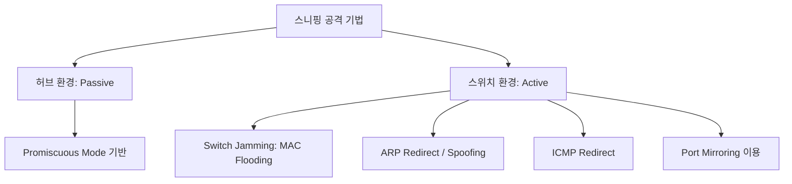

# [020].SE_스니핑_Sniffing

## 1. [도입: Why] 스니핑(Sniffing)의 개요

### 가. 정의
- 컴퓨터 네트워크상에서 전송되는 패킷을 가로채어 내용을 엿듣는 도청 행위 (Passive Eavesdropping)

### 나. 위험성 및 영향
1. **기밀성(Confidentiality) 침해**: 평문으로 전송되는 아이디, 패스워드, 민감 데이터의 직접 노출
2. **세션 하이재킹 기반**: 스니핑을 통해 획득한 세션 ID로 정당한 사용자의 권한 탈취 가능
3. **공격의 비가시성**: 네트워크 트래픽을 변조하지 않고 읽기만 하므로 탐지가 어려움

## 2. [핵심: What & How] 스니핑 기법 및 아키텍처

### 가. 주요 스니핑 기법 및 원리 (Mermaid)

### 나. 스니핑 공격 기술 상세
| 기법 | 설명 | 비고/특징 |
|---|---|---|
| **Promiscuous Mode** | 자신의 MAC 주소가 아닌 패킷도 수신하도록 NIC 설정 | 스니핑의 기본 동작 모드 |
| **Switch Jamming** | 위조 MAC 주소를 대량 발생시켜 스위치를 더미 허브화 | MAC Table 오버플로우 유발 |
| **ARP Redirect** | 공격자의 MAC 주소가 게이트웨이인 것처럼 속여 패킷 유도 | **MITM (Man-in-the-Middle)** 기반 |
| **ICMP Redirect** | 호스트의 라우팅 테이블을 조작하여 특정 경로로 유도 | 비정상적 ICMP 패킷 전송 |

## 3. [심화: Deep-dive] 스니핑 탐지 및 방어 체계

### 가. 스니퍼(Sniffer) 탐지 기법
1. **Promiscuous Mode 탐지**: 위조된 ARP 요청에 대한 응답 여부 확인 (ARP Method)
2. **Ping / DNS 감시**: 비정상적으로 많은 DNS 역방향 질의나 Ping 응답 속도 분석
3. **Decoy 기법**: 가짜 아이디/패스워드를 네트워크에 흘려 로그인 시도 여부 감시

### 나. 단계별 방어 전략
- **암호화 (Encryption)**: SSL/TLS, SSH, VPN 등을 적용하여 데이터 유출 시에도 내용 은닉 (원천 방어)
- **보안 설정**: 스위치의 MAC 주소 테이블을 **Static**으로 고정하여 ARP Spoofing 차단
- **세그멘테이션**: VLAN을 통해 네트워크 영역을 분리하여 스니핑의 전파 범위 최소화

## 4. [결론: Effect & Insight] 기술사적 제언

### 가. 실무적 대응: 종단간 암호화(E2EE)
- 네트워크 장비의 보안 설정(Port Security)만으로는 한계가 있으므로, 애플리케이션 계층에서 **종단간 암호화(End-to-End Encryption)**를 기본으로 채택해야 함

### 나. 보안 거버넌스 강화
- **내부자 위협 관리**: 스니핑은 주로 내부 네트워크에서 발생하므로, 내부망 가시성 확보 및 이상 트래픽(MAC Flooding 등) 실시간 탐지 솔루션 도입 필요
- **SDN/NFV 연계**: 가상화된 네트워크 환경에서 트래픽의 흐름을 중앙에서 통제하고 비정상적인 트래픽 경로 변경 시 즉시 차단하는 동적 보안 체계 구축 권고

## 5. 검증 체크리스트 (PE-Audit)

| # | 검증 항목 | 기준 | 판정 |
|---|---|---|---|
| 1 | **최신성·정확성** | 스니핑 정의 및 스위치 환경 공격/탐지 기술 반영 | ✅ |
| 2 | **키워드 적정성** | Promiscuous, MAC Flooding, ARP Spoofing, E2EE 등 배치 | ✅ |
| 3 | **시각화 품질** | 스니핑 기법의 계층 구조를 명확히 표현 | ✅ |
| 4 | **논리적 일관성** | 공격 원리 → 기법 상세 → 탐지/방어 → 미래 제언 연결 | ✅ |
| 5 | **차별화 요소** | SDN 보안 및 E2EE 활용 제언 포함 | ✅ |
