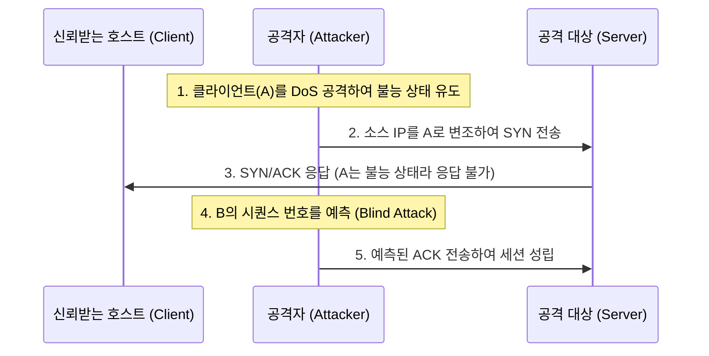

# [021].SE_IP_스푸핑_IP_Spoofing

## 1. [도입: Why] IP 스푸핑(IP Spoofing)의 개요

### 가. 정의
- 공격자가 자신의 IP 주소를 공격 대상 네트워크의 신뢰받는 호스트 IP 주소로 변조하여, IP 기반의 인증 및 신뢰 관계(Trust Relationship)를 무력화시키는 공격 기법

### 나. 등장 배경 및 필요성
1. **IP 인증의 취약점**: 소스 IP 주소만으로 호스트를 인증하는 시스템(r-command 등)의 보안 허점 노출
2. **신뢰 관계 악용**: 특정 서버와 클라이언트 간의 기설정된 신뢰 관계를 도용하여 불법적인 자원 접근 시도
3. **블라인드 공격(Blind Attack)**: 수신되는 패킷을 보지 않고도 시퀀스 번호 예측을 통해 세션을 성립시키는 고도화된 공격 대응 필요

## 2. [핵심: What & How] IP 스푸핑의 메커니즘

### 가. 공격 프로세스 및 개념도

### 나. 핵심 구성 요소 및 기술
| 구분 | 기술 요소 | 상세 설명 |
|---|---|---|
| **신뢰 관계 (Trust)** | IP 기반 인증 | 유닉스 계열의 rlogin, rsh 등 소스 IP 기반 허용 설정 |
| **시퀀스 번호 예측** | ISN Prediction | SYN/ACK 패킷을 보지 못하는 상태에서 다음 ACK 번호를 추정 |
| **DoS 공격** | Resource Exhaustion | 타겟 호스트(A)가 리셋 패킷(RST)을 보내지 못하도록 무력화 |
| **블라인드 공격** | Blind Attack | 외부 네트워크에서 내부 신뢰 서버로의 일방향성 침투 공격 |

## 3. [심화: Deep-dive] 탐지 및 대응 기술 (패보티IU)

### 가. 주요 대응 방안 상세 분석
| 대응 기술 | 설명 | 효과 |
|---|---|---|
| **패킷 필터링** | Ingress/Egress Filtering | 내부망 IP가 외부에서 유입되거나, 존재하지 않는 IP가 유출되는 것 차단 |
| **Bogon-List** | 비할당 IP 목록 활용 | 할당되지 않은 사설/예약 IP 주소로부터의 패킷 유입 원천 차단 |
| **uRPF** | Unicast Reverse Path Forwarding | 소스 IP가 유입된 인터페이스로 다시 나갈 수 있는지 경로 검증 |
| **IP Source Guard** | IP-MAC 바인딩 검증 | 스위치 포트별로 정당한 IP/MAC 조합만 허용 |
| **보안 프로토콜** | SSH, TLS, IPsec | IP 기반 인증 대신 강력한 암호화 기반 인증(PKI 등)으로 전환 |

### 나. 유사 공격과의 비교
| 비교 항목 | IP Spoofing | ARP Spoofing |
|---|---|---|
| **공격 계층** | 3계층 (Network) | 2계층 (Data Link) |
| **변조 대상** | IP 주소 (Software) | MAC 주소 (Hardware) |
| **공격 범위** | 원격(Remote) 공격 가능 | 로컬 네트워크(LAN) 한정 |
| **핵심 기법** | 신뢰 관계 무력화 | 중간자 공격 (MITM) |

## 4. [결론: Effect & Insight] 기술사적 제언

### 가. 실무 도입 시 고려사항
- 단순 필터링만으로는 ISN(Initial Sequence Number) 예측을 통한 공격을 완벽히 막기 어려우므로, OS 차원에서 시퀀스 번호를 난수화(Randomization)하여 생성하도록 설정해야 함

### 나. 보안 거버넌스 및 발전 방향
- **제로 트러스트(Zero Trust)**: IP 주소는 언제든 변조될 수 있다는 전제하에 "절대 신뢰하지 않고 항상 검증"하는 인증 모델 도입 필수
- **SDN 보안**: 가상화 환경에서 uRPF 및 동적 패킷 검사(DAI) 기능을 중앙 집중적으로 제어하여 지능형 스푸핑 대응 체계 구축 권고

## 5. 검증 체크리스트 (PE-Audit)

| # | 검증 항목 | 기준 | 판정 |
|---|---|---|---|
| 1 | **최신성·정확성** | Blind Attack 및 uRPF 등 현대적 대응 기술 반영 | ✅ |
| 2 | **키워드 적정성** | 패보티IU, 신뢰 관계, ISN 예측, Ingress Filtering 등 배치 | ✅ |
| 3 | **시각화 품질** | 시퀀스 다이어그램으로 공격 절차를 직관적으로 표현 | ✅ |
| 4 | **논리적 일관성** | IP 인증 취약점 → 공격 절차 → 대응 기술 → 제로 트러스트 연결 | ✅ |
| 5 | **차별화 요소** | ISN 난수화 및 SDN 보안 연계 제언 포함 | ✅ |
