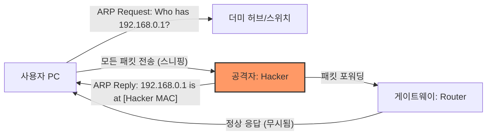

# [022].SE_ARP_스푸핑_및_Poisoning

## 1. [도입: Why] ARP 스푸핑 및 Poisoning의 개요

### 가. 정의
- **ARP 스푸핑 (ARP Spoofing)**: 로컬 네트워크(LAN)에서 공격자가 자신의 MAC 주소를 특정 IP(대개 게이트웨이)의 주소인 것처럼 위장하여 패킷을 가로채는 중간자 공격(MITM) 기법
- **ARP Poisoning**: ARP 프로토콜의 취약점인 'Stateless'를 악용하여 위조된 ARP 응답을 지속적으로 전송함으로써 타겟 호스트의 ARP Table(Cache)을 오염시키는 행위

### 나. 등장 배경 및 필요성
1. **ARP의 태생적 취약점**: 별도의 인증 절차 없이 응답 패킷을 신뢰하여 ARP Table을 갱신하는 비정형성 노출
2. **도청 및 위변조 기반**: 단순한 도청을 넘어, 가로챈 패킷을 변조하거나 세션 하이재킹으로 연결되는 2차 공격의 시발점
3. **로컬 망 보안의 중요성**: 내부자 공격 또는 감염된 호스트에 의한 사설망 내 정보 유출 차단 필요성 증대

## 2. [핵심: What & How] ARP 기반 공격 유형 및 구조

### 가. 공격 메커니즘 개념도 (Mermaid)

### 나. 주요 공격 기술 분류
| 기법 | 설명 | 핵심 메커니즘 |
|---|---|---|
| **ARP Spoofing** | 특정 단말기 간의 통신 가로채기 | MAC 주소 위조 및 중간자 개입 |
| **ARP Redirect** | 호스트의 게이트웨이 MAC을 공격자로 변경 | 자신을 라우터로 속여 외부 통신 스니핑 |
| **ARP Poisoning** | ARP Cache Table의 지속적 오염 | 비정상적 ARP Reply 패킷 다량 전송 |
| **MAC Flooding** | 스위치의 MAC Table을 가득 채워 허브화 | 스위치 테이블 오버플로우 유발 |

## 3. [심화: Deep-dive] 탐지 및 대응 체계 (인암정보 MA사)

### 가. 탐지 방안 분석
1. **피해 시스템**: ARP Table 내 MAC 주소 중복 여부 확인 (`arp -a`), 비정상적 ARP 수신 감시
2. **공격 시스템**: Promiscuous 모드 동작 여부 탐지, 패킷 캡처 도구 실행 여부 확인
3. **네트워크 장비**: 포트별 학습된 MAC 주소 개수 제한, ARP 패킷 정밀 검사(DAI)

### 나. 단계별 대응 방안 상세
| 구분 | 대응 기술 | 설명 |
|---|---|---|
| **시스템** | **정적 ARP 설정** | 중요 서버/게이트웨이의 MAC 주소를 `Static`으로 고정하여 갱신 차단 |
| | 인증/암호화 강화 | SSL/TLS, IPsec 등 상위 계층 암호화를 통해 데이터 유출 방지 |
| **네트워크** | **DAI (Dynamic ARP Inspection)** | 신뢰할 수 없는 포트에서 유입되는 부당한 ARP 패킷 차단 |
| | Port Security | 스위치 포트별 최대 수용 MAC 개수 제한 및 위반 시 포트 차단 |
| | 사설 VLAN (PVLAN) | 동일 서브넷 내 호스트 간의 L2 통신을 물리적으로 분리 |

## 4. [결론: Effect & Insight] 기술사적 제언

### 가. 실무적 한계 및 운영 전략
- 수백 대의 호스트에 정적 ARP를 설정하는 것은 운영 효율성 면에서 불가능하므로, 핵심 자원(Default Gateway, DB)에 대해서만 선별적으로 적용하고 네트워크 레벨의 대응(DAI)을 주축으로 삼아야 함

### 나. 보안 거버넌스 및 미래 대응
- **신뢰 모델의 변화**: ARP와 같은 신뢰 기반 레거시 프로토콜의 한계를 인정하고, 네트워크 세그먼테이션(Micro-segmentation)을 통한 공격면 최소화 지향
- **자동화 탐지**: AI 기반의 트래픽 분석을 통해 평소와 다른 ARP 패킷 패턴을 즉시 탐지하고 격리하는 자동화된 대응 체계 구축 필요

## 5. 검증 체크리스트 (PE-Audit)

| # | 검증 항목 | 기준 | 판정 |
|---|---|---|---|
| 1 | **최신성·정확성** | DAI, PVLAN 등 현대적 네트워크 대응 기술 반영 | ✅ |
| 2 | **키워드 적정성** | 인암정보 MA사, MITM, DAI, Static ARP, PVLAN 등 배치 | ✅ |
| 3 | **시각화 품질** | 중간자 공격의 패킷 흐름을 Mermaid로 명확히 표현 | ✅ |
| 4 | **논리적 일관성** | ARP 취약점 → 공격 유형 → 탐지/대응 → 운영 제언 연결 | ✅ |
| 5 | **차별화 요소** | 정적 ARP 운영의 실무적 한계 및 마이크로 세그멘테이션 제언 | ✅ |
