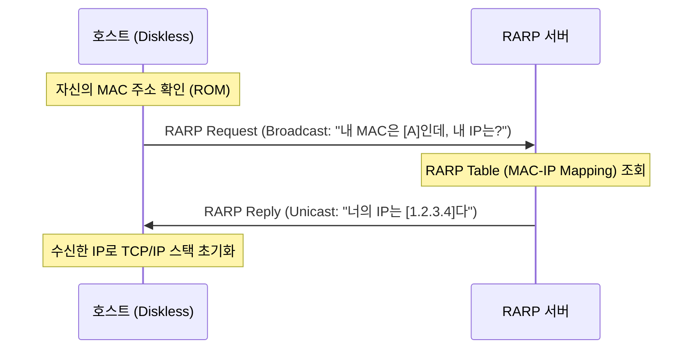

# [023].SE_RARP_Reverse_ARP

## 1. [도입: Why] RARP(Reverse ARP)의 개요

### 가. 정의
- 로컬 네트워크(LAN) 상의 호스트가 자신의 물리적 주소(MAC Address)는 알고 있으나, 논리적 주소(IP Address)를 모를 때 서버로부터 IP 주소를 부여받기 위해 사용하는 프로토콜 (RFC 903)

### 나. 등장 배경 및 필요성
1. **디스크 없는 워크스테이션 (Diskless Workstation)**: 하드디스크가 없어 IP 주소를 저장할 수 없는 단말기가 부팅 시 자신의 IP를 동적으로 확인하기 위해 필수적
2. **부팅 단계 주소 획득**: OS가 로드되기 전, ROM 등에 기록된 고유 MAC 주소만을 기반으로 네트워크 통신 가능 상태로 진입하는 첫 단계
3. **제한적 환경 대응**: DHCP(Dynamic Host Configuration Protocol)의 모태가 된 기술로, 초기 망 구성 및 주소 할당 메커니즘 제공

## 2. [핵심: What & How] RARP의 동작 원리 및 구조

### 가. RARP 동작 프로세스 개념도

### 나. 핵심 구성 요소
| 구분 | 구성 요소 | 상세 역할 |
|---|---|---|
| **RARP Request** | 브로드캐스트 패킷 | 목적지 MAC 주소를 'FF:FF:FF:FF:FF:FF'로 설정하여 서버 탐색 |
| **RARP Reply** | 유니캐스트 패킷 | 요청한 호스트의 MAC으로 직접 응답 (IP 정보 포함) |
| **RARP 서버** | IP 관리 주체 | MAC 주소와 IP 주소의 매핑 테이블을 유지 및 관리 |
| **MAC 주소** | Physical Address | 호스트의 유일한 식별자로, IP 요청의 기반 정보 |

## 3. [심화: Deep-dive] ARP vs RARP 비교 및 기술적 한계

### 가. ARP와 RARP의 상세 분석 (Comparison)
| 비교 항목 | ARP (Address Resolution Protocol) | RARP (Reverse ARP) |
|---|---|---|
| **해결 방향** | IP 주소 → MAC 주소 | **MAC 주소 → IP 주소** |
| **사용 목적** | 데이터 전송을 위한 물리 주소 획득 | **부팅 시 논리 주소(IP) 획득** |
| **대상 호스트** | 모든 일반적인 호스트 | 주로 디스크 없는 장비 (IoT 초기 모델 등) |
| **통신 방식** | Request(BC) / Reply(UC) | Request(BC) / Reply(UC) |

### 나. RARP의 기술적 한계 및 계승
1. **데이터링크 계층 의존**: 네트워크 계층(IP)이 아닌 2계층에서 직접 동작하여, 라우터를 넘어서는 주소 할당 불가 (Broadcast 한계)
2. **단순 기능**: IP 주소 외의 정보(게이트웨이, 서브넷 마스크, DNS 서버 등)를 제공하지 못함
3. **DHCP로의 진화**: RARP의 한계를 극복하기 위해 BOOTP(Bootstrap Protocol)를 거쳐 현재의 **DHCP**로 발전

## 4. [결론: Effect & Insight] 기술사적 제언

### 가. 레거시 기술의 교훈
- RARP는 IP 주소 할당의 자동화라는 초기 혁신을 이끌었으며, 이는 현대 클라우드 및 SDN 환경의 **동적 IP 할당(IPAM)** 기술의 근간이 됨

### 나. 보안 및 거버넌스 관점
- **주소 도용 위험**: RARP 서버 역시 위변조된 요청에 대해 부적절한 IP를 할당하거나, 공격자가 위조 서버를 운영할 수 있는 취약점 존재
- **대체 기술 활용**: 현재는 RARP를 거의 사용하지 않으나, 임베디드 및 IoT 초소형 기기의 부팅 메커니즘 이해를 위해 기초 이론으로 숙지 필수

## 5. 검증 체크리스트 (PE-Audit)

| # | 검증 항목 | 기준 | 판정 |
|---|---|---|---|
| 1 | **최신성·정확성** | RFC 903 표준 및 DHCP와의 발전 계보 반영 | ✅ |
| 2 | **키워드 적정성** | Diskless, MAC/IP 매핑, Broadcast/Unicast, DHCP 진화 등 | ✅ |
| 3 | **시각화 품질** | RARP의 요청-응답 시퀀스를 명확히 표현 | ✅ |
| 4 | **논리적 일관성** | 주소 미인지 → 서버 요청 → 주소 획득 → DHCP 진화 연결 | ✅ |
| 5 | **차별화 요소** | BOOTP/DHCP와의 계보 및 IoT 환경 제언 포함 | ✅ |
