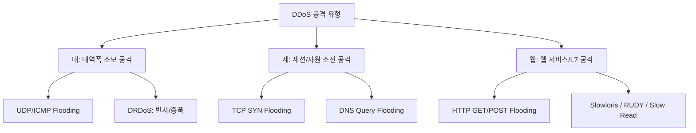

# [024].SE_DoS_및_DDoS_공격_개요

## 1. [도입: Why] DoS 및 DDoS의 개요

### 가. 정의
- **DoS (Denial of Service)**: 타겟 시스템의 가용 자원(CPU, Memory, Bandwidth)을 고갈시켜 정상적인 사용자가 서비스를 이용하지 못하게 하는 서비스 거부 공격
- **DDoS (Distributed DoS)**: 다수의 분산된 호스트(Zombie PC/Botnet)를 통해 타겟 시스템에 동시 다발적으로 대규모 트래픽을 유도하는 분산 서비스 거부 공격

### 나. 등장 배경 및 필요성
1. **공격의 용이성**: 오픈소스 공격 도구 및 DDoSaaS(Service형 공격)의 보편화로 낮은 비용으로 막대한 피해 유도 가능
2. **비즈니스 연속성 위협**: 온라인 중심 산업 구조에서 서비스 중단은 즉각적인 금전적 손실 및 기업 신뢰도 하락으로 직결
3. **지능화된 공격 기법**: 단순 대역폭 소모를 넘어 애플리케이션 계층(L7)을 겨냥한 정밀한 자원 소진 공격 증가

## 2. [핵심: What & How] DDoS 공격 유형 및 메커니즘

### 가. DDoS 공격 분류 체계 ([대세웹])

### 나. 공격 유형별 핵심 특징
| 구분 | 공격 기법 | 상세 메커니즘 | 대응 포인트 |
|---|---|---|---|
| **대역폭** | **UDP/ICMP Flood** | 대량의 무의미한 패킷으로 네트워크 회선 고갈 | ISP 협조, Ingress 필터링 |
| **세션** | **SYN Flooding** | TCP 3-Way Handshake의 Half-open 취약점 이용 | SYN Cookie, 임계치 설정 |
| **웹(L7)** | **Slowloris** | HTTP 헤더를 비정상적으로 늦게 보내 커넥션 점유 | Timeout 단축, L7 스위치 |
| | **CC Attack** | 다량의 페이지 요청을 통해 DB/WAS 부하 유발 | Cache 적용, User-Agent 차단 |

## 3. [심화: Deep-dive] DDoS 대응 체계 및 절차 ([UIP사])

### 가. 단계별 대응 절차
1. **공격 인지**: BPS/PPS/CPS 급증 확인, 웹 서버 로그 및 임계치 위반 알람 모니터링
2. **공격 분석**: 패킷 덤프 분석을 통해 시그니처 추출, HTTP 요청 패턴(Header, Parameter) 파악
3. **유형별 차단**: ACL(Access Control List) 적용, L7 필터링, 공격 IP 블랙리스팅 수행
4. **사후 조치**: 좀비 PC IP 확보 및 관련 기관(KISA 등) 공유, 차단 정책 최적화

### 나. 전용 대응 기술 ([DLBC/LA])
- **DNS 싱크홀**: 악성 도메인 요청을 가짜 IP로 유도하여 좀비 PC의 명령 제어(C&C) 차단
- **Blackholing**: 공격 대상 IP로 향하는 트래픽을 Null 인터페이스로 전달하여 회선 보호
- **CAR (Committed Access Rate)**: 인터페이스별 트래픽 속도를 제한하여 특정 대역폭 초과 시 드랍

## 4. [결론: Effect & Insight] 기술사적 제언

### 가. 실무 도입 시 고려사항: 계층적 방어(Defense in Depth)
- 단일 솔루션만으로는 대응이 불가능하므로 ISP(회선), 방화벽/IPS(네트워크), L7 스위치(애플리케이션), 안티디도스(전용)의 다층 방어 체계 구축 필수

### 나. 보안 거버넌스 및 발전 방향
- **클라우드 기반 대응**: 대규모 대역폭 공격(Tbps급)에 대응하기 위해 자체 인프라 대신 클라우드 기반 스크러빙 센터 활용 권고
- **AI 기반 탐지**: 정상 트래픽과 유사한 지능형 L7 공격 탐지를 위해 머신러닝 기반 이상 행위 분석 기술 도입 시급

## 5. 검증 체크리스트 (PE-Audit)

| # | 검증 항목 | 기준 | 판정 |
|---|---|---|---|
| 1 | **최신성·정확성** | 대세웹 분류 및 최신 L7 공격 유형 반영 | ✅ |
| 2 | **키워드 적정성** | 대세웹, UIP사, SYN Cookie, DNS 싱크홀, CAR 등 배치 | ✅ |
| 3 | **시각화 품질** | DDoS의 계층적 공격 유형을 Mermaid로 명확히 표현 | ✅ |
| 4 | **논리적 일관성** | 공격 정의 → 유형(대세웹) → 대응(UIP사) → 제언 연결 | ✅ |
| 5 | **차별화 요소** | 계층적 방어 전략 및 AI 기반 탐지 제언 포함 | ✅ |
