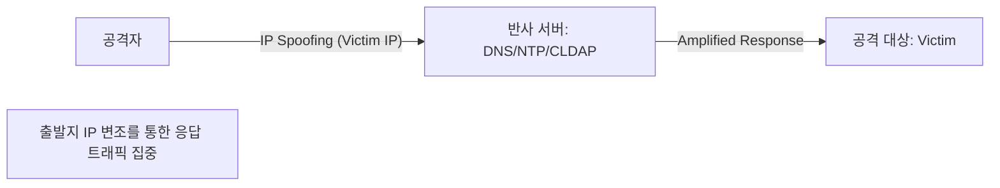

# [025].SE_DDoS_심화_유형_및_대응

## 1. [도입: Why] 특수 DDoS 공격의 개요

### 가. 정의
- 일반적인 대역폭 공격(Flooding)과 달리, 특정 프로토콜의 취약점, 웹 서버의 자원 관리 방식, 혹은 경제적 갈취 목적으로 설계된 지능화된 DDoS 공격 기법

### 나. 등장 배경 및 필요성
1. **탐지 우회**: 정상적인 요청과 유사한 패턴을 사용하여 기존 보안 장비(IDS/IPS) 탐지 우회 시도
2. **반사 및 증폭**: 적은 자원으로 대규모 공격을 수행하기 위해 공인 서버들의 응답 트래픽 악용 (DRDoS)
3. **복합적 목적**: 단순 서비스 마비를 넘어 금전적 갈취(Ransom) 및 내부 침투를 위한 교란 목적으로 진화

## 2. [핵심: What & How] 지능형 DDoS 공격 메커니즘

### 가. DRDoS (Distributed Reflection DoS) 공격 구조

### 나. 주요 심화 공격 유형 분석
| 공격 명칭 | 상세 메커니즘 | 대응 방안 |
|---|---|---|
| **DRDoS** | 출발지 IP를 타겟 IP로 위조 후 반사 서버에 요청, 증폭된 응답 집중 | Ingress 필터링, uRPF, Victim IP/Port 차단 |
| **HULK DoS** | URL 파라미터를 무작위로 변경하며 페이지 무한 요청, 캐시 무력화 | User-Agent 필터링, HTTP 302 Redirect 활용 |
| **HASH DoS** | 해시 충돌(Hash Collision)을 유발하는 파라미터 전송, CPU 부하 증대 | 웹서버 엔진 업데이트, 파라미터 개수 제한 |
| **Ransom DDoS** | 금전 미지불 시 DDoS 공격 예고 및 실행 협박 | 사이버대피소 연계, 백업 서버 구축, 가용성 확보 |

## 3. [심화: Deep-dive] 랜섬 디도스(Ransom DDoS) 상세 분석

### 가. 랜섬 디도스 특징 및 절차
- **특징**: 대상 타겟 지정(금융/도박/게임 등), 반복적 수행, 가상 자산(비트코인 등) 요구
- **절차**: [대상 선정] → [협박 메일 전송] → [사전 시범 공격] → [본 공격 실행] → [금전 갈취 시도]

### 나. 랜섬웨어 측면 vs 디도스 측면 대응
| 구분 | 대응 기술 및 전략 | 비고 |
|---|---|---|
| **랜섬웨어 대응** | 백업 체계 수립, EDR(Endpoint Detection), Anti-Virus | 데이터 가용성 보호 |
| **디도스 대응** | F/W, IPS/IDS 임계치 설정, IP/Port 차단 | 서비스 가용성 보호 |
| **거버넌스** | 침해사고 신고, 유관기관(KISA) 공조, 대피소 전환 | 신속한 복구 및 대응 |

## 4. [결론: Effect & Insight] 기술사적 제언

### 가. 실무적 방어 전략: 동적 정책 관리
- **HULK**와 같은 동적 파라미터 공격 대응을 위해 정적 패턴 매칭이 아닌, 비정상적 빈도로 요청되는 파라미터 조합을 실시간 탐지하는 동적 정책(Dynamic Policy) 적용 필요

### 나. 보안 거버넌스 강화
- **반사 서버 관리**: 자체 운영 중인 DNS, NTP 서버가 공격의 반사체(Reflector)로 악용되지 않도록 불필요한 재귀 질의(Recursive Query) 차단 및 보안 설정 강화 필수

### 다. 발전 방향 및 제언
- 향후 IoT 기기(Botnet)를 활용한 초거대 규모 공격에 대비하여 글로벌 위협 정보 공유 체계(C TI)를 활용한 선제적 IP 차단 및 화이트리스트 기반 접근 제어 모델 확산 권고

## 5. 검증 체크리스트 (PE-Audit)

| # | 검증 항목 | 기준 | 판정 |
|---|---|---|---|
| 1 | **최신성·정확성** | DRDoS, HULK, HASH DoS 등 최신 공격 기법 반영 | ✅ |
| 2 | **키워드 적정성** | 반사 및 증폭, 302 Redirect, 해시 충돌, Ransom DDoS 등 배치 | ✅ |
| 3 | **시각화 품질** | DRDoS의 반사/증폭 구조를 Mermaid로 직관적 표현 | ✅ |
| 4 | **논리적 일관성** | 공격 원리 → 심화 유형 → 유형별 대응 → 제언 연결 | ✅ |
| 5 | **차별화 요소** | 비정상 파라미터 탐지 및 반사 서버 관리 제언 포함 | ✅ |
