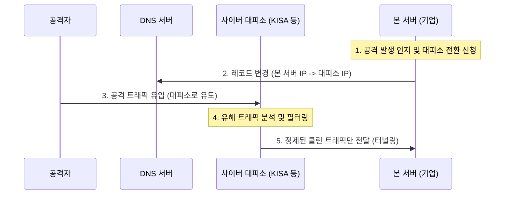

# [026].SE_DDoS_사이버대피소_및_DDoSaaS

## 1. [도입: Why] DDoS 전용 방어 서비스의 개요

### 가. 정의
- **사이버대피소**: 중소기업 등을 대상으로 DDoS 공격 트래픽을 외부 대피소로 우회시켜 정밀 분석 및 차단 후 정상 트래픽만 본 서버로 전송하는 보안 지원 서비스
- **DDoSaaS (DDoS as a Service)**: 클라우드 기반 공격 인프라를 통해 누구든 저렴한 비용으로 대규모 DDoS 공격을 의뢰하고 수행할 수 있는 범죄형 서비스 모델

### 나. 등장 배경 및 필요성
1. **중소기업 보호**: 자력으로 고가의 안티디도스 장비 도입이 어려운 중소기업의 비즈니스 연속성 보장
2. **공격의 산업화 (DDoSaaS)**: 다크웹 등을 통한 공격 서비스의 상품화로 공격 규모와 횟수가 폭증하여 전문 방어 서비스의 필요성 증대
3. **초거대 규모 공격 대응**: 수백 Gbps~Tbps급의 대역폭 공격은 개별 기업 인프라(회선)만으로는 방어가 불가능함

## 2. [핵심: What & How] 사이버대피소 및 DDoSaaS 구조

### 가. 사이버대피소 우회 방어 메커니즘 (Mermaid)

### 나. DDoSaaS의 공격 라이프사이클 및 구성
| 단계 | 상세 행위 | 비고 |
|---|---|---|
| **서비스 거래** | 다크웹 등에서 공격 기간/규모에 따른 비용 지불 | 익명 결제 (Crypto) |
| **사전 준비** | 타겟 취약점 분석, C&C 서버를 통한 봇넷(좀비 PC) 확보 | IoT 봇넷 활발 |
| **DDoS 실행** | API 호출 등을 통해 공격 명령 하달 (UDP/TCP/HTTP 등) | 지능형 파라미터 공격 |
| **서비스 마비** | 대역폭 소진 및 어플리케이션 자원(CPU/Session) 고갈 | 최종 목표 달성 |

## 3. [심화: Deep-dive] 사이버대피소 대응 기법 및 내부 보안 강화

### 가. 사이버대피소 대응 기술 (관리/기술/물리)
1. **관리적 측면**: 화이트리스트(Whitelist) 관리, 이상행위 IP 상시 모니터링, 방어 정책 최적화
2. **기술적 측면**: DNS 정보 변경, 캐시(Cache) 적용을 통한 오리진 서버 부하 분산, 리버스 프록시(Reverse Proxy) 활용
3. **물리적 측면**: 주요 시설 출입 관리 및 보호 인력 배치, 주기적인 데이터 백업 체계 가동

### 나. 내부 시스템 측면의 핵심 보안 대책
- **제로 트러스트**: 모든 접속 주체에 대해 엄격한 인증 및 최소 권한 부여 (WAF 기반 필터링 병행)
- **데이터 보호**: 실시간 데이터 암호화 및 유출 탐지 솔루션 연동
- **단말 보안**: 좀비 PC가 되지 않도록 엔드포인트 보안(EDR) 및 단말 복제 방지 기술 적용

## 4. [결론: Effect & Insight] 기술사적 제언

### 가. 실무 도입 시 고려사항: 전환 지연 시간(Latency)
- 대피소 우회 시 네트워크 홉(Hop) 증가에 따른 응답 지연이 발생할 수 있으므로, 평상시에 모의 훈련을 통해 신속한 전환 절차를 숙달해야 함

### 나. 보안 거버넌스 강화
- **민관 공조**: DDoSaaS와 같은 공격 도구의 유통을 막기 위해 국내외 수사기관 및 보안 벤더와의 위협 정보(CTI) 공유 거버넌스 강화 필수

### 다. 발전 방향 및 제언
- 향후 인공지능(AI)을 활용한 자율 방어 체계(Autonomous Defense)를 구축하여, 사람이 개입하기 전 실시간으로 공격 패턴을 인지하고 대피소로 자동 전환하는 지능형 인프라로의 진화가 필요함

## 5. 검증 체크리스트 (PE-Audit)

| # | 검증 항목 | 기준 | 판정 |
|---|---|---|---|
| 1 | **최신성·정확성** | 사이버대피소 동작 방식 및 DDoSaaS 특징 반영 | ✅ |
| 2 | **키워드 적정성** | 우회 방어, DNS 변경, 리버스 프록시, 제로 트러스트, 봇넷 등 | ✅ |
| 3 | **시각화 품질** | 대피소 우회 흐름을 시퀀스 도로 명확히 표현 | ✅ |
| 4 | **논리적 일관성** | 중소기업 한계 → 대피소 해결책 → DDoSaaS 위협 연결 | ✅ |
| 5 | **차별화 요소** | AI 기반 자율 방어 체계 및 클린 트래픽 제언 포함 | ✅ |
