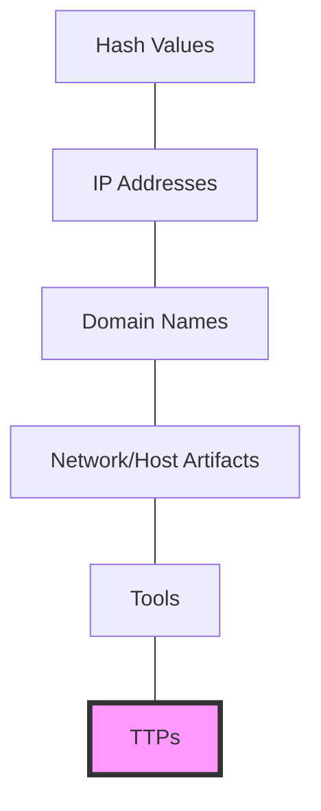

Parent: [[05.SE/GEMINI.MD]]

# 1. TTPs의 개요 및 배경

## 가. 정의
- 사이버 공격자의 공격 패턴과 행동 양식을 분석하기 위한 3가지 핵심 요소인 **전술(Tactics), 기법(Techniques), 절차(Procedures)**의 약어
- 공격자의 의도와 능력을 식별하여 선제적인 방어 체계를 구축하는 **위협 인텔리전스(CTI)**의 핵심 개념

## 나. 등장 배경 및 필요성
- **지능형 지속 위협(APT)**: 단순 악성코드 탐지를 넘어 공격자의 전체적인 행동 흐름 분석 필요
- **공격자 식별(Attribution)**: 유사한 TTPs를 사용하는 공격 그룹(Group)을 분류하여 대응 전략 수립
- **방어 최적화**: 공격자의 공격 단계를 차단하는 **Cyber Kill Chain** 및 **MITRE ATT&CK** 프레임워크와 연계

# 2. TTPs의 핵심 구성 요소 및 메커니즘

## 가. 상세 구성 [두음: 전기절]
| 구성 요소 | 설명 | 주요 예시 |
|---|---|---|
| **Tactics (전술)** | 공격의 목적 및 의도 (Why) | 초기 침투, 권한 상승, 데이터 유출 등 |
| **Techniques (기법)** | 전술을 달성하기 위한 구체적인 방법 (How) | 스피어 피싱, SQL 인젝션, 무차별 대입 공격 |
| **Procedures (절차)** | 기법을 실행하는 일련의 순서 및 세부 도구 (Steps) | 특정 도구 활용 순서, C2 서버 연결 방식 등 |

## 나. 개념도 (Pyramid of Pain 연계)

- **Pyramid of Pain**: 최상단에 위치한 TTPs는 공격자가 변경하기 가장 어렵고, 방어자가 탐지했을 때 공격자에게 가장 큰 타격을 주는 요소임

# 3. TTPs 기반 프레임워크 및 활용

## 가. MITRE ATT&CK 프레임워크
- 실제 발생한 사이버 공격 사례를 기반으로 공격자의 TTPs를 매트릭스 형태로 정리한 지식 베이스
- **Enterprise, Mobile, ICS** 등 도메인별 공격 전술 및 기법 제공

## 나. TTPs 활용 시나리오
1.  **위협 헌팅 (Threat Hunting)**: 침해 지표(IoC)가 발견되지 않아도 알려진 TTPs 패턴을 추적하여 잠재적 위협 탐지
2.  **모의 해킹 (Red Teaming)**: 특정 공격 그룹의 TTPs를 모사하여 실제 방어 체계의 유효성 검증
3.  **위협 인텔리전스 공유**: **STIX/TAXII** 표준 형식을 사용하여 타 조직과 공격 그룹의 TTPs 공유

# 4. 기술사적 제언 및 실무 적용 방안

## 가. 실무 도입 시 고려사항
- **자동화된 분석**: SIEM, EDR 솔루션과 연동하여 실시간으로 유입되는 이벤트를 TTPs 패턴과 매핑(Mapping) 필요
- **지속적인 업데이트**: 공격 기법은 끊임없이 진화하므로 최신 위협 리포트와 프레임워크 업데이트 반영 필수

## 나. 최신 트렌드와 발전 방향
- **AI 기반 TTPs 추론**: 방대한 보안 로그에서 AI를 활용하여 공격자의 정교한 TTPs를 자동으로 추출하고 예측
- **클라우드 TTPs 확대**: 컨테이너, 서버리스 등 클라우드 네이티브 환경에 특화된 공격 기법 분석 가속화

> [!tip] **기술사 인사이트**
> 공격자의 도구(Tools)나 IP 주소는 쉽게 바꿀 수 있지만, 그들의 **습관(Procedures)**과 **전술(Tactics)**은 쉽게 바뀌지 않습니다. TTPs에 집중하는 것은 공격자의 '얼굴'이 아닌 **'행동의 본질'**을 보는 것입니다.

## Related Notes
- [[024.SE_DoS_諛_DDoS_怨듦꺽_媛.md]]
- [[004.Model_Inversion_Attack.md]]
- [[015.Risk_Assessment.md]]
