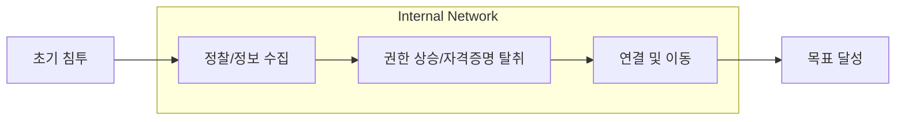

Parent: [[05.SE/GEMINI.MD]]

# 1. IT 인프라 확장에 따른 보안 패러다임의 변화

## 가. 인프라 확장의 부작용
- 클라우드, IoT, 원격 근무 확대로 인해 보호해야 할 자산과 연결점이 기하급수적으로 증가
- 기존의 경계 보안(Perimeter Security) 중심에서 **제로 트러스트(Zero Trust)** 및 **공격 중심 보안**으로의 전환 요구

# 2. 공격 표면 (Attack Surface)과 공격 벡터 (Attack Vector)

## 가. 개념 비교 및 정의
| 항목 | 공격 표면 (Attack Surface) | 공격 벡터 (Attack Vector) |
|---|---|---|
| **정의** | 공격자가 침입하거나 데이터를 유출할 수 있는 **모든 지점의 합** | 공격자가 시스템에 접근하거나 침투하기 위해 사용하는 **경로나 수단** |
| **관점** | **자산 중심** (어디가 취약한가?) | **경로 중심** (어떻게 들어오는가?) |
| **구성 요소** | 외부망 IP, 열린 포트, API, 사용자 계정, 클라우드 설정 오류 등 | 피싱 메일, 취약점(Exploit), 공급망 공격(Supply Chain), 소셜 엔지니어링 등 |
| **관리 전략** | **표면 축소 (Reduction)**: 불필요한 포트 폐쇄, 자산 식별 | **경로 차단 (Prevention)**: 백신, IPS, 메일 보안 솔루션 도입 |

## 나. 공격 표면 관리 (ASM: Attack Surface Management)의 중요성
- 그림자 IT(Shadow IT) 및 관리되지 않는 자산을 식별하여 공격의 '기회' 자체를 제거하는 선제적 방어 체계

# 3. 측면 이동 (Lateral Movement)의 메커니즘 및 기법

## 가. 정의
- 공격자가 내부 망 침투 성공 후, 최종 목표(데이터 유출, 랜섬웨어 실행 등)에 도달하기 위해 **다른 시스템으로 접근을 확대**해 나가는 과정
- 사이버 킬체인(Cyber Kill Chain)의 중반부에 해당하며, 내부망 내에서의 권한 상승 및 정보 수집 포함

## 나. 단계별 메커니즘

| 단계 | 주요 활동 | 설명 |
|---|---|---|
| **1. 정찰 (Reconnaissance)** | 내부 망 스캐닝, 호스트 식별 | 침투한 시스템 주변의 네트워크 구조, 공유 폴더, 액티브 디렉토리(AD) 구조 파악 |
| **2. 자격증명 탈취** | Mimikatz 활용, Keylogging | 메모리 내의 패스워드 해시 또는 토큰을 탈취하여 다른 시스템 접속 권한 확보 |
| **3. 이동 및 연결** | RDP, SSH, PowerShell Remoting | 탈취한 계정을 사용하여 정상적인 관리 도구(WMI 등)로 다른 서버에 원격 접속 |
| **4. 지속성 확보** | 백도어 설치, 서비스 등록 | 재부팅 후에도 제어권을 유지하기 위해 시스템 서비스나 레지스트리에 악성코드 등록 |

## 다. 주요 기법 (MITRE ATT&CK 기반)
1.  **Pass-the-Hash (PtH)**: 사용자의 평문 비밀번호 대신 암호화된 **해시(Hash)** 값을 사용하여 인증을 통과하는 기법
2.  **Pass-the-Ticket (PtT)**: Kerberos 인증 환경에서 탈취한 **TGT(Ticket Granting Ticket)**를 사용하여 다른 서비스에 접근
3.  **Living off the Land (LotL)**: 별도의 악성코드 설치 없이 **PowerShell, WMI, PsExec** 등 시스템 기본 관리 도구를 악용하여 탐지를 회피

# 4. 측면 이동 방어 및 탐지 방안 (기술사 제언)

## 가. 방어 체계 고도화
- **네트워크 세분화 (Micro-segmentation)**: 내부 망을 최소 단위로 쪼개어 특정 시스템 침해 시 확산 범위 제한
- **ID 기반 보안 (IAM)**: 다요소 인증(MFA) 강화 및 권한 오남용 모니터링
- **제로 트러스트 (Zero Trust)**: "Never Trust, Always Verify" 원칙에 따라 내부 트래픽도 지속적으로 검증

## 나. 탐지 및 대응 (Detection & Response)
- **EDR/XDR 도입**: 단말에서의 이상 행위(정상 프로세스의 비정상적 네트워크 연결 등) 탐지
- **Deception 기술 (Honeypot)**: 가상의 자산을 네트워크에 배치하여 공격자의 측면 이동 유도 및 조기 탐지

> [!tip] **기술사 인사이트**
> 현대의 사이버 위협은 "한 번 뚫리면 끝"인 성벽 보안에서 **"이미 침투했다는 가정(Assume Breach)"** 하에 내부 확산을 막는 전략으로 변모했습니다. 측면 이동을 탐지하기 위해서는 단순 시그니처 기반 탐지를 넘어 **사용자 및 엔터티 행동 분석(UEBA)**과 같은 AI 기반 이상 징후 탐지 역량이 필수적입니다.

## Related Notes
- [[027.TTPs.md]]
- [[004.SE_제로_트러스트.md]]
- [[020.Cyber_Resilience.md]]
