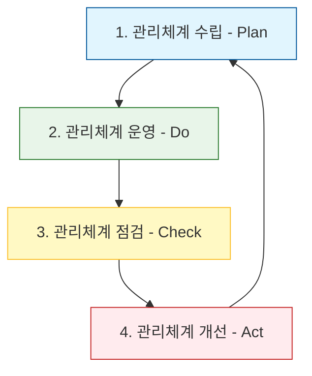

Parent: [[05.SE/GEMINI.MD]]

# 1. 정보보호 관리체계 (ISMS / ISMS-P)의 개요

## 가. 정의
- 기업이 주요 정보자산을 보호하기 위해 수립·운영하는 종합적인 관리체계(**ISMS**)와 개인정보 보호 관리체계(**PIMS**)를 통합한 국가 공인 인증 제도
- 조직의 위험 관리 기반 보안 수준을 객관적으로 검증하여 대외적 신뢰성을 확보하는 체계

## 나. 법적 근거
1.  **정보통신망법 제47조**: 정보보호 관리체계의 인증 (ISMS 법적 근거)
2.  **개인정보 보호법 제32조의2**: 개인정보 보호 관리체계의 인증 (ISMS-P 법적 근거)
3.  **전자정부법**: 공공기관의 정보보호 수준 제고를 위한 의무 준수 사항

# 2. ISMS/ISMS-P의 인증 영역 및 관리 과정

## 가. 인증 영역 및 항목
| 구분 | 영역 | 인증 항목 수 | 설명 |
|---|---|---|---|
| **ISMS** | 1. 관리체계 수립 및 운영 | 16개 | 정책 수립, 조직 구성, 위험 관리 등 |
| | 2. 보호대책 요구사항 | 64개 | 물리 보안, 네트워크 보안, 사고 대응 등 |
| **ISMS-P** | 3. 개인정보 처리 단계별 요구사항 | 22개 | 수집, 보유, 이용, 제공, 파기 등 (추가) |
| **합계** | **총 3개 영역** | **102개** | ISMS는 1, 2영역(80개)만 심사 |

## 나. 관리 과정 (PDCA Cycle 기반) [두음: 수운점개]

1.  **수립 (Establish)**: 조직 구성, 자산 식별, **위험 식별 및 평가(Risk Assessment)**, 계획 수립
2.  **운영 (Operate)**: 보호대책 적용, 교육 및 훈련, 형상 관리, 로그 검토 등 실무 운영
3.  **점검 (Monitor)**: 내부 감사(Internal Audit), 경영진 보고, 부적합 사항 도출
4.  **개선 (Improve)**: 발견된 취약점 보완, 정책 수정, 지속적 품질 향상

# 3. ISMS-P 간편인증 제도 및 강화 방안

## 가. ISMS-P 간편인증 (Lite) 제도
- **도입 배경**: 소상공인 및 중속기업(SME)의 인증 비용 부담 완화 및 보안 사각지대 해소
- **주요 특징**:
    - **대상**: 매출액 50억 미만, 개인정보 보유량 100만 건 미만인 중소기업 등
    - **간소화**: 인증 항목을 대폭 축소 (기존 102개 → 약 **40~50여 개** 수준으로 최적화)
    - **효과**: 심사 기간 단축, 수수료 절감, 중소기업의 자율 보안 체계 확산

## 나. ISMS-P 제도의 강화 및 발전 방안
1.  **클라우드 네이티브 보안 강화**: CSP(클라우드 서비스 제공자)와의 공동 책임 모델에 따른 책임 경계 명확화 및 클라우드 특화 항목(IAM, API 보안 등) 강화
2.  **공급망 보안 (Supply Chain Security)**: 위탁 업체 및 외부 파트너사에 대한 보안 관리 실태 점검 항목 구체화 및 **SBOM** 활용 권고
3.  **실효성 중심 심사**: 문서 중심 심사에서 탈피, 실제 시스템 설정값과 운영 현황을 점검하는 **기술 점검(Technical Audit)** 비중 확대
4.  **AI 보안 거버넌스 통합**: 생성형 AI 도입 시 프롬프트 유출 방지 및 모델 오남용 방지 대책을 관리체계 내에 포함하는 가이드라인 제시

# 4. 기술사적 제언

## 가. 인증의 목적성 전환
- "인증 획득" 그 자체를 목적으로 하는 것이 아니라, **"지속 가능한 보안 거버넌스 구축"**을 통한 비즈니스 연속성 확보 수단으로 인식 전환 필요

## 나. 자동화된 준거성 관리 (Compliance Automation)
- 수동적인 문서 관리를 넘어, **GRC(Governance, Risk, Compliance)** 솔루션을 도입하여 상시 모니터링 및 실시간 증적 관리가 가능한 체계로의 발전이 요구됨

> [!tip] **기술사 인사이트**
> ISMS-P는 단순한 체크리스트가 아닌 기업의 **'보안 성숙도(Security Maturity)'**를 측정하는 척도입니다. 최근 **제로 트러스트(Zero Trust)** 아키텍처 도입 시, ISMS-P의 보호대책과 제로 트러스트의 세부 통제 항목을 매핑하여 통합 보안 체계를 구축하는 전략이 중요합니다.

## Related Notes
- [[069.MG_IT_거버넌스.md]]
- [[015.Risk_Assessment.md]]
- [[004.SE_제로_트러스트.md]]
- [[020.Cyber_Resilience.md]]
